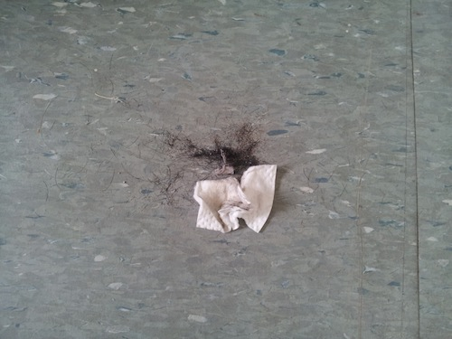
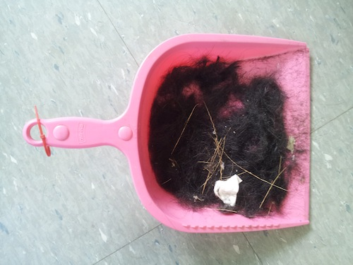
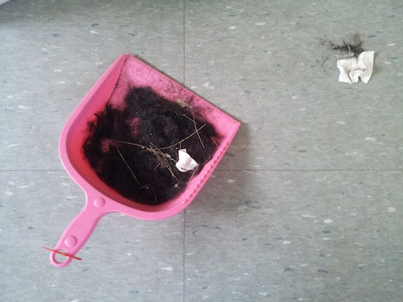
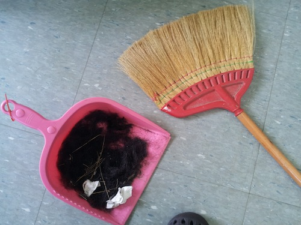
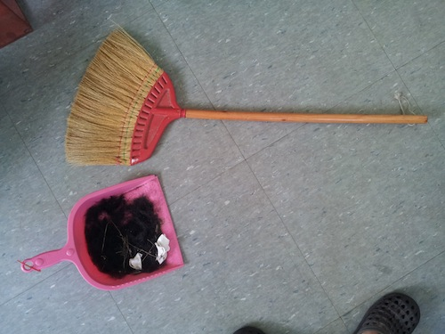

### agile / 기민함

오늘 머리를 자르고 나서.. 바닥에 떨어진 머리카락들을 치우면서 한 생각인데...

프로세스.
-
에자일이란 건.. 룰을 계속해서 바꾸고 즉각적으로 적응해나가는 것이다.
-
빗질을 해 나간다.
슬리퍼는 젖어있으므로 함부로 머리카락을 밟으면, 빗질을 할 수 없게 된다.
빗질을 한다.
눈에 보이는 곳. 그리고 빗자루가 닿는 곳 부터, 순차적으로 해나간다.
그러다가, 어느 순간. 짚으로 만든 빗자루로는 잘 쓸어지지 않는 아주작은 머리카락들이 눈에 띄기 시작한다.
조금더 해본다. 음 역시 안된다. 계속해서 빗질을 하면 될수는 있을 것 같다.
여기서 기존의 계획을 고수 하느냐. 아니면 다른 방법을 생각하느냐.
-
프로세스. 매뉴얼. 룰. 규칙. 물리법칙.
-
뉴튼의 역학.
고전 물리학의 법칙에 머물러있지 않으려면, 생각을 깨야 한다.
-
나는 기본적으로 규칙을 정하고, 그것을 고수하는 것을 미덕으로 삼아왔다.
그랬을때, 어떤 미가. 찾아온다고 생각하는 편이다.
안되는 것도 고수 한다. 일단은.
주어진 것은 끝까지 해본다.
그래야 그 법칙이 옳은지 그른지 알수 있다.
-
그런데, 다른 방법도 있다.
-
머리카락을 쓰레받기에 쓸어담아본다. 역시나. 작은 머리카락들은 잘 담기지 않는다.
쓰레기중에 화장솜이 한개 눈에 띈다.
오, 그래. 저 화장솜을 써보자.
그런데, 한두번 해보니.. 몇가닥의 긴 머리카락이 남아있어서, 깔끔하게 '닦아'지질 않는다.
음, 저것들은 손가락으로 치우자. 몇개 안되고 손가락+화장솜은 지금 상황에서 조합이 좋다.
-
그렇게 하고나서, 화장솜으로 닦아서 쓰레받기에 넣으니 목표를 달성한다.
-
키워드. 1) 상황 2) 목표.
-
에자일 사고방식이란, 첫째 뚜렷한 목표의식. 목표만 달성할 수 있다면, 문제만 해결할 수 있다면, 즉시 방법론을 수정할 수 있다.
둘째, 상황. 이를 위해선 상황을 빨리 파악하는 능력이 필수적이다.
지금 상황에 맞는 방법론을 즉시/빠르게 찾아내야 한다.
-
유연한 사고.
-
작업에서도 마찬가지.
-
프로세스를 고수하는 것. 물리를 좋아하는 나는 세상이 일정한 법칙으로 이루어져있다고 생각하는 것이 좋다.
매뉴얼. 법칙은 반증이 나올때까지 고수한다. 는 것이 기본적인 방침이다. ('반'이 있어야 '정'이 무너지고, '합'을 이룰 수 있음.)
그러나.. 반증이 나오기 전에도. 방법론은 바뀔 수 있다.
즉, 과학적 회의주의만이 진리에 다다르는 길은 아니다.
그것은 아마도, 필요악적인 접근방식. 정-반-합을 이루기 위한 '절차'일 뿐.
반드시, 아름다운 것은 아닐 수 있다는 생각을 하게 된다.
-
에자일에 대해서, 단순히 이렇게만 서술하기엔 부족함이 있다.
발터 벤야민의 아케이드를 에자일적인 접근이라고 이해한 적이 있다.
오늘 있었던 일도 마찬가지.
아케이드란.. 사고의 흐름을 따라가는 것.
직관의 연쇄. 를 말하는 것이다.
즉, 검증이 없이, 직관의 흐름을 따라가되, 그것이 명쾌한 어떤것.
건축물, 애니메이션, 움직이는 그림/뷰
시간적으로 변화하는 작업은 변화하는 상황을 말한다.
그것은 꿈과 같이. 활동적이고, 기민한 창조이다.
-
즉 유연하다는 말은 맞지 않다.
'유연함'은 시간적인 요소를 말하고 있지 않으니까..
시간이 없다는 것은 상황의 변화도 없다는 것이다.
-
변화하는 상황/상태에 함께 엮여서/연동해서(실시간으로) 변화하는, 어떤 진행형의 존재가 되고자 하는 것.
예지적인 요소가 있다고도 말할 수 있다.
어떤 동물적 감각이기도 하다.
-
반사적이라고 할까?
상황에 반사적으로 반응할 수 있다면, ..
작업도 반사적으로 할 수 있다면, 어떨까.
-
오늘 머리카락을 치우면서, 한 몇가지 전환들은 행동을 하면서, 생각하고, 생각하면서, 행위하는 어떤 것이었고.
꽤 신선한 부분이있었다.
간단한 문제였지만.
-
퍼포먼스에 대해서, 무스라라에서 만난 어떤 독일 여자 작가 친구가 했던 얘기가.. 퍼포먼스와 액트의 차이에 대해서 말했는데.
액트는 대본이 있고, 짜여져있으며 계획이 되어있는 반면,
퍼포먼스는 그런 것이 없고, 대상이 되는 것이라고 했다.
-
즉, 무엇을 할지는 '기민하게' 결정되는 것이고, 미리 정해진 것은 없다는 것.
난 그때도 지금도 그 말이 참 신기하게 느껴진다.
무엇을 할지 모르면서, 그 어떤 준비물들을 어떻게 준비하며.. 장소나 미리정해야만 준비할 수 있는 것들은 어떻게 준비를 할 수 있단 말인가.
-
알면서도 모르는 것.
모르면서도 아는 것.
그런 예지와 초월의 영역에 대한 단편을 경험한 것 같았다.
-
에자일에 대한 생각은 계속 진행형이다.
뭔가 잡힐듯 잡히지 않는 어떤 것이고.
어찌보면, 지금까지 말한 것들을 볼때도, 그것은 이해할 수 있는 것이 아니고,
그저 느낄수만있는 어떤 것인 것 같다.
-
목표는 단순히, 그런 감각을 체득하게 되는 것.
그렇게 되면, 뭔가 한단계 올라설 수 있을 것 같다는 것..
오늘은  여기까지.. (9/23/2014)
