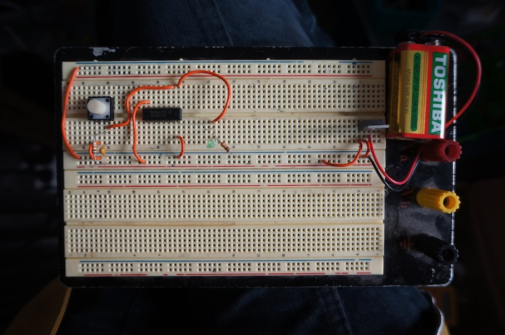
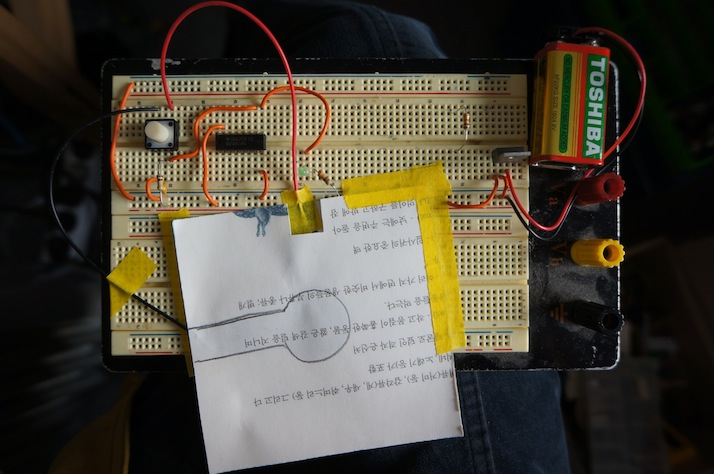
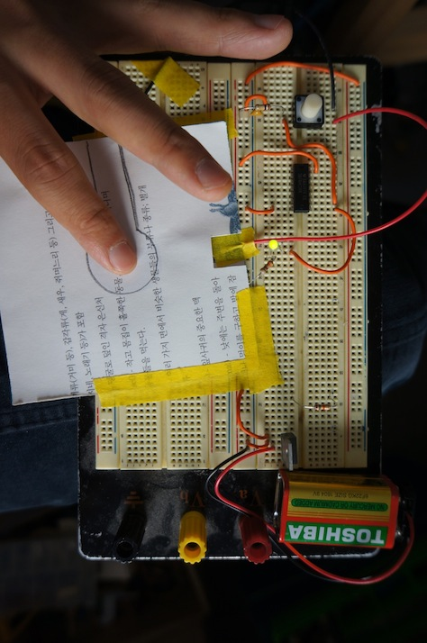
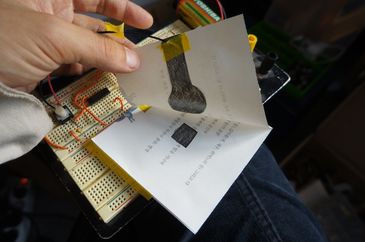
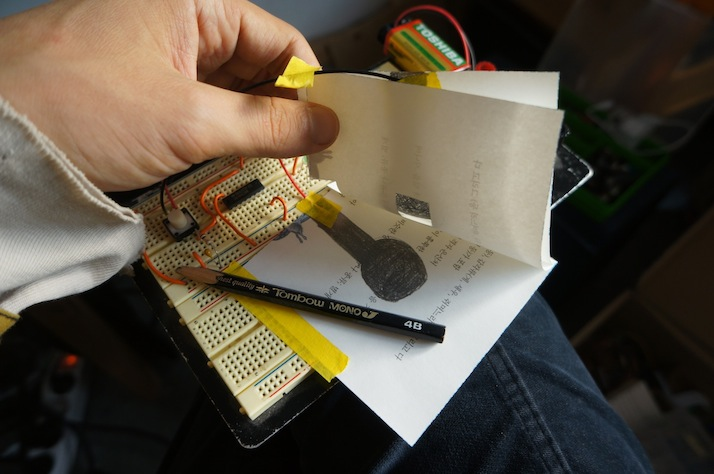

######2014Nov11 03:24:33+0900

전시 아이디어가 필요해..

-

'디자이너가 만들어 주는 새로운 방식에 참여하는 방식'

'디자이너가 더 이상 일반인들을 위해 무언가를 해내는 방식이 아닌 디자이너가 만들어 주는 새로운 방식에 참여하는 방식으로 전환할 기회로 작용'

이렇게 말하고 있는데..

결국.. 디자인 플랫폼을 디자인하는 건가?

-

프린팅과 목공에 대한 얘기가 많이 나오는데.. 여기에 국한하는 문제제기인 건가?

byop의 앱이라던가.. 모듈이란 것들은 해당사항이 없을까? 그게 좀더 플랫폼에 가까운데...

-

종이 회로 책 등을 만드는 것은.. feasible할지 모르는 방향인데..

---

useless / useful things 의 도식.

디자인 계통의 전시이다.

텍스트를 검토한 결과.

잘 인지가 되지 않는 텍스트였다.

일단은, 문제로 집는 지점이 뭔지 불명확하다.

대략 종합한 내용에 따르면,

DIY가 공예가 된다는 건데.. 그러면서, 산업디자인과 경쟁하려고 한다.. 그러면서, 순수한 소비자의 DIY가 .. 판매를 염두하는 DIY가 된다.

그러면서, 거대자본과 경쟁하게 되고, 패배하게 되고.. 이상한 방향으로 방향을 튼다.

예를 들면, 넘쳐나는 비즈 공예들.. 인형 만들기. 등등.. 필요해서 생산하는 것이 아니라. 필요해서 제작하는 것이 아니라.

필요를 떠나서, 사회의 필요를 계산해서 제작하게 된다.

여기 숨어있는 배경이..

개인적으로 필요한 것과. 사회적으로 / 시장에서 필요하다고 여겨지는 것이 나뉘고, 이원화되고, 차별화된다는 것이다.

생계가 우선이 될때 해킹은 빛을 잃는다.

사회적공헌이 될때 까지는 괜찮을지 몰라도..

본연의 재미에 의한 해킹은 더이상 없다.

이런 진행과정을 문제 삼고. DIY제작의 본연의 모습. 70년대.. 조립식 목공들의 태도에 대한 향수를 지시하면서..

현재의 새로운 디자인 개념의 재발견을 도모하는 것이라면..

이와 같은 지점은 내가 보는 시각에서는 시대유감. 시대착오적이다.

내가 지금 판단하고 있는 시각에서는 maker운동에 대한 갤러웨이의 유감이라던가.. 그런 것들 까지도 모두다 긍정적일 뿐이다.

해킹은 useless와 useful의 도식 바깥에 있으며, 애초에 usefulness를 정의하는 것이 시장이라면. 더욱더 그렇다.

개인적인 의미의 useless / useful 도식은 내장하고 있으며, 분명히 어떤 이유가 되었든 간에.. 그것이 없다면. 누구도 해킹을 위한 노력을 하지는 않는다.

그러나 시장에서는 그것이 반드시 역할을 하지 않으며, 넓게 봤을 때, 그 말은 곧 사회적으로도 역할을 하지 않는다는 것이다.

그저 그와 같은 잉여 hacking들을 쌓이고 쌓여서, 나중에 종합되어, 또 어쩌다가, useful한 것도 부수적으로 만들어지는 것일 뿐이다.

그리고 그것을 발굴하는 것은 vectoralist들의 일이고. (뭐 그렇게 단정할 일은 아닐지도 모르지만... 우리에 의해서 발견되기도 하지.)

-

여기서 우리는 어떤 지점을 택할 것인가.

hacking의 배경은 channel에 있다.

'디자이너여, 디자이너가 아닌게 되어라.' 라던가.

'디자이너여, 너도 소비자다.'

'디자이너, 너는 채널일 뿐이다.'

그저 종합하여, 제시하는 것 그게 다 이다.

빅터 빠빠넥의 텍스트에서 제시하듯이..

산업디자이너는 세상에서 가장 먼저 사라져야할 종족이다.

(인용)
```
파파넥의 인간을 위한 디자인 서문 발췌.
```

그저 어떻게 하면, 세상에 덜 해를 끼칠지 노심초사 고민해야 할 것이다.

음. 여기서는 산업디자이너라는 용어를 쓰고 있다..

즉, 군림하는 디자이너. 를 말한다.

생산자인 디자이너.

'디자이너는 생산자다.'

그런 디자이너를 DIY 개인 디자이너라고 말한다면, 그들의 문제는 좁은 세계인식에 있다.

그렇긴한데.. 문제랄까.. 양립적인 것이..

군림하는 디자이너는 공장을 무기로 가지고 있기 때문에, 무한히 폭력적이다.

그들은 자신이 서있는 땅을 항상 의심해야만한다.

자신이 상상할 수 있는 모든 수단과 방법을 동원해서, 공부하고 연구하고, 노력해서.

지구와 인류에 가능한한 해를 끼치지 않을 방법을 고민하고.

현재와 미래와 그 이후의 미래까지도 고민해서, 저울질. 해야 한다.

주제 넘게, 그 작은 머리로, 전 인류를 위해서..

그런 머리털 다 빠지는 고민이 없이, 대충 뭔가를 디자인한다는 것은 빅터 아저씨가 말하는 악한 디자이너인 것이다.

즉,

디자이너는 원죄를 가진 인간들이다.

어떻게 하면 죄를 더이상 짖지 않을까를 고민해야 한다.

-

반면, 채널을 이용한 디자인은.. **AS IS의 면죄부**를 앞세우고 움직인다.

누구도 무기를 갖고 있지 않다. 혹은 모두들 가지고 있다.

**여기서 갖고 있지 않은 무기는 '공장', 대신 갖고 있는 무기는 'copy' 이다.**

복제. 라는 것은 공장을 대체한다.

복제가 가능해야만 기업가와 공장은 사라지게 된다.

물론 vectoralist들은 이미 공장 (유물적)의 단계에서 정보 (비유물적)의 단계로 넘어 갔기 때문에..

그렇게 말해봤자 큰 의미는 없지만,

문제는 open source / 소프트웨어 개발 커뮤니티를 제외하고, 실물세계에서 그것은 아직도 현실화되지 못하고 있고.

vectoralist들도 공장의 처분할 수는 없다.

3d 프린터가 그래서 중요하게 들어오긴하지만.. 이것도 아직 핵심적인 대안으로서 역할을 하기엔 멀었다.

반면, 실제로 공장 단위의 3d 프린팅은 나름대로 강력한 생산력을 가지고 있어서 대안이아니라 공장의 역할을 이미하고 있기도 하다..

-

여튼, 요점은 copy이고.. channel이고 .. community이다. 채널이 주어질 때, 사람들이 모여서, 소비자들이 모여서 생산을 한다.

더이상 소비와 생산의 개념도 흐릿해진다.

소비자들은 채널에 로그인하고, 생산자가 된다.

공동 생산이다.

-

diy 된 물건들은 대략 덕지덕지다.

또는 지나치게 오타쿠적이어서 대부분의 사람들에게 해당사항이 없기도 하다.

하지만, 아무렴 어때, 잉여라는 것은 이미 전제 되어있다.

단지 누군가가 그것을 보고, 이해하고, 자기의 프로젝트에 효과적으로 활용하게 된다.

프라모델에 바르는 에나멜을 엄청 고가의 물질을 들여서 어느 프라모델 오타쿠가 제작해서 특수한 에나멜 페인팅을 했다고 치자.

대부분의 사람들을 혀를 내두르고 말일이지만, 어느날 어떤 다른 해커가 이 물질이 들어간 페인트 제작방법을 찾고 있었는데.. 이 사람의 practice 를 참고해서, 뭔가 매우 유용한 걸 만들어내기도 한다는 것이다.

-

재료 자체가 모듈이 된다.

이런 일이 가능한 이유는 물질이 키가 되기 때문이다.

(인용)
```
(승범씨의 이야기.. MIT smart material)
```
-

instructables 에서 보면, 주간 베스트 였나? 뭔가 뽑아내고 있는 걸 볼 수 있는데..

그 선정 기준은 볼만 할 것이다.

(인용)
```
(instructable 선정기준)
```

주제 자체에 대해서. 이렇다하게 말하고 있지는 않은 것 같다.

단지, 잘 도큐멘트가 되어있는지. 정보가 잘 가공이 되어, 공유되고 있는지를 본다.

즉, 가져다 쓸 수 있는 정보인지 아닌지 그 모범사례들을 추려서 커뮤니티를 재교육하고 있다고 볼 수 있다.

-

-

그래서 암튼.. 채널이.. 키가 된다고, 나는, 보고 있다.

stedlijk에서 모니카가 했다고 하는 참여적인 리플렛 디자인이 있었는데.. 점들이 찍혀있고.. 관람객은 한장을 받아서 점을 잇고..

전시중에 그것을 스캔한다.

(인용)
```
(stedlijk 리플렛)
```

그것들이 모여서 영상이 되는데 어떤 추상적인 애니메이션이 완성된다.

그것이 무엇인지는 중요하지 않을 수도 있다.

단지, 채널이 된다는 것.

그게 강하게 부각되는 것은 아닌지.

-

우리가 할 수 있다고 생각하는 것들은 3가지가 있는데.

paper circuit을 이용한 책.

초 만드는 기구.

BYOP.

그들은 결국 어떤 플랫폼을 원하는 것 같아서..BYOP가 가장 플랫폼에 가깝다고 봤다.

-

플랫폼이 아니라.

채널이 되려면. 엄청 쉬워야 한다.

종이에 선을 긋는 것 같이.. 누구나 쉽게 참여하거나 첨언할 수 있어야한다.

인터넷 기사에 댓글달 때는 그렇게 목소리 큰 사람들이, 다 어디갔는걸까?

제작은 그렇게 쉽지만은 않다.

그래 그건 알겠는데... 여튼 그 스피릿이 이 동네에서도 살아 움직일 수 있는지를 보고 싶다.

단순히.. 그냥 그게 보고 싶다. 그걸 보기만 해도 좋을 것 같고 감동적일 것 같고.

그것이 대안일 수도 있을 것 같고 그렇다.

-

뭔가 되게 쉬운거..

그러면서 디자인을 하는 거.

git처럼 blame도 하고. commit도 하는데..

뭔가 3d 프린터reprap의 계보도에서 멘델 계열이 공동체에 의해서 선택되고 더 심화 개발되어 나간 것 처럼..

(인용)
```
(reprap계보도)
```

공장주와 시장의 선택이 아니라. 소비자가 생산자로서 선택하는 것.

그게 diy의 최고의 매력이 아닐까.

소비자(편의상.. 이렇게 부르고 있다. 사실은 이렇게 되면 더이상 소비자가 아니다.)가 공동체적으로 원하는 것을 선택한다.

산업디자이너와 공장은 함께 끈으로 묶어서 난지도에 처박아 버리면된다.

소비자들은 재료를 가져다가.. 스스로 생산자가 되고.. 생산 방법은 채널을 통해 검증되고. 공동체적으로 선택된다.

진화론적 선택이 가장 효율적이라고 하지만, 이런 취사선택의 문제에다가 실패하면 죽으라고 할 만큼.. 인간의 목숨이 가벼운 것은 아니기 때문에..

조금 느려도, 공동체적인 움직임을 원한다.

그러기 위해선, 지속적으로 공동체가 살아있어야 한다. 시간이 걸리는 일이기 때문에.. 말이다.

여튼, 영글어서, 완성에 가까운 open source 프로젝트들 mature 프로젝트들을 보면, 숭고하다.

(인용)
```
(mature open source proj. 예시.)
```
-

이렇게 되면, 채널을 통해서 선택되고, 자가 생산 검증되면.. 즉, 디자인 파트까지도 개인의 몫으로 되지면..

파파넥이 우려하는 문제.. 공장의 군림하는 산업디자이너가 죄를 지을 일도 없어진다.

각자는 필요한 것을 만든다. 공동체는 필요에 따라서 판단한다.

공장이 생겨서 누군가가 피해를 보고 사는 터전을 빼앗기고 자리를 옮겨야 하고.. 이사를 가야하고...

그런 뒷수습이 가장 빠르로 민감하게 수정된다. 바로 그들 자신에 의해서 말이다.

물론, 공동체가 책임을 져야 할 일이다.

공동체들간의 이익이 충돌 할 수도 있다.

재료로 나무를 너무 많이 써서 지구가, 산이 황폐해진다고 하면.. 공동체들은 판단할 수 있다..

물론, 다른 형태의 우기는 공동체도 나올 수 있을 것 같다. (아마, 지금까지는 이런 공동체적 해킹/diy가 많이 있는 사례가 아니어서 대부분이 좋은 취지와 윤리의식을 가지고 있는 것 같다. 그러나, 이런 것도 보편화되면.. 그런 정의감/영웅심이 사그라들어 더이상 기능하지 않게 되어. 독불장군적인 공동체도 나올 수 가 있을 것이다. 그것들은.. 이들이 자본으로 묶이기 때문일 것이다 어떤 이윤상의 문제 때문에.. 환경단체의 나무 사용자재 요구를 거부하는 것이다. 그러나 이런 결속은 기존의 공장주의 단독적인 판단에 의한 것에 비해서는 많이 약할 것이고, 개인개인이 판단하면 장기적으로 수정되게 될 수 밖에 없다.. 즉, **보편타당의 칸트**가 작용할 여지가 많이 열린다. **공론장**에서.. 댓글에서.. 동일한 개인/개인으로 바라보는 그 순간. 공통감을 발휘하게 되면, 공동체는 움직인다.)

(인용)
```
칸트의 보편타당.
```

그러고 보면.. 한국 사회의 댓글들은 다 왜 그모양일까.. 기자 / 독자 라는 구도가 있어서 그런 것 같다.
그런 상황 앞에서 쉽게 자신의 진지함을 휴지처럼 버려버리고, 일갈 농담을 날리고, 떠나 버린다... 좋지 않은 일이다. 미성숙하다. 어떻게 보아도 미성숙하기 그지 없다.. 사실, 우리나라 뿐 아니라, 어느 나라 사람들도 (예, 미국사람들) 기사에 대한 댓글에서 그런 양상이 없는 것은 아니다..

그러나, 오픈 소스 사회에서는 그런 것은 바로 쫒겨난다. 누구도 동조해주지 않는다. 유치하기 때문이다. 진지한다. 그들은. 또 나는.

(인용)
```
stackoverflow 운영 원칙.. 등등
```
-

아 얘기를 그냥 쏟아내고 있는데.. 어디로 더 가봐야 할까.

-

그래서 세가기를 얘기했었는데... 한가지 더 생각하게 된것이..

예전에 구리 테이프 등을 바닥에 천장에 놓고.. 전시했던 독일 얘들.. ofx였던가..머 아닌 것 같은데 그런 얘들 있었다.

그런 걸 따라한담에.. 사람들이 맨발로 올라서서 소리를 변형하거나.. 등등.

그런다음 맘에 드는 소리를 찾으면 그곳에 표시를 한다.

칠판/블랙보드로 되어있어서 분필이나 팬으로 표시할 수 있다. 설명도 적고..

그렇게 해서 보드가 콜라보레이션의 장이 되고.. 공론장이 된다.

그런 컨셉도 생각했다 어제 밤에..

-

######2014Nov11 11:38:33+0900

원정이가 '바닥에 서킷 그리는 도구 만들면 어떨까?' 이렇게 생각했다고 한다..

음 어떨까..

왜 그렇게 생각했을지 생각해봐야 한다.

-

as is의 면죄부에 대해서 얘기해야 할까. 아니면, copy에 대해서 얘기해야 할까..

아님 공론장 / 채널에 대해서 얘기해야 할까.

.. 일단 인용문들을 찾아서 넣어보자..

-

######2014Nov11 12:14:37+0900

먼저 파파넥이다.

"시각적, 물리적 그리고 화학적으로 잘못되어 가고 있는 환경 속에서 건축가, 산업디자이너, 기획자 등이 인류를 위해 취할 수 있는 가장 간단한 최선의 행동은 전적으로 **그들의 작업을 중단하는 일**이다. 어떠한 오염이든 최소한 일부분이라도 디자이너들은 관련되어 있다. 그러나 이 책에서 나는 좀더 긍정적인 시각을 취했다. 내가 보기에 우리는 작업을 중단하기보다는 적극적으로 작업을 계속해야 한다. 디자인은 젊은이들이 사회를 변화시키는 데 참여하는 한 방식이 될 수 있고 또한 그렇게 되어야만 한다.
사회적으로 또한 도덕적으로 깊이 관련된 디자이너로서, 시계 바늘이 끊임없이 12시1분전을 가리키고 있는 동안 우리는 궁지에 몰린 세계의 요구에 본격적으로 응해야 한다."

여기서도 파파넥은 **젊은이들의 참여의 한 방식**으로 디자인의 입지를 제시한다. 이것이 diy를 말하는 것일까? 실제로 파파넥이 서문에서 예로 들고 있는 커피 테이블 작업은 특허를 거쳐서 public knowledge가 되었고, 지금도 그것은 'Furniture you can build'라는 diy 잡지에 실리고 있다고 한다.

-

그가, 특허를 그래서 좋다고 하는 것은 아니다. 특허에는 반대하는 입장이다. 파파넥은..

---

######2014Nov15 15:04:19+0900

음.. 일단..

funnykit에서 부터 시작된, voice record / playback 키트와 그 칩에 대한 조사와..

ISD계열 칩들의 현황 조사랑.. 가격조사한 링크들을 죄다 여다가 쏟아보자.

<http://www.funnykit.co.kr/shop/goods/goods_list.php?&category=027002002>
<http://www.funnykit.co.kr/shop/goods/goods_view.php?goodsno=14291&category=027002002>
<http://www.funnykit.co.kr/shop/goods/goods_view.php?goodsno=19664&category=027002002>
<http://www.funnykit.co.kr/shop/goods/goods_view.php?goodsno=20441&category=027002002>
<http://www.funnykit.co.kr/shop/goods/goods_view.php?goodsno=13771&category=027002002>
<http://www.dreamkit.co.kr/front/php/product.php?product_no=480&main_cate_no=26&display_group=2>
<http://www.funnykit.co.kr/shop/goods/goods_view.php?goodsno=18681&category=027002002>

여기까지.. 기본 라인업을 체크해봤는데.. 좀더 자료를 얻어볼려고 했더니.. 외국계 키트의 수입이란걸 알게됐다.
VELLEMAN KIT - MK195

<http://cpc.farnell.com/velleman-kit/mk195/kit-voice-recorder-playback/dp/HK01191>
<http://www.farnell.com/datasheets/1728759.pdf>

이쯤 되면, 이건 이들만의 보드가 아닌것이다.. 엘레파츠에 보니..

<http://eleparts.co.kr/front/productlist_morning.php?code=022002007000&listnum=&sort=&block=&gotopage=>
<http://eleparts.co.kr/EPXDJ8N3>

이런식으로.. 많은 것들이 등록되어있기도 하다..

그렇다면 칩을 구하면 해결되는 걸까? 예전과는 달리.. 커스텀 껌딱지 칩이 아니라.. 패키징이 공개되어있었다.. (이런 회사들은 일부러 껌딱지로도 판매하는 것 같더라.. die단위로도 판매하는 옵션이있었음.. 즉 그 때도 아마 같은 칩이였을 거 같다..)

그러다가,
아두이노 쉴드가 나왔다.!

<http://www.open-electronics.org/a-voice-shield-for-arduino-give-voice-to-your-ideas/>
이건 왜 찾아진건지 모르겠지만.. audio decoder가 들어있는 music shield란 것도 나왔다..
<http://www.seeedstudio.com/wiki/Music_Shield_V2.0>

여기 사용된 정확한 칩은, ISD1790PY 라는데..
ISD1700 계열인데..
이쪽 계열 칩은 SOIC여서.. 사용이 매우 핸디하다.
(클래스 D 앰프가 내장되어있다.. 이게 쓸만한진 몰라도.. 뭐.. 나름 오케이 콤비 세트 메뉴..)

<http://www2.nuvoton.com/SiteCollectionDocuments/enu/ProductAndSales/ProductLines/ConsumerLogicIC/ISD%20ChipCorder/ISD1700.pdf>

-

가격도 나쁘지 않다... 7천원 ~ 12천원..
<https://www.eleparts.co.kr/front/productlist_morning.php?code=001006019000&listnum=&sort=&block=&gotopage=>

젤 싼게.. 요건데.. <https://www.eleparts.co.kr/EPX36A3J>
ISD1610BSY - 10초 1개 사운드. / 저장되고..
<http://www.nuvoton.com/resource-files/EN_ISD1600B_Datasheet_Rev-1.22.pdf>

17 계열은 여러개의 사운드인데.. 시간은 똑같다. 즉, 시간을 쪼개 쓸수 있는 기능이 있다는 것이지.
1790은 17계열 90초 저장가능한 건데.. 요게 12천원가량된다.
<https://www.eleparts.co.kr/EPX36A3L> : 1740

-

이정도고.. 이제 앞으로는.. 아까 그 쉴드 디자인이랑 데타시트 디자인 참고해서, 하나 만들고.. (주문하면 4-6일 이기 때문에 빨리 진행해야 한다.)
제작 & 테스트..
그리고, 앞에.. 정전센서 방식이나.. 저항식 방식. 스위치 방식별로.. 입력 회로부분을 설계/테스트 해야 한다.

######2014Nov15 19:09:15+0900

모듈에 대한 디자인은 크게 2가지인 것 같다.

* 첫째로, 보이스 레코딩 & 플레잉 칩 (이것은 앰프와 마이크를 포함한다) / 전원부 설계도 되어야 한다. 각 스위치를 어떻게 작동시킬지도.. 관심가져야 한다.
* 둘째는, 이를 바탕으로, 플레이 스타트 & 플레이 스탑 (혹은 파우즈)를 어떻게 작동할지. 그에 따라서, 3가지 방향 중에서, 가장 쉽다고 생각되는... 스위칭 / 저항식 / 정전식 중에서 가장 쉽다고 생각되는, 스위칭 식의 경우에 어떻게 인터페이스를 할지.. 뽑고.
* 셋째는, 저항식의 경우
* 넷째는, 정전식의 경우를 각각 해본다.

이중 마지막 넷째 경우에 대해서, 가지고 있는 칩으로 테스트 회로를 구성해본다.

-

후니다님과의 대화중 일부.. (내가 찾은 링크들 중심으로..)

이거였군여.. <http://store.qkits.com/moreinfo.cfm/QK188.pdf>
아마도 참고하셨던 회로가...
9:28pm
아맞다맞다.. ㅌㅌ
가물,..
9:28pm
이것저것 찾아보는데, 사용하신 회로와 일치하는건 이게 유일해서... 그냥 반가와서여..
흐흐.
...
<http://media.digikey.com/pdf/Data%20Sheets/Nuvoton%20PDFs/ISD-COB1700.pdf>
media.digikey.com
media.digikey.com
9:51pm
이게 그 쪽에서 만든 개발보드인데..
이걸가지고.. 어떤친구가.. line-in을 해봤다는데..
<http://users.rcn.com/ted.johnson/isd.htm>
이런식으로 했나봐여.. 별로 믿음직스럽진 않긴하지만... 이렇게 간단하게 하면 어떤지 궁금...
별다른 얘긴 없더라구여. 내용은 다른 얘기들이고...
...
10:06pm
이친구는 linein을 마이크로 받고 있던데.. 쓰는 회로는 비슷하네여..
<http://wiki.edwindertien.nl/doku.php?id=modules:isd5116>
<http://wiki.edwindertien.nl/lib/exe/detail.php?id=modules%3Aisd5116&media=modules:isd5116circuit.jpg>
그냥 정리 삼아서 주요내용 메세지로 찍어놓고 있습니다..
...
<http://www.nuvoton.com/hq/products/isd-voice-ics/isd-chipcorder-family/User-Guide/?__locale=en&resourcePage=Y&category=&pageIndex=3>
여기서 누르면 바로 다운이 되더라구여..
유저가이드..
10:12pm
...
10:15pm
<http://read.pudn.com/downloads112/doc/project/467932/apin12-eng.pdf>
아 네 역시 .. / 이것도 뭔가 설계 가이드라는데..
여기서 뭔가 전체적으로 설명해주는데..
...
아까 <http://wiki.edwindertien.nl/lib/exe/detail.php?id=modules%3Aisd5116&media=modules:isd5116circuit.jpg>
네.. 뭐.. 그냥 아이디어니깐여..
10:20pm
어 그러네
이놈은 그래했네
10:20pm
...
11:07pm
아 참 그리고.. 아까 여기서.. <http://www.open-electronics.org/a-voice-shield-for-arduino-give-voice-to-your-ideas/>
<http://www.open-electronics.org/wp-content/uploads/2013/01/ISD_Programmer.jpg>
요런걸 봤는데... 녹음을 안하고.. 웨이브 파일 같은거를.. 바로 칩에 업로드 하는 방법도 있더라구여.
이렇게 하면 음질은 일단 보장될 수도 있고... 라이브 퍼포먼스의 경우라면야.. 얘기는 다르지만.
11:13pm

---

######2014Nov15 23:29:13+0900

모듈에 대한 디자인은 크게 2가지인 것 같다.

* 첫째로, 보이스 레코딩 & 플레잉 칩 (이것은 앰프와 마이크를 포함한다) / 전원부 설계도 되어야 한다. 각 스위치를 어떻게 작동시킬지도.. 관심가져야 한다.
* 둘째는, 이를 바탕으로, 플레이 스타트 & 플레이 스탑 (혹은 파우즈)를 어떻게 작동할지. 그에 따라서, 3가지 방향 중에서, 가장 쉽다고 생각되는... 스위칭 / 저항식 / 정전식 중에서 가장 쉽다고 생각되는, 스위칭 식의 경우에 어떻게 인터페이스를 할지.. 뽑고.
* 셋째는, 저항식의 경우
* 넷째는, 정전식의 경우를 각각 해본다.

이중 마지막 넷째 경우에 대해서, 가지고 있는 칩으로 테스트 회로를 구성해본다.

-

음.. 670mA까지 출력 나온다고 한다.
class D amp 말이다.


캡은 다 필름 캡을 써야 한다.
그라운드 설계는 주어진 자료를 잘 보고 해야한다. 뭔가 요상하다.
<http://www.cyrom.org/datasheets/apin11.pdf>
<http://read.pudn.com/downloads112/doc/project/467932/apin12-eng.pdf>
뭔가 아날로그 오디오 회로를 카파 없이 처리하고, 노이지한 부분들을 카파로 감싸는 식으로 한거 같은데.. 제대로 한번 해봐야 할듯하다.
동희씨나 후**님 도움이 필요하다..

---

음.. 일단 voice shield의 라이브러리 코드를 봤다.. 여러가지 가능한 것 같다.
플레이 / 스톰 자유자재로 가능 할 것 같다.

버튼으로는 어떻게 되는지 보자.

-

```
8.2.2 Playback Operation
Two playback modes can be executed by PLAY , which is internally debounced.

a) Edge-trigger mode: Pulsing PLAY Low once initiates a playback operation of the current 
message. Playback automatically stops at the end of the message. Pulsing PLAY again 
will re-play the message. During playback, the LED flashes and goes Off when the 
playback completes. Pulsing PLAY to Low again during playback stops the playback 
operation. Under these circumstances, the playback pointer remains at the start of the 
played message after the operation is completed.

b) Looping Playback mode: As PLAY is held Low constantly, the device plays all messages
sequentially from the current message to its previous message and loops the playback 
action. During the entire playback process, the LED flashes non-stop. Meanwhile, the 
looping playback mechanism is implemented in the following sequence: start playback from 
current message; as playback is over, perform a forward operation; start playback of new 
message; once playback completes, perform another forward action; start playback of new 
message, …..and so on. This looping pattern continues until PLAY is released. As PLAY
is released, device will continue to playback the current message until completion. When 
playback stops, the playback pointer is set at the start of the halted message.
If no SE1 and SE2 are programmed, after playing a message, except the last one, device 
flashes LED once with blinking period TLS1 due to forward action. As after the last message, 
device flashes LED twice with blinking period TLS2. 
If both SE1 and SE2 are programmed, after playing a message, except the last one, device 
plays SE1 and flashes LED simultaneously due to forward action. Then device keeps on 
the playback of new message. Alternatively, after playing the last message, device plays 
SE2 and flashes LED simultaneously due to forward action. Then device maintains the
playback of the first message. The LED blinking period of SE1 and SE2 are determined by 
the recorded durations of SE1 and SE2, respectively.
Triggering PLAY during a record, erase, or forward operation is an illegal operation and will be 
ignored.

```

음. 그러니까.. 한번 눌렀다가 떼면..
플레이가 시작되고. 플레이중에 다시 누르면, 멈추고. 그 상태로 다시 누르면, 다시 처음부터 플레이가 된다.
오래 누르고 있으면, 누르고 있는 동안 계속해서 플레이가 된다. 다음다음 메세지로 진행.. 띄고나면, 그 순간 플레이중인거 까지 플레이.

-

이렇다는데...
두가지 방향중에 하나를 골라야 한다..

-

spi로 제어할 건지.. 아니면.. 버튼으로 할 건지..
atmega328p는 3-4천원정도이다. 크리스탈만 달면 쓸 수 있을 테니까..
레귤레이터 회로 약간 달아주고..
그러면.. 쓸수는 있겠지.. 다운로드용으로 ftdi 케이블 하나 사고..
그럼 된다..

-

일단, 스위치식으로 하는 경우에는...
play 핀을 로우로 하면 된다. 즉, 슈미트 트리거가 있어야 할 것이고...
무빙에버리지가 필요한데.. 이게 ... 음..
어떨지 모르겠네..
이걸 칩으로 구현하려면.. 기본적인 스위치는 쉽게 할 수가 있는데..
지금 처럼.. 스위치 회로가 종이회로인 경우에는.. 저항도 크고.. 좀 알 수 없는 요소가 나올 것 같아서..
음..

-

그렇긴한데.. 어차피.. 지금도 arduino의 디지털 입력을 그대로 쓰고 있기 때문에 기본적인 ttl 포트 입력을 쓰면 되지 않을까.
즉, 특별한 칩이 없어도 된다. 걍 ttl로 하면 됨.
--> 요거, 종이회로 + rc charging(for debouncing) + ttl(schmitt trigger)로 엘이디 켜고 끄는 걸로 테스트 해볼것.

-

저항식의 경우에는...
역시 마찬가지로...
풀업이 22megohm이나 되겠지만..
음.. 여기에는.. moving average가 들어가는 걸로 알고 있다.
마키마키.
그렇지만, 역시 디지털 리드로만 하고 있고.. 0 / 1 두개의 값사이에서 무빙에버리지를 하는 거라고 보면 된다.
뭐 횟수의 차이인 거지.
문제는 요 간단해 보이는 무빙에버리지를 어떻게 회로로 구현하느냐인데..
결국은.. 커패시터 충방전회로를 이용하면되는 것이다..
기본적인 디바운스 회로의 구성을 따른다.
rc로 하는게 제일 좋을 것 같다.
이전에 잭 스위치를 작업했던 자료를 참고해보는게 좋겠다.
즉, 적당한 rc 조합으로 무빙에버리지를 할 수 있다.
그건 그렇고...
쓰레시홀드에 히스테리시스가 필요한데..
여기엔 컴패레터가 들어가야해.. 오피앰프?
아니면... 슈미트 트리거를 또 쓰면되는데... 요거 레벨을 조정할 수 있어야할 것 같다..
즉, 지금까지 구성은..
종이회로 + rc charging + ttl(schmitt trigger) 요런식...
근데..r은 조절이 쉬운데.. c는 조절이 어려운 상황에서. 얻을 수 있는 rc가 제약이 있을 것이고..
r을 맘대로 조절하면.. 그것도 문제다.. 회로가 저항이 높아서... 어떨지......
하여튼, 1번 경우랑 비슷하긴 한데.. 해봐야 느낌 올거 같다.

종이회로 + rc charging(for debouncing/moving average) + ttl(schmitt trigger)

-

정전식 1layer의 경우는.. 음 같은건데..
c가 하나 있고...
555타이머가 웨이브를 쏴주고.
이걸 넣어서.. 충방전을 잰다는 거지..

종이회로 + 555timer + rc charging(for debouncing/moving average) + ttl(schmitt trigger)

-

쩝.. 만약에.. 아트메가를 쓰면. 뭔가 편해지려나?
과정들이 소프트웨어가 될 수는 있겠지만..
그만큼 더 복잡해 지는 걸 수도 있지..
무빙에버리지 등의 경우에.. 디지탈 무빙에버리지랑 rc는 그 질이 좀 다를 것이다..
잘되면 대박이지만, 잘 안되면, 아날로그 회로의 미궁에 빠지게 되기 쉽다..
쩝. 그러니... 얼른 해보고, 되는데까지 해보는게 좋겠다.

######2014Nov16 01:36:51+0900

-

오케이.. 일단 디바운스회로를 다시 찾아보자..

잭의 에버노트로 고고.

<http://www.icecap.se/Freebies_uk.html>

요게 전에 참고 했던 그 회로이다.. 이중에


요거..

일단, 디바운싱 메카니즘에 대해서 명확하게 이해해야 하는데, 이거에 시간좀 걸렸다.

결국, tau에 대한 이야기인데.. rc circuit의.. rc network의 특성..

<http://en.wikipedia.org/wiki/RC_circuit>
natural respose란 부분 참고..
그냥 커패시터가 charge되는데.. 저항을 통해서 차지되는 과정의 특성이다.
저항이 크면 전류양이 작아지고, 캡이크면, 전류양이 같을 때, 전압 상승이 느려진다.
고로, 둘다 크면 오래걸린다.
여튼, 요점은 전압. 이 아니고, '전류', 철저히, 전류관점에서 이해해야 한다.
그리고, 캡은, 일종의 순간적인 배터리라고 생각하면, 어렵지 않게 이해가 된다.

<http://www.all-electric.com/schematic/debounce.htm>
요 링크에서 보면, 여러가지 ttl과 cmos의 특수상황을 비롯해서.. 다양한 내용이 깊이있게 설명이 되어있다.
내가 보기엔 그래프가 잘못된 것 같은데.. 스위치를 누르면 바로 숏트가 되서 이론적으로는 ideal step이 나와야 하는데, 그림에선 그렇게 표현이 안되어있다.
계속 자신을 믿지 못하고 다른 레퍼런스를 찾다가 대략 다음 링크 정도에서 포기하고, 그냥 자신을 믿어보기로 했다.

<http://blog.mark-stevens.co.uk/2014/02/clocks-reset-signals-switch-debouncing/>
여기 보면, 스위치에 저항이 함께 들어있는 경우를 보여주면서, reset회로에서는 아예 저항조차 없어서..
그래프가 얼마나 스텝에 가깝게 올라서는지에 대한 관찰을 이야기해주는데..
뭐 이런식으로 실험적으로 내 생각을 확인하면 될 것 같고, 일단은 이 글을 기준으로 내 생각이 맞다. 즉, 저항이 없는 스위치에 의한 커패시터의 아이디얼 방전은 0초만에 이뤄진다고 이해하도록 한다. 물론 실제 상황에서는 저항이 0인 경우가 없으므로, 일반적으로 저항이 있는 상태로 이해하는 것이 옳을 것이다.


위에 두가지 혹은 세가지의 debouncing 구성들이 나와있는데.. 지금의 종이 피아노의 구성이나 makey makey의 구성. 즉, 풀업으로 잡아주고, 스위치 ON 시 그라운드가 되거나.. 인체를 통해서 virtual GND되는 형태로 봤을때, 맞는 회로의 모양은
마지막 이미지에 가깝다.
여기서 실제로, 종이회로에 상당한 저항이 있는 것을 고려하면,
구현은 마지막 그림처럼하더라고, 효과적으로는 스위치 옆에 저항이 하나 수k 가 있다고 보면 된다.
즉, 순간적인 charging 은 이뤄지지 않을 가능성이 높다..

-

충전하는 capacitor의 크기는 조절하기가 어려운 편이기 때문에..
중간중간 연결하는 저항들을 조절해서 맞춰나가야 할 가능성이 높다.

-

커패시터들이 기본적으로 moving average 기능을 한다고 봐야 하고, 그렇게 되도록 만들어야 하고, 그렇게 만들 수 있다고 가정한다면.. 어렵지 않게 구현될 수 있다고 예상해볼 수 있다.

---

1 layer 정전식 구현 예이다.

<http://www.seekic.com/circuit_diagram/Control_Circuit/Touch_Sensor_Switch_Circuit_with_555_timer.html>

요거 괜찮을 꺼 같기도 하다. 해보자.. 이건 웨이브폼을 안쓰고 그냥 한다..

저항이랑 / 캡을 조절해서, 다시 스위치가 available 해지는 시간을 정할 수 가 있다.

뒷부분의 다이오드들은 무시해도 될거 같다. 어차피 3번 output핀은 high/low를 왔다갔다 하게 되어있으니까.

그냥 tr하나 물려서 스위칭 하면 된다.

너무 빠르면, 계속 해서 바운스 할 껀데 이때는 일반적인 디바운스 회로를 쓰면된다.

그나저나, 이렇게 한다고 해도.. 감도를 조절할 수가 없다는 문제는 어떡해야 하나..

감도가 너무 높으면 어떻게 하지? 중간에 저항을 하나 삽입하면 되는 걸수도..

감도가 너무 낮으면? 잘 안되면? 터치가...

그럴일이 없을꺼라고 예상은 되지만.. 회로가 5k도 안된다면.. comparator인 opamp의 인풋임피던스는 수 메가 옴이 될 거니까..

모를일이다.. 경험이 많이 없어서..

그렇게 되면 문제지.

555timer의 이해. : <http://www.electronics-tutorials.ws/waveforms/555_timer.html>

ps. 인스트럭터블즈에나오는 bare conductive를 활용하는 예시에서도 보면 비슷하게 하고 있는 걸 볼 수 있는데..

<http://www.instructables.com/id/Making-a-Touch-Sensitive-OnOff-Circuit-with-Bare-/?ALLSTEPS>

3M 옴을 풀업으로 달았다는 점.. charging 회로가 없어서, off 또한, 별도의 스위치로 해야 한다는 점 등이 좀 다르긴한데..

작동 과정은 비슷하다. 적어도 초기에 셋되는 과정은 동일. 일종의 검증된 예시라고 보면 되겠다.

pps. 이 사람 튜토리얼 꽤 볼만하다.. 555의 astable 모드에대해선 설명한다더니만 아무리 따라가봐도 없다.. 그건 좀 별로...
<http://www.electronics-tutorials.ws/waveforms/generators.html>
schmitt 트리거 만으로. 웨이브를 만드는 이건 좀 볼만.

astable 555 에 대한 설명은 대충.. 요거 참고.
555 Timer as Astable Multivibrator
<http://www.electronicshub.org/understanding-555-timer/>

ppps. 좀 복잡하긴 한데 요것도 아이디어가 좀 참고 되는 거 중 하나..
<http://www.electroniccircuitsdesign.com/555-timer-circuits/capacitive-touch-sensor-using-555-timer-circuit.html>
몬가 실제적이다..

######2014Nov16 04:30:05+0900

---

######2014Nov16 15:12:21+0900

오케이.. 스위치 식은 문제 없이 통과고..

지금 영상 비메오에 올려놓고 기다리고 있음.











<iframe src="//player.vimeo.com/video/111962292?title=0&amp;byline=0&amp;portrait=0" width="500" height="281" frameborder="0" webkitallowfullscreen mozallowfullscreen allowfullscreen></iframe>

첨에 기본회로에선 10k 였는데, 이걸로는 스위칭이 안되서, 100k로 바꿔서 됐으니까.. 이부분이 pot이 되야 한다고 볼수도 있겠다.

(캡은 104)

즉, 튜닝 포인트. / 캘리브레이션 포인트.

---

두번째는.. 저항식인데.... 선을 2개 쓰는 거다.

그라운드를 손으로 잡고. 인체 전류를 이용하는 건데.

(그라운드를 안잡으면 안되는 걸까? 암튼..)

-

풀업에 20메가 옴을 써야 했고.. 반응 시간이 느려서.. 캡을 223으로 바꿨고.
그라운드를 피부 중에서, 전기가 잘 흐르는 쪽에 단단하게 붙여야 했다.

여튼, 0.2-0.3 초 정도.. 딜레이 감은 있지만, 작동은 그럭저럭 됐다.

(사진도 있다. 넣어라.)

<iframe src="//player.vimeo.com/video/111962946?title=0&amp;byline=0&amp;portrait=0" width="500" height="281" frameborder="0" webkitallowfullscreen mozallowfullscreen allowfullscreen></iframe>

어렵지 않게 통과.

ps. 아마.. 223도 너무 큰거 아닌가 싶다.. 0.2-3 초 딜레이는 그냥.. 일반스위치로 해도 있는 딜레이어서.. 단순히 캡을 더 낮추면 어떨까 싶다.
느낌상 103이 적당한거 같다.
--> 헉, 젠장 103으로 하니까 완전 딱 좋다...

튜닝 포인트가 있을까 이것도? ..뭐.. 20메가 옴부분이 아닐까 결국.. 캡은.. 튜닝하기가.. 어렵다.. 굳이 하려면. 로터리 텔레비젼 스위치로 해야지... 몇가지 값을 정해놓고 트드득 돌리면서...

---

마지막은 그라운드 없이 그냥 정전식..
555타이머.. 그 안에 들어있는 comparator를 이용한다고 봐야 할 거 같은데 여튼.. 해보자.

bare conductive 에서 내놓은 회로 (instructables에 있는거..) 또는.. 하여튼 원래 할려고 했던 회로는..
그라운드를 다른 한손으로 잡거나하지 않으면 제대로 작동이 안된다..

대신, 마지막의 회로 (좀 복잡했던거.)는.. 회로가 정확하게 이해가 되진 않고 있지만, 대략.. pwm같은 회로를 만들어내는 것 같은데..
어느정도 아날로그 느낌으로 엘이디 밝기가 약간씩 변하는 걸 보여준다.
이게 좀더 promising 하다.

그나저나.. 이걸 계속해서 3단 필터링해서... dc로 만들던지.. dc로 settle시킨후에, peak를 감지하던지 (회로의 설명에선 이런 방식이라고 하고 있음.).. 하면되는데.. 뭔가 좀 더이상 진행이 안되네.. 기분 탓으로.. 아니면, 뭔가 딴 생각이 날것 같은건지..

그리고, 시간이 지나면, 변화양상이 달라지는 것 같기도 하다..
첨엔 좀더 확실하게 밝기가 변했던거 같은데, 계속 켜놓으니까.. 차이가 덜 나는 먹먹한 상태가 되는 것도 같다..
정확한 이해도 필요하고... 뭔가.. 그렇다.

-

여튼, 리플레쉬가 필요한것 같으다..

아, 그리고, 뭔가 기존의 웨이브 인젝션 방식이랑 비교해서, 이 방식을 검토해봐야 할 것 같다.. 좀 더 좋게 만들어지거나, 이해하기 쉽게 되어야 할 것 같다!!

######2014Nov16 21:57:23+0900

기존의 웨이브 인젝션 방식은.

그러니까.. 소프트웨어적인 요소가 들어있다.

먼저 특정 주파수의 구형파를 만들어낸다. 뭐 여러가지 방법으로 만든다. 그냥 찍어내는 수도 있고.. 하이로우를 보면서, 만들어내는 수도 있다.

여튼, 만들어 내고.. 그걸 커패시터에다가 준다.

그러면, 커패시터가 채워졌다가 빠졌다가 하는데, 그에 따라서, 디지털로 읽어서, 하이나 로우가 읽히는 시간의 차이를 본다.

여기서 두가지가 있는데,

하나는, capacitivetouchsense라이브러리에 있는 방법이고, 두번째는 wiretouch에서 구현하고 있는.. pwm을 기본으로 하는 방법이다.

첫째 경우엔 정전류의 소스/싱크의 반복으로.. 터치를 통해서 인체가 전류를 소스/싱크하는 것을 이용해서 캡이 작아지는 효과가 나는데, 이걸 시간차로 감지해내는 경우이고,

둘째는 pwm으로 일정 웨이브를 주고, 이를 이용해서 인체의 커패시턴스를 전압레벨로 측정해내는 방법이다. 여기서는 시간차는 의미가 없다. 항상 일정하다. 변하는 것은 결과적으로 읽히는 전압레벨이다.

지금 구현된 555를 이용한 캡터치는.. 두번째 경우에 더 가까울 수도 있다..

-

일단, 한단계씩 과정을 이해해보자..

######2014Nov16 23:04:19+0900

음. 일단 이건, astable 모드의 전형적인 구성이다. 0-(C)-2-6-저항1-7-저항2-V+
2번 트리거와 6번 쓰레시홀드가 함께 묶여있기 때문에, 비교 전압은 단일화되어서, 1/3 ~ 2/3 vcc를 주기적으로 왔다갔다하는데.
저항1+저항2를 통해서 C가 차지가 되고, 저항2를 통해서 C가 방전이 되므로.. 일종의 duty cycle을 가진다.
그러나, duty cycle자체는 C에 영향을 받지 않게 되어있다. 이론적으로는..

그런데, 이회로는 특이한 점이 첫째로, C가 없다. 즉, 터치가 없을 때는, 공기 캡을 측정하고, 터치가 있으면 휴먼바디를 측정하게 되어있다.
C가 없으면 어떻게 될까? 그냥 충전할 일도 없어지는 건가?

둘째는, 이론적으로는 C의 영향이 없어야 하는데, 터치를 하면 전압이 내려가는 걸 볼 수 있다. 10mV @ 5V vcc 정도의 미약한 정도이지만, 반복적이고 상당히 믿을만하게 일어나는 현상인데.. 이 원인이 뭘까?

-

첫째에 대해서 살펴보자.
C가 없다는 건 어떻게 될까?
충전할 것도 없고 방전할 것도 없다?
물론 공기가 있으니까, 일종의 미약한 극미한 C가 있다고 볼 수 도 있겠지만.. 그냥 딱, 없다고 치면 어떻게 되는 걸까?

충전시간없이 인가된 VCC에 의해서 즉시, VCC가 되려고 할 것이다. 그러나 그러는 사이에 comparator는 반응하게 되고.
2/3vcc를 넘어가는 찰나에 discharge라인이 열리게 되고. 그라운드로 쇼트가 된다.
그럼또 급격히 내려오지만, 다시 올라가고..
어중간한 전압을 형성하게 된다.
(여기에는 저항2패쓰도 작동하고 있기 때문에.. 여기에 아까 처럼 47옴을 쓴다거나. 0옴을 쓴다거나 하면, 큰일이 난다.
적절한 크기의 저항을 써줘야 안전하다. 원래 회로에서 이부분의 저항치가 잘 인쇄가 안보여서.. 15k인지 15r인지 잘 안보였는데.. 15r은 확실히 아닌 것 같다. 그랬다간 전류소모가 많고, 저항이 무척뜨거워지더라...)

대략... 지금 저항1에 10메가, 저항2는 10킬로를 쓰고 있는데.. 1/1000 차이이기 때문에.. 듀티는 거의 50프로에 가깝다고 보면된다.
그리고, comparator는 최고의 속도로 작동하고 있으며, pwm주파수가 너무빨라서, 출력 opamp는 거의 아날로그 값을 출력하고 있다고 볼 수 있을지도 모르겠다. (실지로, 그래프를 찍어봐야 확실해질 것이지만..)

여기에 미약하게 C가 첨가되면.. 혹은 변하면.
이와 같은 고주파 스위칭에서, 손을 댄다거나 하면, 바이패쓰가 일어나는 게 아닐까?
빠른 스위칭이기 때문에 일정부분이 손을 타고 나가버리는게 아닐까..

음.. 뭔가 그럴수도 있겠다 싶다..

실제로 2번 트리거에 연결된 패드를 7번 디스차지로 옮겨서 터치를 하면, .. 묘하게도 이번엔 터치를 할 때 전압이 올라간다..
뭔가 회로가 무지막지하게 돌고 있는데, 건드리면 크게 영향을 받는 그런 상태 같다.. RF 회로 같은 느낌. 여기저기 건드리면 다 영향을 주는 것도 같다..

-

문제랄까? 좀 신경쓰일 부분은.. 전압치가 .. 터치가 있고/없고 하는 부분에 대한 전압치가.. 꽤 일정하지 않은 것 같다.
전압치의 차이는 분명히 일정한데.. 말이다. 그래서 원저자가. 필터를 써서 변화 순간을 감지하는 걸로 했는 것도 같네...

-

######2014Nov16 23:30:40+0900

자자, 그럼 원래 하던얘기로 돌아가서.. 이 방식을 기존 방법중 뭘로 이해해야 하는가 하는 것인데..

대략. 첫번째 capacitivetouchsense 라이브러리의 방법과 유사한데.. 순수 아날로그 ?.. 그건아니지만.. 뭔가 오피앰프를 돌려서.. 아두이노에서 루프로 판단하는 것보다 훨씬 정밀하고 집요하게 감지하는 방식이라고 볼 수 있다.

두번째 wiretouch의 방법과는... 전압레벨이 달라진다는 점은 유사하긴하지만.. 뭔가 개념적인 부분이 다르다..

혹은.. 둘다 아니라고 해야 할 것 같기도 하다.. 뭔가 둘의 장점을 모아놓은 걸 수도 있고.. 그냥 상관이 없는 걸 수도 있다.

보다 정확하게 원리를 이해하고 싶지만. 더이상은 내가 이해할 수 있는 영역이 아니거나, 시간이 너무 많이 걸릴거 같거나.. 누군가에게 물어보는게 보다 효과적이지 싶다.. 물어보기 좋은 주제인것 같다. 흥미로운 현상이기도 하고.

-

######2014Nov16 23:34:03+0900

그럼 계속해서, 진행해보자.
어느정도 이 회로에 대한 신뢰감은 생긴것 같다.

######2014Nov17 00:49:34+0900

2시에 자야 한다고 했당..

-

comparator란 뭐 결국 opamp 인 거고.. 응답시간이 정말 중요한 경우가 아니라면, 그냥 암꺼나 쓰면 된다.

근데 이게 없으면, 아날로그 -> 디지털. 변환이 안된다.
1bit의 adc라고 보면 되는 거지. 한마디로...

-

근데 뭐 어차피 그렇고 그런 마당에....
오피앰프도 쓰고... 레벨쉬프트 & 증폭을 써서.. 신호를 원하는 레벨에 넣고. 슈미트 트리거로 해결보면 안될까?

그게 더 말이 되는 거 같다.

-

######2014Nov17 02:05:58+0900

오케이.. 자야할 시간이다..

<http://www.electronics-tutorials.ws/opamp/opamp_5.html>

differential amplifer 또는 instrumentation amplifier 등을 써서. dc를 빼면 될 것이다.

<http://electronics.stackexchange.com/questions/18264/subtracting-two-voltages-using-an-op-amp>

이 친구가 연습하고 있는 회로가.. 걍 dc를 더하고 빼고 하는 건데.. 문제 없이 잘된다는 걸보면.. 될걸로 보인다..

instrumentation amplifer를 쓰고 있는데.. 그냥 differential amplifier 를 쓰면 될것같고..

isnt. amp.는 높은 input impedence를 가지고 싶은 경우에 쓰는 것이란다.. 난 그런 경우는 아니다.. 555출력을 가지고 하면 되는 거라고 생각해서.. 그렇게 보고 있다.. / 뭐 잘 안되면, inst. amp.를 쓸 수도 있단 얘기지.

-

diff. amp. 에는 저항이 4개가 들어가는데 그냥 다 똑같은걸로 1프로 저항으로 최대한 맞춰보면.. 그럭저럭 될 것 같다.

아주 정밀한 결과를 원하는 것도 아니니깐..

단지.. 튜닝 포인트가 어디가 되어야 하는 건지가 조금 아직 이해가 부족한 부분이다.. 해보면서 해야 할 수도 있다.

-

여튼 어쨌든 간에 요걸 써서.. 원하는 범위로 신호를 rearrange하고 바로 schmitt trigger 를 통과시키면 일단은 끝이다.

-

<http://www.physics.udel.edu/~nowak/phys645/The_operational_amplifier.htm> 요거, 기초를 이해하는데 좋았고...

<http://www.siongboon.com/projects/2008-04-27_analog_electronics/> 요거는 여러가지를 두루두루 보는데 좋았고.. / 유명한 opamp 설명자료들을 탐독하고 나름 정리하려고 노력했던 것 같다. 레퍼런스 리스트 참고.

-

아까 보던 것들인데.. SR flip-flop 에 대해서..

<http://osp.mans.edu.eg/cs212/FF_Edge_Triggered.htm>
<http://en.wikipedia.org/wiki/Flip-flop_(electronics)#Simple_set-reset_latches>

정리해둔다.

######2014Nov17 02:18:10+0900

---

######2014Nov17 08:25:32+0900

굿모닝이다... 아침에 일어나보니 밤새... 그래봤자.. 한 4-5시간.. 빵판에 전원이 들어가있었다.

터치를 해보니.. 변화폭이 기존의 0.1이상이던것이. 0.03밖에 안되는 거 같았다.. 이런.. 뭔가 걱정스럽기도 한거 같기도 하고...

뭔가.. 변화폭이 왜 변하는 거지...

---

######2014Nov18 12:17:44+0900

오늘도 같은 현상.. 아침에 일어나 터치를 해보니.. 덤덤하네.. 전선을 직접 터치하면 괜찮은거 같은데..
종이회로로 터치를 하면 이상한것 같기도하다. 그래서.. 이게 뭔가 종이회로에 캡이 어떤 현상이 있는 거 같기도하고...

전선으로 해도 그런거 같기도 하고... 영... 모르겠넹..
100uF을 쓰면 좋아지려나? 원래 회로도 처럼...

-

여튼, 차차 생각해보기로 하고..
지금 12시20분.. 오늘 도장도 찍으러가야 되는 거 같고...
서둘러야 한다.

보드랑 칩이랑 받아왔다. 일단 인두 꼽고..

-

일단.. 정전식 터치가 신경쓰이긴하지만..
먼저는, 렉/플레이보드가.. 어떻게 인터페이스가 될수있을지 그거부터. 하고 전체 모양을 잡아야 할거 같으다.

-

오늘 할 일.

첫째, 렉/플레이 보드 + 스위칭 종이회로. => 렉/플레이되게 해봐.
둘째, 앰프가 필요하면 달아서.. 전시할 수 있는 모듈회로 셋업해봐.
셋째, 마키마키 종이회로 + 렉/플레이 보드 테스트
넷째, 정전식 종이회로 신호 검출 부분 진행 - 디퍼랜셜 앰프로 신호 컨디셔닝
다섯째, 정전식 종이회로 + 렉/플레이.

여섯째는, 보드 설계를 시작해야 함.. 어느정도 해놔야 내일 9시전까지 맡길수가 있다.

-

######2014Nov18 12:37:16+0900

첫째부터 해보자면..

음.. 걍 셋째부터 하게 됐는데..

마키마키 식으로 회로가 되어있어서. 그냥했고.. 문제 없이 잘됐다.

(사진)

3번 클리어/ 1번 클리어.

2번 추가 앰프 문제는 해봐야 하고.

4번 부분이 역시 되어야 한다.

-

######2014Nov18 15:56:08+0900

밥먹고 얘기하고 들어옴.

-

######2014Nov19 20:26:31+0900

하루가 후울쩍 지나가버렸다..

저녁을 먹었다 벌써..

남은시간안에 보드를 뜬다는 것은 거의 불가능하다.

다 되어있는 보드를 맞기는 것만 가능할 뿐이다.

하여튼, 그건 그렇고... 새로운 방향을 원정이가 제시했는데..

이래저래.. 이걸로 DJ-ing Kit를 만드는데는 무리가 있을 것 같다고 한다면.

아싸리 원래 하던데로, 라즈베리파이를 베이스로 진행하면 어떻겠는가 하는 것이다.

일단, 라즈베리 B+는 오디오부분이 많이 개선되었다고는 하는데,

주문해서 해봐야 할 것이다.

그건 그렇고, 지금은 cpu에서 나오는 고주파 노이즈가 어떤영향을 줄것인지 하는 것이다.

따라서, 기본적인 테스트가 진행이 되어야 하는데..

-

구성은, 라즈베리+아두이노프로미니(또는 아두이노나노? 하여튼, 프로미니는 스파크펀이 독점하고 있어서 맘에 안듬.. / 아 그리고, 프로미니는 유에스비 칩이 빠져있어서 또한 별로다. 하나씩 다 필요해짐. / 유에스비 안쓰고 연결방법이 있긴한가?)+종이회로.

요 기본 구성으로 해서,  recplay + pitch control + 고음질 + reverb 등의 효과?
그리고, 좀더 다양한 구성의 가능성...

-

여튼, rec / play + pitch control 요까지만 해보자.

-

######2014Nov19 23:03:10+0900

Satellite CCRMA 0.99.5 를 구해다가 이미징하고 있다.. 5분정도 지나면 끝날 거 같다.

젠장 한번 하는데 25분 가량이나 걸리다니... 지금은 class 4 를 쓰고 있다. 안정성을 생각해서, 가장 선호받는 클래스긴 한데..

느리다.. rdisk로 하고 있는데도....

-

######2014Nov19 23:12:05+0900

드뎌 끝. 총.. 1547초. 25분 + 0.78분 걸렸다. 초로 환산은 안하겠다. 귀찬아.

-

######2014Nov20 15:35:29+0900

전체 그림이 지금 불분명한데..
정확하게 뭘 만들려고 하는 건지, 혹은 만들고 싶은걸까?

-

사람들이 어찌 됐든, 그림을 그리고, .. 그려진 그림은 어쨌거나, 하나 이상의 단자를 가지고 있다.

단자(들)은 사람들의 터치로 단속이 되고..

몇가지 기능이 정해져있어서. 작동이된다.

이와는 별개로 기계적인 버튼이 몇개 있을 건데, 그중 하나가 rec버튼이다. .. rec버튼도 종이회로로 하는게 좋을 수도 있다. mobmuplat처럼. 말이다.

mobmuplat을 폰에서 독립시키는 거라고도 볼수가 있을 접근인데, 흥미롭기도 하다 나름.

-

어찌됐든, rec버튼이 눌러지면, 마이크로 rec되고, 버튼 끝나면 끝나고..

play버튼이 눌러지면, 한번 플레이가 되던지, 루프로 계속 플레이가 되던지하는게 좋다.

preview버튼이 눌려지면, 실제 작동은 아니지만, 방금 녹음한것 / 녹음되어 있는 것을 들어본다 한번만.

-

플레이중에 다시 눌렀을때, 기존의 소리를 바로 off 하지 말고, fade out 하는 건 어떨지.. 반복해서 누르는 맛을 조금 살려줄수있으려나?

-

지금 패치의 상태는..

rec / preview 가 구현된 패치가 있고

모션센서를 바탕으로, play를 구현하고 있는 패치가 있는데, 이 패치는 개선의 여지가 많고, 필요하다. 즉, 조절할 수 있는 parameter가 너무 적다 이말이다.

또한, 이펙터 처럼. 각 이펙트를 모듈화해서, 이어붙일수있게 해야할 가능성도 있다.

-

사람들이 하게하진 않더라고, 적어도, 장기적으로는 좀 필요한 것 같기도 하다.

-

여튼, rec/preview/play+effectors를 통합하는 패치가 나와야 한다.

이걸 따로따로 분산해야 하는가 하는게 질문이기도 했는데.. 뭐 그럼 좋을 수도 있겠지만.. (적어도 개발단계에서는.)
일단은, 한사람한테 하나의 완성된 키트를 주는 것도 좋다. 뭐. 원하면, 구성에 대한 설정은 간단한 릴레이스위치로 줄수도 있을 것 같다.

-

뭐 대략 ableton에서 이펙터들 줄줄이 비엔나로 넣듯이..그렇게 되면 된다고 보면 된다.

-

feedthrough.. 개념이 있으면좋겠다. 즉, off 상태에는 in == out 으로 그냥 패스 시키게 하면 된다.

-

'rec/preview/play+effectors를 통합'

요걸 좀 생각해봐야 한다...

-

주문이 필요한것 같으면 오늘 다 할것.
걍 넉넉하게 하고 사고 싶은것도 사고!
넘 따지지 말공. mouser에서 해..
pogo pin도 꼭 사보자.. 여러군데 연결 포인트를 주기 위해서 필요할수도 있으려나?
아님 뭐.. 배터리 스프링이라던가. 그냥 스프링이라던가.. 좀더 부드러운 어떤것. 접촉을 위한 부품들.

-

6-7분후면 내려야 하겠네..

뭐 하고 싶은지에 대한 것만이라도 좀 잘 정해지면 좋겠다.

하나의 보드에서 사람들이 다양하게 할 수 있는 것 자체는 좋다.
근데, 1 사람들이 그렇게까지 다양하게 하려고 할까? 사운드 개발하자는 게 아닌데.. 2 이미지 제작에서 오는 어려움. 여러개가 되면 어렵고.. 복잡하고, 단자가 공중에서 내리 꽂히는 것도 별로다. 적어도 바닥을 통해서 연결되어야 할 것 같다. 이미지를 가리면 안돼.
3 이미지와 사운드 그 자체에 좀더 집중해야 한다. 다른걸 하는데에 정신을 뺏기게 하면 안됨.

그렇기 때문에, 간결했으면 좋겠는 것이다.
그러나.

1 금방, 사람들은 확장하고 싶어할 수도 있다. 더 많이 연결해서 어떻게 .. 이미지는 연상을 준다. 이미지가 주는 연상은 그리는 자와 그림 사이의 쌍방의 호흡인데, .. 이 연상이 사운드로 까지 확장이 되어 나가도록 되어야지만, 의미가 있는게 아닐까? 그림을 얼룩말로 그렸는데, 쓰다듬어도, 얼룩줄기를 어루만지는 느낌의 사운드가 나타나주지 않으면.. 곤란할 수도 있다. / 여기에 들어있는 구조는 뭘까? 정반합일까? 이미지와 보는/제작자는 서로 정/반의 구성으로 고치고, 다르게 보여지고, 생각을 고치고, 그림을 고치면서 나아가는데.. / 대체 이건 누굴 위한 걸까? / 이 자체로 이미 충분히 복잡하지 않나? 다 완결된 정반합에다가는 힘들게 완성한 만큼 다시 반. 을 붙이기 어려을것인가? 아님 다시 정반합은 시작되는 것일까?

---

######2014Nov21 14:35:44+0900

Satellite CCRMA는 low-latency kernel 을 compile해서 얻어내야 하는 것인데, 구체적인 recipe는 공유되고 있지 않은 것 같다.
이미지 내부를 뒤져보면 나올지 모르겠는데, 이걸 찾지 못하면 rpi만을 쓸 수 있는 것이고... 동일 성능의 이미지를 얻기는 쉽지 않아지는데.. 그렇게되면, 지원 보드에 없는 보드를 쓰기가 어렵다.

UDOO 라던가.. 하는 보드들을 쓸 수 있을지 의문이다.

BB-xM이 out of stock 인 것에 대해서는 다들 인지 하고 있는 것 같으나, 아직 다른 보드에 대한 계획은 없는 것 같다.

---

######2014Nov21 14:38:34+0900

결국 결론은 우리는 rpi에 들러붙어있어야 한다는 얘기다.

-

rpi를 몇개 사고, 그 밖에 좀더 좋아보이는 보드를 테스트로 한두개 사면 될 것 같다.

BB-xM을 살 수 있으면 좋을 것 같다.
근데, 정말 안파는 것 같다.

---

######2014Nov21 18:07:14+0900

전체 시스템은 다음과 같이 잡았다.

arduino nano + rpi b+ + (optional)audio card (beringer UCA202) + 앰프스피커 + batterypack (shaomi) + 1 custom brd (power control + charge cable plugs)

오늘 할일은 rec/play의 기본 구현. 버튼 1 - rec, 버튼 2 - play. 요렇게만 구성한다.

-

해야할일은 모듈화.

rec모듈과 플레이 모듈이 2개가 있어야 할 것이다.

rec 부분은 기존의 soundsnap에서 가져오고, play 부분은 기존의 actionpick actionshot에서 가져온다.

---

아.. 써글.. 마이크를 또 주문해야 된다.

음..
요거랑..
<http://electronics.stackexchange.com/questions/57683/can-i-use-a-pnp-transistor-with-an-electret-microphone-to-get-an-non-inverting-o>
<http://electronics.stackexchange.com/questions/57824/how-do-i-get-5v-for-loud-noise-0v-for-silence-from-electret-microphone-or-oth/58703#58703>
요걸 볼때...

mic는 그냥 일반 electret을 써도 될 거 같다. 충분한 정보가 여기 들어있는듯.

---

######2014Nov21 18:40:59+0900

그럼 다시 rec모듈과 play모듈로 넘어가자.

rpi에서 테스트 할 첫번째는,

* 한개의 사운드를 녹음하고 플레이한다.
* 그렇지만, 번호는 넣을 수 있어야 한다. 번호를 넣어서 rec, 번호를 넣어서 play. 그래야 모듈러하게 쓸 수 있다.
* play 모듈은 기존의 2가지 방식.. soundpick / soundshot 두가지가 있었는데, 이 부분은 그대로 킵해야 할 수가 있다. 정확하게 1 shot play를 하고 멈추는 게 미리 프로그램이 되어있지 않으면 힘들다. phasor로 하는 방식에서는 멈춰야하는 타이밍을 제대로 잡아내지 못한다.
  * 물론 가능성은 있는 것 같다. 지금 코드를 예를들어서보면, 두가지 방식으로 동시에 작동을 시켜도 문제가 없이 동작하는 걸 볼 수가 있다. 물론, 두개의 따른 버퍼에 데이터를 별로도 가지고 있는 오브젝트 2개이기 때문에 가능한 것일 수도 있다. 하지만, 만일 하나의 버퍼를 공유하면 어떻게 될까? read가 쫑이 나면 문제가 될지 몰라도 아마 괜찮을 것 같다. - 음.. 뭐. 그런대로.. soundplay 라는 이름으로 하나로 합쳐도 봤는데.. 맹.. 양분된 두 놈을 합쳐봤자 소용이 없는 것 같다. 구조를 그대로 지켜줘야 하니깐.. 그냥 두개의 모듈을 가지고 가고 둘을 결합해서 쓰는 것 이상의 의미를 못찾겠다. 이름은 soundloop & soundshot 으로 했고.. filepick은 독립시키는 게 맞을 수 있겠지만, 둘은 따로 가져가는 게 좋겠다. / 지금은 일단 filepick 을 따로 빼내지 않고 그냥 놔두기로 한다. 왜냐하면 아직 byop가 이 라이브러리에 dependant하기 때문에 섯불리 고치면, 혼란이 유발됨.
  * 즉, 결론은 그대로 킵하는 것으로 낸다. 두가지를 다 가지고 가고 두개의 오브젝트를 넣어주면 될 일이다. 메모리를 2배로 쓰게 되지만, 필요하면 이부분은 합쳐도 되긴한다만.. 지금으로서는 메모리가 문제 될 거 같진 않다.
* 즉, rec / shot / loop 세가지 버튼이 있으면 된다. loop은 좋긴한데.. 너무 계속 loop을 하다간, 전시장도 시끄럽고, 배터리도 금방나가게 되니까.. 1분간 loop을 하면 멈추는 식으로 타이머를 달아주는것은 어떨지? 아님.. 오래 눌러서, loop을 작동? 아님 누르는 동안 loop이 작동? 뭐가 좋을까... 한번 누르면 shot. 계속 누르고 있으면, 계속 loop가 되다가, 손을 떼면, 마저 play하고 스탑? ... 이부분은 적당한 걸로 하나 통일 해야 할 것 같다.
  * 일단, 지금은 어떻게? 지금은.. rec / shot & 누르고 있으면 계속 play... 근데 그럼. 끝났다는 걸 어떻게 알지? --> 음.. 아무튼 복잡해지니까.. 요건 일단 보류하고. 지금은 그냥 rec / shot 까지만 구현.

######2014Nov22 04:42:39+0900

마이크.. 마이크가 문제다.

일단 테스트는 성공적이었다. 겨우겨우.. 간신히.

ua-1ex를 쓰고, advanced driver 스위치를 오프 시키고 (<http://alsa.opensrc.org/Edirol_UA-1EX>), monitoring off 시키고, satellite 이미지를 0.99.5 에서 0.94로 다운그레이드하고, 돌렸더니, 성공하긴 했다..

근데, 참 힘들었다.

-

외장 오디오 카드가 없이는 안될까? 생각해봤다.

사용경험이 있는 베링거 모델의 경우..

현재 국내 가격이 52000 이다.

<http://mall.godpeople.com/?G=1397107776-9> 재고가 있는지는 모르겠지만..

-

누군가가 기발한 아이디어랄까? 웹캠에 딸린 마이크를 쓰는 농담을 해봤다는데, 난 집에 있는 웹캠해봐도 안되더라.. 뭐 그래봤자 한개 뿐이고, 난 5개가 필요하기 때문에, ...
<http://blog.oscarliang.net/raspberry-pi-voice-recognition-works-like-siri/>

그래서, mic인데 usb로 되는 거.. 그런 간단한거 찾기 시작.
<http://www.raspberrypi.org/forums/viewtopic.php?f=26&t=43731>

그래서, 이런거,
<http://www.thomann.de/se/the_tbone_micplug_usb.htm?sid=dcb1791bb6da8377129119c8391073a6>
이런거,
<http://www.ebay.co.uk/itm/360592515604>
또 이런거,
<http://www.ebay.com/bhp/mini-usb-microphone>
<http://www.ebay.com/itm/Mini-Flexible-USB-Recording-Microphone-Mic-for-Laptop-Desktop-Notebook-PC-Black-/221539590910>

찾았는데, 이게 결국 adc 를 포함하는 거여서, 가격이 확 떨어지지를 않는다.

어차피 오디오 I/O를 다 해결하려면, 베링거가 유력한데, 52000 원보다 현격히 싸면서 필요한 성능을 내면 좋겠다. 고음질 아녀도 되니까..

-

그래서 이번엔 한국사이트로 찾아봤다.
이런거,
<http://search.gmarket.co.kr/search.aspx?page=4&page_size=70&keyword=usb+%B8%B6%C0%CC%C5%A9&keywordSeq=6107706600&list_type=list&delivery_group_no=&searchType=main&gdlc=&gdmc=&gdsc=&InResult=&PrevKeyword=&exceptKeyword=&tabSearchType=ALL&sortfield=sell_price_asc&IsMileage=&IsDiscount=&IsStamp=&IsOversea=&IsOld=&IsFeeFree=&IsGuild=&IsVisit=&IsGift=&IsWithoutFee=&IsBookcash=&delFee=&TradWay=&OrderType=&PriceStart=10&PriceEnd=9900000&keywordOrg=&keywordCVT=&keywordCVTi=&SearchClassFormWord=&IsTabSearch=&anchor=list_top_anchor&IsNickName=&IsReturnFeeFree=&IsLotteItem=&IsBrandOnItem=&IsGlobalItem=&IsTpl=&SubdivYN=&inventoryIndex=&categoryType=TS&callFrom=&selectedKeyword=&brfd_brand_no=&pp_sell_cust_no=&brandDirectMode=0&plusGoodsCount=0#list_top_anchor>

<http://search.gmarket.co.kr/search.aspx?page=5&page_size=70&keyword=usb+%B8%B6%C0%CC%C5%A9&keywordSeq=6107706600&list_type=list&delivery_group_no=&searchType=main&gdlc=&gdmc=&gdsc=&InResult=&PrevKeyword=&exceptKeyword=&tabSearchType=ALL&sortfield=sell_price_asc&IsMileage=&IsDiscount=&IsStamp=&IsOversea=&IsOld=&IsFeeFree=&IsGuild=&IsVisit=&IsGift=&IsWithoutFee=&IsBookcash=&delFee=&TradWay=&OrderType=&PriceStart=10&PriceEnd=9900000&keywordOrg=&keywordCVT=&keywordCVTi=&SearchClassFormWord=&IsTabSearch=&anchor=list_top_anchor&IsNickName=&IsReturnFeeFree=&IsLotteItem=&IsBrandOnItem=&IsGlobalItem=&IsTpl=&SubdivYN=&inventoryIndex=&categoryType=TS&callFrom=&selectedKeyword=&brfd_brand_no=&pp_sell_cust_no=&brandDirectMode=0&plusGoodsCount=0#list_top_anchor>

<http://item2.gmarket.co.kr/Item/detailview/Item.aspx?goodscode=620431225>

<http://item2.gmarket.co.kr/Item/detailview/Item.aspx?goodscode=484543556&pos_class_cd=111111111&pos_class_kind=T&pos_shop_cd=SH&keyword_seqno=6107706600&search_keyword=usb+%A2%AC%A2%D2AI%26%23361%3B>

이런것들..
마지막꺼 보다가..

사진에서 VID PID가 찍혀있었다. 찾아보니 칩셋이 나왔다.
CM108 이란다.
<http://www.raspberrypi.org/forums/viewtopic.php?f=28&t=74982>

다시 이 이름으로 검색하니, adafruit tutorial 이 나온다.
<https://learn.adafruit.com/usb-audio-cards-with-a-raspberry-pi/figure-out-your-chipset>
<https://learn.adafruit.com/usb-audio-cards-with-a-raspberry-pi>

cm108인 경우만 특별히 firmware update를 챙겨서 하라고 하고 있다.

-

이들도 audio card를 제공은 하는데, 뭐 .. mic 쪽은 보장안한다. 추천 안한단다.
그런 얘길 들으니 점점 자신이 없어지긴하는데,

여튼 cm108의 경우에는 펌웨어 업데이트를 해야 하나보더라. 
<https://github.com/Hexxeh/rpi-update>
<http://www.raspberrypi.org/forums/viewtopic.php?f=29&t=55711>
뭔가 툴을 알게 되었다. 펌웨어 관리 체인.. 같은거다.

-

<http://www.george-smart.co.uk/wiki/USB_Soundcard_Tests>
여기를 봐도.. 이게 무슨 플렛폼인지는 몰라도, 싸구려 USB오디오라고 다 안되라는 법은 없는 것 같기도 하다...
logilink 꺼랑, sb play 가 rpi에서 된다고 나오는데....
희망을 가져본다.
싸구려이면서도 잘되는 놈이 있을 수 있기를.

-

싸블 같은 경우는 여기..
<http://ko.aliexpress.com/item/Free-Shipping-dropshipping-new-creative-sound-blaster-play-SB1140-USB-sound-card-external-sound-card-creative/1722347598.html>

독일제는..
<http://www.delock.de/produkte/G_61961/merkmale.html>

뭐 그렇고, 아까본 coms였나? 의.. cm108 기반 카드도 있는 것 같은데, cm108이라고 또 다 되는 것도 아닌 것 같으니.. 이거 반드시 확인하고 구매해야 한다.

-

뭔가 관련된 이슈인듯..
<http://www.raspberrypi.org/forums/viewtopic.php?f=28&t=70437>

-

그래서, 종합하자면, 내일 빨리 나가서, logilink / coms 등에서 나오는 걸 잘 보고 모양을 보고, 칩셋을 보고.. 구매를 한 후에.. 바로 열어서 라즈베리 0.94 / 0.98 에 올리고 마이크 / 오디오가 다 되는지 체크를 한다.
그보다 먼저!.. 지금 있는 베링거를 가지고 오디오 입출력이 잘 되는지 확인해야 한다.
만일 이게 안되면, ua-1ex는 지금 구할 수 있는 물건이 아니기 때문에, 우리는 절대절명의 위기에 처하게 됨.

-

1 베링거 테스트.
2 달려나가서, 싸구려들 테스트. 되는게 있으면 구매.
3 베링거도 안되고 싸구려들도 안되면... 그럼 정말 큰일! 되는 놈을 혈안이 되어 찾아야 함!!

ps. 근데 싸구려들, 된다고 해도 음질이 마니 떨어지면, 곤란함.. 음질까지 좋아야 채택 가능하기 때문에, 베링거가 되는게 일단은 제일 중요하다. 음질이 좋게 나올 수 있는 케이스가 마니 없음. 베링거 아니면....

이상이다.

######2014Nov22 05:02:36+0900

---

######2014Nov22 20:18:53+0900

cm108칩들.. 마니 사왔는데, 다 똑같고, playback은 문제 없는데 playback+capture 시에 playback 채널에서 노이즈가 심하다.
(pure data에서 그러는데, pd의 문제 같지는 않은 것도 같다.. 확실한건 아니지만..)

aplay / arecord로 하면 괜찮은 것 같기도 하고.. 적어도 aplay 는 되는 것 같다. cm108에서..
record 는 아직 성공 못했다.. 왠지 모르겠음.

fiq문제라는데..
<https://github.com/raspberrypi/linux/issues/575>
<https://www.dropbox.com/s/qt6wlm34uafu9gu/quux.flac>
이 사운드 파일을 들어봐도 유사하고..

<http://www.raspberrypi.org/forums/viewtopic.php?f=28&t=70437>
여기보면 포럼 쓰레드가 11페이지나 있음..

첫번째 링크를 보면, 방법은 fiq를 disable 하던가..
다른 방법은 3.14.1 커널로 갈아타라는데...

일단 밥을 먹자고 한다..

---

그래서 방향은 cm108을 고쳐서 되게 만들거나..

cm108이 아닌 유일한 .. 칩셋.. abko 꺼 오디오 카드를 살려서 되게 만들어야 한다.

---

######2014Nov23 10:22:14+0900

이제 시작시작. 3일 남았다.

1일차.

1. 기본플랫폼 확정
  * HW : RPi + Arduino + touch circuit + audio card + audio amp + battery pack : 1 set 만든다.
  * SW : Pd-patch - sample-based player version (매뉴얼에 들어갈 기본 패치, 작업들에 꼭 이 패치를 써야 하는 건 아님.)

2. 아날로그 입력 받는 touch circuit 설계

3. 플랫폼 2 : Pd-patch - sinewave-based player version (매뉴얼에 들어갈 기본 패치, 작업들에 꼭 이 패치를 써야 하는 건 아님.)

요기가지 하는 것이 목표다.

1번을 12시까지 해보자. 일단.

---

######2014Nov24 05:50:26+0900

자.... 여러가지 탐구시간 좋았는데..

지금 6시 십분전이라서. 자야한다.

그리고, 자기전엔 뭔가 결론은 내려야 한다.

-

일단.. 어느정도.. 흥미로운 양상은 찾았다.. 면적 중심이라는 거.. contact과 texture를 활용하고, 길이는 무시하는 방식으로 가야한다. (같은 의미에서 잭/데니스가 하려는 게, 내가 해보라고 한게.. 메탈콘택트 + 저항성 물질의 연결, 이게 잘 될지는 잘 모르겠다..)

swipe over 모션이 재미있고. 의미가 있는것 같다. swipe over가 연속되어, 쓰다듬을때, 대략 텍스쳐란 얘기가 되기도 한다.

-

그래서 뭔가 우연인지 뭔지.. 지금 그려놓은게 그럭저럭 괜찮게 되는데... dc offset 레벨이 좀 .. 조절이 안된다..

-

캘리브레이션 포인트를 찾아보려고했다 그래서.. 그래서 나온게.. '손톱의 절반이 걸쳐진 상태'의 값을 기준으로 하자는 것이다. rough하게.. 절반의 반응치를 얻게 해주는 자세다.

-

근데, 아무리 해도 이게 2.5에 정착이 안된다. 뭔가 opamp의 내부저항이란 관련이 있는 것 같다.

-

여튼 그래서 게인 1 짜리 인버터를 만들어봤다. 그러다가.. 걍.. 한번. 어서 본건 있어가지구.. 100uF을 중간에 바이패스 해봤더니..

엄청난 mavg 가 구현이 되었다.. 단지.. 레그가 너무 심해서.. 그게 좀 문제인데.. 흥미롭다..

반대로 치고 나가는 걸 좀 막아볼려고.. 했는데.. 다이오드를 피드백 라인에 달아봤다.

그래도, 0.7볼트는 막을 수가 없다. 쇼트키다이오드라는 게 이름만 생각이 난다 예전에 학교때 배웠던것 같다.

-

근데.. 뭐.. 손가락을 떼지 않으면 문제가 없긴한데.. 맹 아두이노 이후에서 소프트웨어로 처리해주면 된다.

떼고나서 바로 re-engage 했을 때의 지연시간은 그리 길지 않은 걸로 보인다.

swipe over방식으로 이해하면, 이 상황은 관객이 떠난 상황이기 때문에.. 2.5기준으로 그냥 마이너스 값으로 처리하면 그만일 수도 있다..

다시 engage가 되면, 작동하면 된다..

---

######2014Nov25 10:59:43+0900

어제 하던거의 답을 찾은 것 같다.

avg~ 가 arithmatic mean을 계산해준다는데, 단순히 (a0 + a1 + ... + aN)/N을 계산한다는데.

여기의 N은 어떻게 결정되는지가 문제였는데..

답은 block size이고, 기본 64라고 보면되는 것 같다. 오디오 설정 창에서 block size를 정해주는게 있는데..

signal이란 것은 기본 64개의 숫자들로 구성되어서 처리되는 것이다.

t_signal오브젝트의 s_vec를 보면. 해당 데이터를 포인트 하고 있고, s_n이 얼마인지를 알고자하는 거였는데..

정확한 코드를 찾아내진 못했지만, 구글에서 검색된 어떤 쓰레드를 하나 참고 해볼때.. 64이고...

(사진1-구글 서치)

(사진2-block~ 코드 설명)

avg~-help.pd 에서 block~ 오브젝트를 넣어서 해당 패치의 블록 사이즈만 변경해보면, avg~의 결과치가 달라지는 걸 볼 수 있다.

-

결국 block 1 1 1로 오브젝트를 만들어 넣으면, signal 오브젝트와 control 오브젝트가 동일해지는 결과를 낳게 된다.. 테스트해보진 않았지만,

개념상은 그렇다.

-

실험까지 성공했다..
avg~의 값이 바뀌는게 중간 값은 없고.. 0 -> 1 -> 0 으로 바뀌는데.. 좀 이상하긴 하지만..
block~ 1048576 으로 해서. 보니..
0->1로 바뀌는 시점이 매우 느려진다. 즉 int 계산으로 하고 있어서. 내부의 소숫점 상태는 안나타나는 것 같다. -> 이부분이 좀 이상하긴하다.
어쨌든, blocksize가 바뀌면, 타이밍이 바뀌는 걸 봐서.. 생각한대로 작동은 하는데..
왜 소숫점이 안되는지.. 왜 osc~로 하면.. 즉, avg~-help 예제에서는 소숫점이 나오는데 이경우에는 안나오는지는 다시 의문.

---

######2014Nov25 12:03:00+0900

왜 작동 양상이 차이가 나는지도 확인하려고 노력은 해봤는데..

일단은.. SSE의 블록 계산의 차이이거나.. 뭐...

zexy라이브러리의 eq_tilde_perform (==~) 와 lq_tilde_perform (<~)의 내용은 거의 동일! 다른게 없다.

결과만이 달라지는데.. 내가 뭘 이해를 잘못하고 있는 것이거나.. SSE등 가져다쓰는 계산 함수에서 다르게 계산하는 것?

(코드 diff 사진.)

---

######2014Nov25 12:26:01+0900

다시 생각해보니 이해가 되는 것도 있다...

(wierd-behaviour-of-zexy-eq-tilde.pd 사진)

(==~ 헬프 예제 수정해서 ==~에서 float가 나오게 한 패치 사진)

아.. 이건 좀 어이가 없는데.. 너무 당연한 것 같다. 사진 잘 보고 생각해봐..

---

######2014Nov25 14:19:53+0900

오!프린트
OH!P.

<오!프린트>는 인쇄물에 소리를 결합하는 프린트 방법론을 소개한다. 전도성 잉크 혹은 흑연(연필)을 이용하여 제작되는 인쇄물에 특정한 전자장치가 연결되어, 이미지를 만질 때, 계획된 소리가 발생하게 하기 위한 일련의 제작과정을 매뉴얼과 예시로 제시한다. 이미지는 시각적인 결과물을 넘어서서, 청각적인 것이 되고, 이미지를 만지는 과정과 결합되어 촉각적인 것으로 다시한번 확장된다. 만지고 들리는 이미지는 기존의 시각적 이미지에 다른 차원을 부여하고, 소리와 그래픽 이미지의 상호작용성을 실험할 수 있게 한다. 출력과정의 일부이자 플랫폼인 전자장치의 설계와 내용은 매뉴얼에 포함시켜, 손쉽게 재생산할 수 있게 한다. / 태그. 이미지의 외삽(extrapolation). 공감각적 이미지. 소리 그림.
