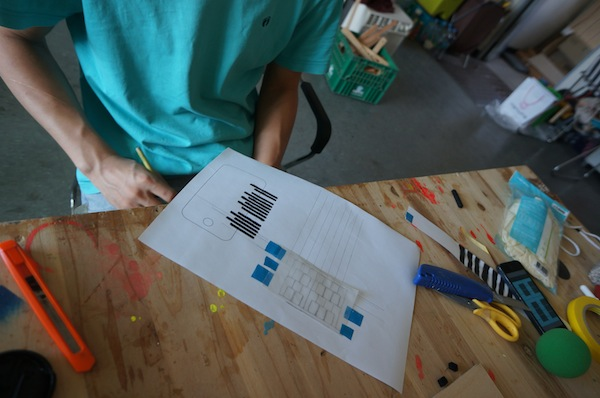
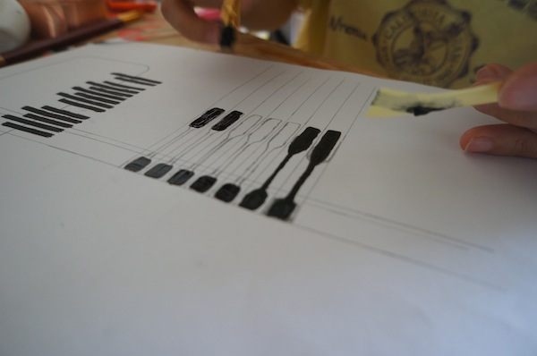

# todo:기술놀이와 해킹

## official
[http://www.unmakelab.org/?page_id=27](http://www.unmakelab.org/?page_id=27)

**해킹**은 *정보*-기술 사회를 들여다 볼 수 있는 가능성을 가지고 있을까? 이곳에서는 사실 그러한 토양과 전통이 드물었으니 그러한 가능성을 어떻게 상상해야 할지 잘 모르겠다. 그러나 여전히 해킹은 기술정보문화의 이면을 들여다 보는 좋은 방법이라 믿는다. 일단 그들의 회로를 번역하고 이해하고 놀아보자

###introduction text
> 기술놀이와 해킹 세미나×워크숍
> 
> <오픈 세미나>
> 해킹은 기술문화, 정보정치, 디지털경제의 핵심의 위치에 있는 기술문화정치로서의 가능성을 가집니다. 이번 오픈 세미나에는 <기술놀이와 해킹> 워크숍 기획과 진행을 맡은 김승범, 다이애나 밴드를 초대합니다. 이들은 어떤 맥락과 질문을 가지고 작업과 프로젝트를 진행하고 있는지에 대한 이야기와 함께 현재의 기술문화와 해킹에 대한 의견을 공유하는 시간을 가집니다.
> *일시 _ 9월 26일(금), 오후 7시 / 장소 _ 디스코-텍(Disco-Tech) / 진행 _ 김승범, 다이애나 밴드
> 
> <제작기술 워크숍>
> 제작기술 워크숍 1 _ 화.개.보드 두번째 이야기: 오토맞다
> 일정 _ 9월 27일(토) – 28일(일) / 장소 _ 워크스페이스 753 (Workspace 753) / 진행 _ 김승범
> 
> 제작기술 워크숍 2 _ 모르는 게 약?  "AS IS" 클럽
> 일정 _ 10월 11일(토) – 12일(일) / 장소 _ 아티스트 런 스페이스 413 (artist run space 413) / 진행 _ 다이애나 밴드
> 
> `No warranty. Use this "AS IS." 인생에 보증서는 없었다. 따라서, 우린 모두 <AS IS 클럽>의 잠재적 멤버이다. 정보-기술 사회는 마법과  연금술, 요즘 말로 코드와 노-하우로 가득 차 넘치고 있다. (…) '모르는 게 약'을 파기하고. '모르니 까막'눈이 되어 보자. 열린 소스 요리를 맛보고, 저명하신 '유남생' 선생님을 찾아내는 데 성공한다면, 오늘 밤은 바로 당신이 <AS IS 클럽>의 요리사다!`
> 
> 협업
> 
> 김승범 (개발자, 교육자)
>  
> 다이애나 밴드 (신원정, 이두호)
> 
> `다이애나 밴드는 관계적 미학을 향한 디자인과 인터액티브 미디어 아트를 실험하는 2인조팀이다. 관객들의 참여와 관계형성을 위해 공연성과 상호작용성을 작업에 적용한다. 관객은 때때로 작품의 적극적인 개입자로서 혹은 일시적 사건의 관찰자로서 초대된다. www.dianaband.info`

## discussion (9/16)

###방법론이랄까.. role model이랄까..
> zine sprint 50% + rietveld pre-course Janet 선생님 수업처럼, 어느정도 direction이 있는 GUIDED 성향의 수업 50%

1. 개인/개인이 하나의 작업을 진행하거나
2. 상징적인 어떤 것을 같이 만들거나- ladyada의 TV-B-GONE이나.. Wave bubble이나.. **gadget**를 만드는 것..

이 두가지는 어떤걸할지에 따라서 달라질 수 있다.

### 목적/목표

1번은..

<span style="color:crimson">한방 먹이는 것.</span> 뭐에다가? --> 기술의 아우라/ 기술의 허영/ 계급적 기술 (스마트폰을 깨부실 필욘 없다. 소중하다 부시지 말자.)
간디의 소금 행진 이야기 -> 소금전매법에 반대하는 비폭력 행동으로, 바닷물에서 소금을 생산, *자급자족*함으로 해서.. 자본가와 정치인의 행동을 폭로하고, 무법화 시키는 결과.

gui bending / touch bending

> 계급적 기술을 **우습게 만들기** (이슈를 만드는 것)

가지고 놀기.

2번은..

같은 gui bending / touch bending 을 하되..

> **physical phone**

*터치*의 확장
*빛*의 확장
*폰*의 확장
물리적 확장..

**몸**이 키워드.
그러나, *몸의 확장*이 아닌 그 반대 방향의 확장. *기기의 몸의 확장*?

> 1번 경우엔 위의 방법론의 2번이 더 어울릴 수가 있고..
> 2번 경우엔 1번 방법론이 더 어울릴수가 있고.. 그런것 같다.

### 결론

1번 경우엔.. 그래서 뭘 하면 의미있어질 수 있을지 그 **무엇**에 대해서 생각해봐야 하고.
2번의 경우엔.. 얼만큼 확장이 될 수 있는지. 그 **가능성**과 **방법**에 대해서 실험해 봐야 한다.

두가지 방향 다 진행되어야 함.

## working day (9/18)

지난 번에 이어서, 오늘은 gui / touch bending을 테스트해보면서.. 1번의 의미에대해서도 생각해본다.

-

MobMuPlat

<iframe src="//player.vimeo.com/video/85295522?title=0&amp;byline=0&amp;portrait=0" width="600" height="338" frameborder="0" webkitallowfullscreen mozallowfullscreen allowfullscreen></iframe>

-

이걸 해볼까 한다..

-

일단.. 뭐가 목표일까..

-

어제 처럼 회의하는데, 메모를 안하고 보이스 레코딩을 하는 짓은 하면 안된다.. 내용이 녹음이 됐건 안됐건.. 상관없이..
그걸 뭐 다시 듣고 있는다고 특별히 무슨 얘기가 더 잘 정리될 것 같지도 않고..
반드시 메모지를 꺼내던가해서.. 가져오던가해서.. 펜으로 메모를 할 일이다.

-

솔직히 뭘하면 의미가 있을지 생각하는 것도 좋다. 그치만.. 그건 앉아서 생각한다고 나올것도 아니고..
좀더 대화를 통해서 나오게 될 어떤 것인것 같다.
쉽게 볼일이 아니지.
그러니깐, 좀더.. 손에 잡히는 실험을 하는 방향으로 진행하는 것이 맞다.

-

일단, 피아노부터 할까? 종이 피아노를 그대로 확장해보자.

## working day (9/20)

<https://github.com/Ridwy/MobMuPlat-Funhouse>


mobmuplat editor의 바이너리 및 기타 필요한 자료들..

> mobmuplat editor의 바이너리 버젼을 찾아서 온동네를 돌아다니고 거의 하루를 소비한것 같은데..
> 이거뭐.. 그냥 메인 페이지에 있었다. <http://music.columbia.edu/~daniglesia/mobmuplat/MobMuPlatDistribution_1.61.zip>
> 
> 자세히 봐야 할 내용을 대충봐서 그런지.. 아님 뭔가.. 원저자가 좀 덜 친절하거나 소통 부재이던지.. 여튼..
> 나는 이클립스를 깔아서. 소스코드를 자바 컴파일해서 잘돌아간다.. jar로 만들진 못하고 있긴하지만.. 내 꺼가 더 빠르고 잘되는 느낌임..
> 여튼, 이런게 있으니 참고할 일이고... 그 보다도.. 이 패키지 안에.. 필요한 pd 파일들이 있기 때문에.. 반드시 가지고 있어야 하는 것은 맞다.

## working day (9/22)

오늘은 진짜로.. mobmuplat의 funhouse를 가지고.. 터치종이피아노를 테스트/개발 해야함.
어제 성민씨가 꽤 재밌어했다.
funhouse-ADSR의 ADSR이란.. attack decay sustain release 라던가.. 어택 커브의 상승/유지/하강/유지 의 시간을 조절해서.. envelope 쉐이핑하는 거라고 말했다. 맞는 얘기겠지?

http://en.wikipedia.org/wiki/Synthesizer#ADSR_envelope


ㅇㅇ 잘보면.. 세번째 sustain은 레벨에 대한 파라미터고.. 나머진 시간적인 파라미터고..

커패시티브 센싱을 에뮬레이트 하는 것에 대해서 좀 알아봄.
원래는, 어떤걸 이용해서 화면에 붙일 지 찾아보다가.. (어떤 재료를 사야하는 걸까 등등.)
새롭게 알게 된 사실이..

[](http://www.youtube.com/watch?v=tGFZkrMoFo0)

이걸 보면.. 터치 센싱을 GROUNDING으로 구현했다고 하는데..
그래서 샤시 그라운드.. 즉, 장치 외부의 그라운드를 이용하거나 실제로 땅에 접촉시키라는 말이있다.
<http://electronics.stackexchange.com/a/23039>
```
I haven't actually done this, but it seems the problem is the objects you are using are too small and don't have enough ambient capacitance. A human touching something adds capacitive coupling to the environment. Think of the size and surface area difference between a carrot and a carrot+human.

You should be able to use something conductive that is covered by a thin insulating layer, then connect the conducive part to a conductive plate under the iPhone or to ground. In this case "conductive" only needs to be not a good insulator. As you found, even something like a carrot is conductive enough. Try connecting a ground clip to the other end of the carrot, or connect it to the chassis of your machine.
```

다음 링크도 뭔가 도움이 될수도 있겠다 싶어.. 남겨두고..

<http://electronics.stackexchange.com/questions/60385/how-to-use-a-capacitive-touch-screen-without-a-human-hand>

여튼, 그래서.. 이거다 싶어서 해본게..


이렇게 만들어도보고.. (즉, 샤시 그라운드를 이용해서 손을 안대고, 터치하기.)


이렇게도 해봤다. (손으로 핸드폰을 만지지 않고 있으면서도, 만지고 있는 효과를 줄수 있지 않을까 해서..)

영상..

<iframe src="//player.vimeo.com/video/106800131?title=0&amp;byline=0&amp;portrait=0" width="600" height="338" frameborder="0" webkitallowfullscreen mozallowfullscreen allowfullscreen></iframe>

되긴되는데.. 그래도.. 터치패드를 벗어나면 오감지가 나게 되는 문제는 해결이 안된다.

어떻게 하는게 좋을지... 내일 또 생각해보자..

## working day (9/23)

이 영상, 넣었으면 좋겠다.

[](http://www.youtube.com/watch?v=NuPolrd9yuo)

1분 8초 쯤 부터.. 시작해서...

Professional Jen! writing emails. the C drive. the D drive...

-

벗어날 때 오감지 나는 부분을 해결해보기 위해서.. 가늘게 넘어가도록 하고, 그 밖에 손가락 터치 모양을 흉내내는 패드.
정확한 터치 위치 등을 잡아봤다.








저항치는 300-400 옴정도였고, 센싱은 나아지긴했는데.. 여전히 확실하게 잡히지 않는다.
옆에서 새어나오는 **GND '기운'**은 잡아지는 것 같긴 하다.
폰의 뒷면을 나머지 한손으로 터치해주면, 확실히 좋아지나..
그것이 꼭 내 몸을 통해서 회로를 이루는 것은 아닌 것 같고.
다른 사람이 후면터치를 해줘도 거의 유사한 효과를 갖는다.
단순 노이즈 감쇄 효과인가?


표면 접촉을 개선하고, 건반을 누를때 옆에 건반과의 간섭문제가 있어서..
이를 해결하기 위해 손으로 누르는 건반의 사이사이를 넓히고.
페인팅도 곱게해보았다. 결과는 잘 안됐다.

이상하게도-혹은, 재미있게도- 단일 건반은 잘 안되는데, **동시에 여러개의 건반을 누르면**, 갑자기 작동이 된다.
뭔가 일정한 입력치 이상이 되어야 터치가 된것으로 인식되는 구조가 숨어있는 것 같다.
곱게 바르다보니, 저항치가 낮아졌는데, 800-1000 옴정도가 되었다.
따라서, 단순히 저항치만 높아지면 되는 것이 아닐까 생각하게 됨.
희망적.


그런데, 아까 잘됐던 300-400옴 짜리가 다시 해보니 잘안되더라.. 되던게 안되니 열받음.
접촉면이 곱지 않아서인가? 생각하고, 고운 철솜으로 문질러서 판판하게 만들었다. 접촉면을 개선하기 위해서.
하다보니, 연필가루처럼 온 종이가 더럽혀지더라, 그래서 지우개 질도 했다.
결과는 뭐 약간은 개선된 것도 같긴한데, 아까처럼은 안된다.

건조가 더 진행됐기 때문인가? 다시 미궁 속으로..

-

대체 어떻게 해야 휴먼터치로 올바로 인식되는 것일까?
추측만으로 계속하고 있긴하지만, 뭔가 자료.. **'문건'**은 없는 걸까?

-

약간의 검색을 해보았다.
몇가지 단서는.. 다음과 같다.

1) 일단, 기기마다 위치 보정이 필요하다. 에르고노믹스를 고려해서 좌표의 쉬프트가 가정되어있음. <http://en.wikipedia.org/wiki/Touchscreen#Ergonomics_and_usage>

2) 몇가지 구현 방법론의 차이도 있음. <http://en.wikipedia.org/wiki/Touchscreen#Capacitive>

3) 프로파일이 잘 안찾아지면, 스타일러스 펜의 디자인 가이드라인을 참고해보는 것도 방법. <http://en.wikipedia.org/wiki/Stylus_(computing)>, <http://msdn.microsoft.com/en-us/library/windows/apps/hh465370.aspx>

오늘은 여기까지다.

~~젝일 모기들은 언제 없어지려는 걸까?~~

-

## working day (9/24)

터치스크린의 종류, 방식, 원리 간단 정리

<http://halcyonera.tistory.com/38>

스마트폰의 터치는 어떻게 되는건가?

<http://ask.nate.com/qna/view.html?n=11030557>
<http://www.cyworld.com/csm47/3438765>

이중 프로파일에 대해 언급하는 이미지를 가지고.
이미지 서치/키워드 서치로 찾아낸 원래 자료..
<http://webcache.googleusercontent.com/search?q=cache:http://www.embedded.com/print/4008781>
"Getting in touch with capacitance sensor algorithms", John Carey, Atmel - September 09, 2009

이 글은 꽤 citation이 많이 된 글인 것 같다.
오리지널 링크는 죽었음.

-

관련 자료.
<http://www.touchuserinterface.com/2008/11/how-capacitive-sensing-works.html>
다양한 관련 문건들을 연결시켜준다.

-

재미있는 것을 찾았는데..

센서스. 란 건데.. 뒷면 옆면 터치를 인식할 수 있게 해주는 .. 기술이다..

<http://photohistory.tistory.com/12477>

캐노피. 란 이름으로도 나왔다. 같은 계열인지는 몰라도.. 상세한 자료는 찾을 수가 없지만. 이런게 있었다는 사실은 존재함.

<http://www.cnet.com/products/sensus-touch-sensitive-case/>

-

뒷면 터치에 대한 약간의 언급이 있는 자료.. 더 파볼 가치가 있을 수도 있다.

<http://www.touchuserinterface.com/2008_11_01_archive.html>

-

국내 터치 컨트롤러 취급 회사.

<https://www.expodesk.com/imidex/exhibition_directory_view_kor.php?exnano_id=imidex765>

<http://www.nanots.co.kr/?module=Html&action=SiteComp&sSubNo=5&sNo=1>

-

스파크 펀에서 제공하는 정전식 터치 패드 브레이크 보드..

<https://www.sparkfun.com/products/12017>

데이타 시트 등 자료를 볼 수 있을 수도 있다.

-

유사한 주제에 관심 갖는 사람들..

<http://electronics.stackexchange.com/questions/259/capacitive-touchscreen-for-diy-usage>
<http://electronics.stackexchange.com/questions/27795/is-possible-to-use-ipad-touch-screen-with-pic16f707-mcu-for-diy>
<http://plaintxt.org/ti_343s0538_touch_screen_controller/>

-

아이폰의 터치 스크린은 어떻게 만들어져있나?
HowStuffWorks

<http://electronics.howstuffworks.com/iphone1.htm>
<http://electronics.howstuffworks.com/iphone2.htm>

**좀더 결정적인 자료는 요거**
<http://www.scientificamerican.com/slideshow/touch-screens-redefine-the-market/#3>


-

'projected capacitive touch technology'라고 불리는 기술이다.

<http://www.elotouch.com/Technologies/projectedcapacitive/monitor.asp>

<http://www.datadisplay-group.com/lcd-displays/monitor-technologies/touch-technologies/#c5044>

```
PCAP – Projected Capacitive Touch
The Touch with the iPad feel. PCAP Touch Sensors are a variant of capacitive touchscreens in which the touch sensors comprise rows and columns of transparent conductive material, mounted on a carrier layer of glass. When a current is passed through the matrix, a uniform electrostatic field is created. If a conductive object, such as a finger, then comes near the Touch surface, this electrostatic field is disturbed, and the resulting changes in capacitance can be measured.

 
Advantages and Disadvantages of PCAP Touch Sensors
Advantages: PCAP supports “drag-and-drop” movement of objects giving it the iPad-Feel; two or more simultaneous touchpoints can be used; PCAP functions through security glass;  true “flat” designs are possible;  the technology is resilient.
Disadvantages: PCAP is more expensive than 5-wire and the cost of integration is higher; it does not function at all, or only in part if wearing gloves and is generally not usable by those with prostheses.
```

-

**projected mutual capacitive touch의 전반적인 설명**

<http://large.stanford.edu/courses/2012/ph250/lee2/docs/art6.pdf> -> local copy 있음.

고스트 터치를 스캐닝으로 구별해낸다고 함.


그런데 스캐닝을 한다고 해도 그게 어떻게 구별이 될까? 그건 다음 자료에서 파악 가능..

-

마이크로 칩의.. 설명자료..

<http://www.microchip.com/stellent/groups/techpub_sg/documents/devicedoc/en550192.pdf> -> local copy 있음.

**여기서 페이지 8을 보면.. 아주 중요한 개념을 설명하는데.. mutual capacitance가 어떻게 상호작용하는지에 대한 내용임**


고스트 터치를 구별해내는 원리!

-

터치 스크린을 전담하는 컨트롤러 칩이 존재할 것이라는 생각이 들었다.
그냥 될리는 없고..
그렇다면 그 칩의 데이타시트를 추적해보면된다 싶었는데..
커스텀 칩들이어서 자료가 없고. 데이타시트도 비공개....

iPhone 3GS Uses TI Touch Screen Chip
<http://www.chipworks.com/en/technical-competitive-analysis/resources/blog/iphone-3gs-uses-ti-touch-screen-chip/>

chipworks라는 곳이 흥미로운데.. 커스텀칩의 다이(die)영상을 찍어서.. 여러가지 숨겨진 사실들을 알아내기도 하고.
리버스 엔지니어링을 위한 자료를 판매한다.
오픈소스 개념은 아니고, 영업인데.. 이런식의 접근이 있다는 사실이 신선하다.


예를 들면 위와 같은 사진..

비슷한 사업을 하는 다른곳.

<http://www.techinsights.com/teardowns/new-apple-ipad-gen3-teardown-analysis/>

아이폰 5의 touch controller 칩 분석 자료의 가격은 무려. 5000 달러.

<https://chipworks.secure.force.com/catalog/ProductDetails?sku=TEX-343S0538&viewState=DetailView&cartID=&g=&parentCategory=&navigationStr=CatalogSearchInc&searchText=iphone>

칩자체의 가격은 8.4 달러.. (아이폰 4s)

<http://www.aliexpress.com/item/Original-Touch-Controller-IC-343S0538-Replacement-For-iPhone-4S-Logic-Board-Motherboard/1358092931.html>

-

touch screen controller에 대해서는 ifixit에서도 인식하고 있다.

<https://www.ifixit.com/Teardown/iPhone+1st+Generation+Teardown/599>

-

칩 데이타 시트를 구할 수 없어서 또 다른 방법으로 접근해보았다.
오픈소스 소사이어티의 결과물들인데.. 리눅스 드라이버가 개발된 예가 있었다.

bcm5974라는 칩이 multi-touch controller의 일종인데..
데이타시트는 구할 수 없고.. 리눅스(우분투) 드라이버만 찾아진다.
드라이버 코드를 읽어보면 약간의 단서는 얻을 수 있지만. 결정적인.. 단서는 없다.

다음 링크에서 구할 수 있을 것 같은데.. 사실은 구할 수가 없고... 아마 옮겼나보다.

<http://bitmath.org/code/bcm5974-dkms/>

커널 org 에 올라와있는 것.. 실제로 코드가 존재하는지 의문스러웠는데.. 있긴있는 것 같다.

<https://www.kernel.org/doc/Documentation/input/bcm5974.txt>

다음 링크에서 구할 수 있음.

<https://github.com/bendavis78/bcm5974-dkms>

아이폰의 projected, mutual capacitive multi-touch sensing 방식의 trackpad (macbook용)은..

The Wellspring trackpad라고도 불리는 것 같다.

-

아이폰은. 한번에 5손가락 까지 멀티 터치 지원하는 듯함.

<http://stackoverflow.com/questions/1202484/how-to-force-iphone-ipod-touch-to-handle-more-than-5-touches-at-the-same-time>

즉, 6번째 터치에서 모든 터치가 사라지는 경우는 다른게 아니라 드라이버 자체의 한계 또는 지원대상이 아닐 가능성이 있음.
즉, 만약.. 5개 이상의 터치가 이뤄진다면, 오감지던.. 계획적인 실수이던.. 작동 멈추게 됨.

## working day (9/25)

어제 찾은 자료들을 한번 훓어보다가.
다시 한번..

<http://blog.marines.co.kr/eb-af-b8-eb-9e-98-ec-9d-98-eb-aa-a8-eb-b0-94-ec-9d-bc-ea-b8-b0-ec-88-a0-ec-97-90-eb-8c-80-ed-95-9c-ea-b3-a0-eb-af-bc-2-ec-9e-85-eb-a0-a5-ec-9e-a5-ec-b9-98-ed-8e-b8/>

'프로파일'이란 언급에 주목하게 되었다.


뭔가 프로파일을 가지고 작동한다는 것이지.

즉, 무슨 단순히 저항이 작아서나 주변의 그라운드 '기운' 따위가 원인이 아니고,
터치 인식은 꽤나 지능적이어서.. 손가락의 전형적인 터치 패턴을 인식하고 작동하기 때문에.
주먹구구로 할 수는 없고.. 그 느낌을 제대로 흉내를 내줘야 한다는 것이다.

그러니까, 엔트리는 치솟아줘야 하고, 엑시트는 바닥으로 꺼져줘야 한다.
레벨은 얼마 이상.. 그래프 처럼..여러가지 요소들이있고. 이들이 환경에 따라 학습되고 있을 가능성도 있다.

-

그래서 뭔가 굉장히 깔끔하게 만들어주려고 노력해보았다.

컨덕티브 테이프는 기존에.. very conductive (resistance < 5 ohm)를 쓰고 있었는데,
저항성 테이프로 바꿨다. (5cm정도에 100옴정도)
GUI의 버튼 크기도 넓찍하게 바꿨다. 옆에 버튼과의 간섭이 생길 수가 있기 때문에.

그냥 했더니.. 그라운드 '기운'이 올라와서.. 오감지가 난다. 그래서 차폐.를 해야 한다고 생각해서..
구리테이프로 차폐를 해보았는데..


정반대로 완전히 강하게 반응하게 되었고, 세개의 스위치는 완전히 연결되서 함께 동작하게 되었다.
이것도 나름 한가지 가능성/발견이긴하다. 여러개의 스위치를 연결시켜도 동시에 누르는 경우에 활용가능한..
특히, mobmuplat+pd 와 같이 GUI를 자유롭게 만들수 있는게 아니라.. 기존의 앱을 사용하는 경우에.. 동시에 여러군데를 터치해야 하는 경우가 있을수도?


구리테이프를 이용한 차폐는 철회하고..
일단, 터치를 구리테이프로 연장할 수 있는지 테스트..
되긴되는데, 구리테이프의 강한 안테나적인 성질 때문에.. 손을 떼고.. 1센치-2센치 공중에서 손이 머무는 상태에서도 untouched상태로 넘어가주질 않는다.
그라운드 영향을 제거하고, 뭔가 지대로 해보자고 해서 최선을 다해본다.

화면 사이드 통과부분은 칼로 잘라내서 그라운드 영향을 없애보고..
접촉면의 모양도 뭔가 손가락스럽게 각을 잡아줬더니.. 꽤 잘됐다.
별도 앰프를 연결했고. 앰프에 그라운드 단자가 외부로 노출되어있는 부분이 있어서. 이 단자를 다른 연주하지 않는 손가락을 확실하게 잡아주었다.
케이스 뒷면이나 폰의 뒷면을 잡는 것보다는 직접적으로 그라운드 신호선을 잡고 있다고 볼 수 있다.
테이프를 썼기 때문에 터치에 접촉하는 표면의 높이도 균일하다.


결과는 성공적이었다.
원정이가 좋아했는데..
실크 스크린의 필요성을 다시 말했더니, 기존의 나무 판에 컨덕티브 잉크로 실크했던 woodpiano표면에다가 해보자고 해서 해봤더니.
이게 의외로 상당히 잘됐다.


그래서, 나무가 전자파 차폐 성능이 꽤 좋다는 것을 떠올렸다. (jack과 프로젝트하면서 알게 된 사실...)

나무판에 실크 인쇄 하는 방법을 해보는 것이 좋겠다.

-

어제 작업 내용 정리하다가 다시 보게 된 영상인데.. 흥미로운 내용을 담고 있다.

요거 보면, 대략 드라이버에서 무슨 일이 벌어지는지 예상할 수 있다..
거의 이미지에 가깝게 터치를 볼 수 있다.

<http://www.touchuserinterface.com/2013/08/an-open-capacitive-multi-touch-tracker.html>

[](https://www.youtube.com/watch?v=OqpGoA8d-6Q)

얘네들 쫌 짱인데..
<http://www.wiretouch.net/>

-

위의 데모의 터치 인식 영상을 보면, 오브젝트 트랙킹의 가능성도 배제할 수는 없다.

저녁을 먹고, 나무에 실크 인쇄를 해서 진행해볼 것이다.

-
