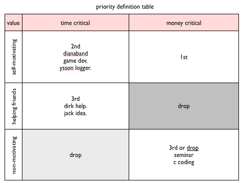

######2014Nov05 12:57:23+0900

google chrome에 패스워드가 다 저장되어있다....

이건 어떻게 생각해야 하는 걸까.

그냥 show버튼만 누르면 그냥 뜬다...

뭔가 찜찜하다.

---

######2014Nov05 12:53:46+0900

내 몸에 장기는 식물과 같다.

식물 처럼, 살고 죽고.. 한다.

몸의 좌표계가 고정되어있어서, 움직여도 움직이지 않는다.

담배피면, 폐가 죽을 거다.

식물을 키우면서, 몸의 장기를 잘 키우는 연습을 하는 것도 좋을 것이다.

나는 식물을 잘 죽인다. 식물을 잘 살릴 수 있고, 기를 수 있고, 나무가 되게 할 수 있으면,

몸도 좋아지지 않을까. 싶다.

---

음.. 날짜 찍어 넣어주는 플러그인을 구해 넣었다..
f5를 누르면된다.. 설정은 플러그인에서 안하고, 키맵에서 arg로 해버리면 된다.

지금 시각은 이렇다. 2014Nov01 23:12:50+0900

잘 찍히네.. 폰트 태그까지 넣어버렸다. 날짜가 넘 큼직하면 무서워.

######2014Nov01 23:12:50+0900

음 그냥 # 여섯개로 해도 되려나.. 이 # 들의 폰트 크기를 전체적으로 한번 잡아줘야지 이걸 잘 쓸 것 같은데..
일단은.. 샵으로 하지 뭐.

다시 한번..

######2014Nov01 23:15:26+0900

음. 걍 font가 낫겠당.. 중간에도 넣을 수 있고. 이렇게 2014Nov01 23:16:51+0900

하여간.. 됐고..

######2014Nov10 05:45:09+0900
(이거 뭔가 syntax highlighter 버그 같은게 있어서.. 다시 #여섯개로 바꿨당.)

-

######2014Nov01 23:17:24+0900

보다시피, 오늘 부터 노벰버. 11월이 시작되었다.

자.. 질문을 잘해야 한다... 음.. 질문은. 나 자신에게 던질 질문은...

-

음, 일단 노래를 바꿔봤당.

-

질문을 잘 던져야 할 것이다.

내갸 하고 싶은 게 뭔지..를 물을 것인지..
해야 되는 게 뭔지를 물어야 할 것인지..
######2014Nov01 23:33:50+0900

시간이 또각또각 잘 가네..
해야하는 일은 todo에 대략 적어놨는데..
그 중에 하나를 하는 것도 괜찮고..
걍 하고 싶은 일은 하나 해도 괜찮을 것이다.

뭐가 됐든.. move. 움직여야 한다. 그게 키다.

날씨가 추워질 거라고 하니.. 잘 먹고 힘을 모으고.. 담배도 줄이고. 그래야 할 필요가 있긴한데..
그게 생각대로 잘 될지 모르겠네.

######2014Nov01 23:39:05+0900

-

######2014Nov02 01:29:44+0900

음.. 인제 다들 자겠지?

그동안 쌓인 히스토리랑.. 팁들을 정리해야 할 것 같다.
일일이 다 적는게 고역이기도 하고.. 도중에 깃이나.. 컴퓨터를 리셋업 하는 바람에.. 도구가 없어져서 못하기도 하고.

아직도 찜찜한 부분이 있다..

일단, 맥이랑 윈도우가 둘다 리셋업이 끝났다.
그렇지만, 맥의 데이타가 정리가 안되어 있는 것은 여전하다.
그외에도 doohoyimac외장하드도 정리해야 하고..
그 다음으로는 굴러다니는 외장하드들 정리.
그 다음으로는 nas 4테라 하드를 정리해야 한다.

이건 뭐 평생 걸릴 것 같은 일이지만 일단은 적어둔다 이렇게.

######2014Nov02 01:33:12+0900

그리고.. 정리를 하면서.. 그리고 크롬 히스토리를 훓어보면서.. 그간 쌓인 경험치 (게임에서야 경험치가 전투가 끝나면 자동으로 쌓이니까 좋지만) 현실에서는 경험치는 곧 정보고 정보는 정리되지 않으면, 오래 가지 못한다. 즉, 시간이 지나면 경험치가 스스로 하강하게 된다. (재미있는 지점이네..)

하여튼, 그래서.. 그런저런 경험들을 정리해야 한다.

그나저나, 크롬 브라우저 편하긴 한데, 좀 너무 느리고.. 싱크나 구글드라이브나 이런게 점점 많아지니까.. 짜증난다.. 구글이 점점 썩어가고 있다.
다른 브라우져는 없는지 살펴볼 일이다.
tor였나.. 그런 것도 있고. chromium도 있고... 다른 것들도 마니 있을 것이고..opera란 것도 있구 사실은..
뭐 쩝.. 자세히 모르긴한데.. 찾아보자.

-

자.. 이런 저런 정리가 끝나면.. 뭘해야할지도 보이고 의욕도 날 것이다. 작업실을 물리적으로 정리하는 것도 굉장히 중요하다. 결정하는 부분들은 원정이가 오면 하면 되겠지만.. 그전에 정리를 좀 해서.. 제안할 건들을 정리해 놓아야.. 시간낭비를 줄일 수 있다.

-

뭐 여튼, 집에서 복잡하거나 창조적인 일은 못하니까.. 정리를 한다고 하면...
어떤게 좋을까.

1) 데이타 정리
2) 히스토리 정리
3) 공간 정리

-

1->2->3 순으로 하면 되겠다.

######2014Nov02 01:39:32+0900

시작!

-

1번 - 데이타 정리.

지금 현재 정리해야 할 부분들을 나열해보겠다.
윈도우는 깨끗하다고 보고 있는데, 한번 체크만 해보자 나중에.
맥에서는.. 지난 데이타에서 덤프 받은게 있는데 그부분들을 중점적으로 체크하고..
맥은 다 되면 백업을 받아두는 것이 필요하다. 최종 버젼을 백업할것. 걍 이미지로.

######2014Nov02 01:42:22+0900
아래 맥 정리 대상 폴더를 나열한다.

/Users/doohoyi/Desktop/
/Users/doohoyi/Documents/
/Users/doohoyi/Downloads/
/Users/doohoyi/Movies/
/Users/doohoyi/Music/
/Users/doohoyi/Pictures/
/Users/doohoyi/Sites/

-

dictunifier는 원래 10.5 tiger를 대상으로 개발된 sdconv를 기반으로 만들어졌기 때문에.. 이후 호환성은 보장받기가 어려운 게 사실인데..
현재의 10.7이나 사람들의 말에 따르면 10.6 snow leopard에서도 제대로 서포트가 안되는 경우가 있는 것 같다.
개발자들의 말로는 된다고들 하는데 된다는 사람도 있고 아닌 사람도 있다. 사전의 버젼이나 데이타 구조도 영향이 있는 것 같고...

그래서, 베스트 방법은 10.5에서 혹은 10.6도 좋고.. 여튼, 맥의 버젼을 바꿔가면서 되는 방향으로.. 해야 한다. dictionary 앱만 이전 버젼을 가져오는게 가능하려나? 별로 좋은 생각은 아니겠지.. 여튼, 그렇게 되는 방향으로 가야 하는데, 시스템을 바꿔가면서 해야 하고. 그렇게 어려운 일이기 때문에 한번 컨버젼에 성공했다면, ~/Library/Dictionaries 폴더에 있는 *.dictionary 파일들을 꼭 백업해 두어야 한다. dictunifier나... stardict라던가.. 사전들이 그렇게 개발자들에 의해서 지원 받고 있지 못하기 때문에, 업스트림을 잘 따라갈 수 있을리가 만무하다. 됐다! 하면, 무조건 소중하게 백업해 둘것.

stardict형식으로 된 사전들 중 간략한/보편적인 것들은 여기서 찾을 것. <http://abloz.com/huzheng/stardict-dic/>
액티브하진 않지만, stardict의 사이트가 정보가 가장 fresh하다 <http://stardict-4.sourceforge.net/>

-

gitX를 깔았고.. git도 깔았지만.. 아직 git config를 못해서 sign-off나 commit, push를 못하고 있으니.. 빨리 바로 잡아야 한다.

-

라이온에서 추가된 제스쳐중에 잘 안쓰던 것들이 좀 있는데, 기왕이면 쓰면 좋을 것 같다. 런치패드라던가. 바탕화면 보기.. 세손가락+한손가락 제스쳐들.. 그리고 동일앱의 여러개창이 있을 때, 네손가락을 아래로 하는 걸로 윈도우스위칭하는 것. 요 세가지가 익숙해지면 유용할 수가 있다.

-

sublime text 2의 사용법중에서.. keymap / command / palette 등의 컨셉을 insertdate플러그인을 설정하면서 알게 되었는데.. 좀 정리해볼것.
확실히 많은 가능성을 가지고 있는 툴이다 이건..

-

stickies 노트도 좀 정리해야 한다.. 메모들은 모아서 여기 올리면 정말 많이 줄일 수 있을 텐데.. 지금 상태는 좀 말이 안됨.

-

######2014Nov02 10:54:57+0900
.gitignore를 이용해서.. .priv.md 라는 식으로 하고.. navigation.md 도 따로 하고..
아님.. 폴더를 하나 잡아서.. 그 폴더 전체를 ignore하고.. 로컬에서만 돌게 하는 것도 방법이겠다..
내부에는 navigation 을 따로 잡아주고..

-

######2014Nov02 14:06:05+0900

한번더.. 생각해보면..
git을 먼저 정리해야 할 것 같기도 하다.

-

매번 전부다 push할 수는 없으니까.. 구조를 먼저 잡아야할지도.

-

---

######2014Nov01 05:59:42+0900

노트북 마이크 .. 노트북 유에스비 접촉..

문제들 언제 해결해야함..

/

오픈소스를 사용만하고, 만들어서 릴리즈하지 않는다고 해도. 우리는 해킹을 하고 있는 것이다. 해킹은 '용도변경'을 포함하니까.

---

######2014Oct20 13:02:00+0900

몰입과 매혹의 차이?

게임에 몰입되는 것과, 불꽃에 매혹되는 것.

몰입은 뭔가.. 그 순간에만 작동하는 것. 게임이던 무엇이던. 그것을 하고 있는 순간에 철저히 빠져드는 것이라면,

매혹은 뭔가.. 시공을 초월해서 작동하는 것. 불꽃에 매혹된다는 것도 맞는 말은 아니다. 그러니깐.. 그것이 없으면 없는대로. 생각하지 않고 있어도 그렇고.. 음악에 기타에 매혹되는 것. 다른 것을 하거나 생각하는 시간은 그것을 하다가 쉬는 시간이고. 그것을 하고 있으면 몰입도 되지만, 그것만은 아닌 것. 그것이 없으면 없는 것을 생각하고, 있으면 있는 것을 생각한다. 뭐 그런거?

-

나는 그 어떤 매혹의 불꽃을 되찾아 가고 있을까?

---

######2014Jul28 12:00:34+0900

<http://hackhappy.org/uncategorized/how-to-use-a-raspberry-pi-to-create-a-wireless-to-wired-network-bridge/>

--

wireless router network drone!

쿼드콥터 + UAV + WiFi adaptor (rpi) 두개 (하나는 입력/하나는 출력) + Battery + 무선 충전 spot for retired guys.

or Automatic WiFi signal amplitude checker drone.
SSID를 찍으면, 해당 신호가 가장 크게 잡히는 지점을 찾아낸다. (but 집안/건물안으로 들어가면 안됨. 여기에 조건 필요.)

--

군집 운행하는 무선 라우터 기능이 탑재된 AR 무인항행 쿼드콥터 군단 + 무선충전 스팟.

--

링크는 나름 기반기술.. 무선랜을 잡아서 유선랜으로 포워딩해주는 스크립트..  (남의 무선랜을 받아쓰는데.. 집안에선 신호가 약해서.. 하늘에 쿼드콥터 드론을 띄워서 신호를 받아오게 하는거 생각하게 됐음.) / 아직 잠이덜깬거 같아욤.

---

######2014Jul16 06:03:32+0900

institute. or/and art center
irresponsible / independant
different base

-

hacking institute.
i just want to learn. or evolve or become better on anything.
desire for learning and improving on sth.
i have.
but not really becoming better.
-
english . japanesse (even though i watch so many j-anime jav)
arduino.
making things.
electronics.
electrics
analog circuits.
whatever. all.
wood making
art. visual art.
i need a school for myself.
i need a different base. starting position.
against others. which all corrupted.
-
this might just be another jerry macguire's white paper. which is just idealistic and nothing more. is just romantic but nothing real.
but what's the matter? let's do it.
i m spending my time all the time for myself.
to make myself better.
do whatever is available.
otherwise, stop doing it. and re-catch the existing base asap. once u decide then move fast.
-

i need a future. which is actually the current.
otherwise, i will stop immediately.

-

i just want to be a better me then yesterday. that's all i truly want.

---

######2014Jul13 11:23:33+0900

미래.미래.미래.
-
미래는 나 자신에게도 필요하고. 우리에게도 필요하고.
또 가족들에게/조카들/형/형수님.
또 친구들에게/한국인들에게/세계인들에게.
내가 미래를 줄수있어야 한다.
지구에게. 미래를 줄수있어야 한다. 제시.
제시.
제시.
-
의외성.의외.희극.웃끼다.
-

---

######2013Nov17 16:09:16+0900

난 좀 너무 딱딱한가. conservative 한가.
훈련하면서도.. 뭔가. 지나치게. 딱딱하게 된다. 옵세시브하게.
매뉴얼에 메이고. 하라는 게 있으면 그것에 메이고.
자세나 같은거. 해야 하면. 지나치게 딱딱해지고.

수영이나. 춤이나. 그런걸 해서, 좀 더 몸 중심의 사람이 되지 못하면..
안될 것 같다.

사람을 무서워하지 말아야 한다. 원정이나 너나.. 둘다.

---

######2013Nov07 13:26:20+0900

on the stage..

living on the stage..
afraid of the stage.
camera makes the stage.
filming makes stages..
internet makes stage.
broadcasting.
if you are on the stage, what you gonna do.
those luxury everything is could be acceptable because those are not only for the people there but also people here.

filming makes stage.
on the stage, i do hide. cause it gives me a fear.
why? i have lots of things to hide.
but actually, if you cannot take use of the stage,
then, you cannot really be on the stage.
that means in a way that you cannot really say sth. aloud or say something seriously to the world.
why are you so shy. i need to know the answer and re-think on that.

-

first, you do a performance from the people in front of you..
or, first, you do a performance just from the camera,
but next moment, this becomes online in vimeo or sth. then, this becomes something else.

at this moment, if you feel shy, that could be a feeling of shame that you didn't count others to see that. but well, actually, you don't even think of others to see this. cause then, you couldn't be able to  do anything because you don't have confidence on being attractive to others.
but well, if you do sth. with different intents.. sth. else than attraction. could be fine. maybe.
if you want to say sth. other than attraction, yes.. would be fine.

-

for the works,

you say that you want to do some experiments..
that means that you are using the world, there is nobody who gets any message or benefit from your act. you are just doing an experiment and you will get some result. but that is not a communication at all. you do sth. only for yourself.. and even you don't have a purpose to do that.
you want to do communication with others. you want to go out of yourself.
but you get locked inside more and more..

-

you need to go on the stage. not as an experimenter for as an actor. with message.
having exhibitions. is on the stage. but why i do feel not on the stage.
should do sth. on your own. and face the real stage. and people.

---

######2013Jun02 02:26:30+0900

쏭의 카레 레시피.

당근 양파 호박 버섯 시금치 고구마 마늘 감자.
버터(마가린) 청양고추 바질 (해물/닭고기) 후추

-

마늘/버터(마가린)/청양고추 볶는다.
-
양파 잘게 썰거나 믹서 해서 2-3개 넣는다. (해물/닭고기등 추가 가능 야채전에)
-
같이 볶다가. 어느정도 익으면, 단단한 야채 순서대로 넣고 같이 볶는다.
-
당근->감자->고구마(덩어리로)->버섯->호박->시금치
같이 볶아..
-
어느정도 익으면 물을 확.
-
저으면서......... 끓으면 팔팔 88 넣는다. 카레를....
-
카레를 넣은후에는 젖는다.
-
그다음에.. 후추/바질 넣는다.
-
안눌러붙을때까지 저어주다가..
-
어느정도 되면, 먹으면된다.
-
(냉장고 하루 숙성! 좋다.)

---

######2013May16 08:57:46+0900

원정은 공간과 오브젝트와 상상
-
나는 오브젝트와 스토리와 상상

---

######2013May16 08:35:26+0900

원정의 상상
-
전깃줄이 이어진 저 너머에 있는 누군가와 누군가의 공간
-
높은 곳에서 먼곳을 바라보며.. 그 너머에 있는 사람들과 공간을 생각.
-
'이것은 공상이 아니다.' 라는 상상의 전제.. - 근원적 모순? :ㅇ

---

######2013May16 07:52:27+0900

상상 전문가.
-

나는 상상하는 게 좋고. 상상에 빠져드는 것이 좋다.
누군가 상상을 방해하거나 멈추게 하면, 화를 낸다.
그래서, 회사도 그만뒀다. 상상하는 걸 막고.
내 상상의 가치를 몰라주기 때문에, 상상은 돈이 안되기때문에.
상상하는 즐거움을 버리고 사는 것은 삶이 아니었기 때문에.

이야기. 애니메이션.
그런게 좋고 계속 하지 않을 수 없다.
뭔가 작업 방향도 그런 쪽으로 잡아야 하는게 아닐까.
애초부터. 표현력은 별로 없었다.
표현할 필요가 없었는지도 모른다.
내 상상은 이미 내 안에서는 다 표현이 되어있었으니까.
꿈처럼.

반나절이고 한나절이고 계속 될 수 있었다. 상상의 시간은...
그것은 가장 행복한 시간이었다.

-

imagination professional.
나는 끝없이 상상할 수 있는 존재가 되고 싶은 것 같다.
문제는 그것을 어떻게 표현할 것인가.

---

######2013Mar10 11:29:01+0900

줄자 - shopping list
-
1단선/랩핑와이어 - 하얀색 와이어랑 같은거.
2알루미늄테이프. (0점 감지용)
3메카니칼 스위치(?) (0점 감지용 - 백업)
4좀 납짝한 푸쉬 스위치? 부드럽고 작고 릴라이어블한 놈으로...
5홀센서 - 10개. WSH133  / 홀센서는 크로스로 배치.
-
6아두이노프로미니 4개.
7블루투스 모듈 2개.
8건전지? 2개.
9충전보드 2개.
-
스파크펀 (--> 아트로봇) / 메카솔루션 / 디바이스마트.
-
단선은 일단 구매 안해도 되고..
메카니칼 스위치랑 알미늄테이프는.. 뭐 사면 좋을 것 같긴한데.. 둘다 좀 확실한 방법은 아직 아니다. 조그만 더 좋은 방법은 없나? --> 걍 좀 납짝한 푸시 스위치는 어떨까. 납짝한게 없으면. 구조적으로 그렇게 만들순없을까? 기존의 스탑퍼 모양을 좀 이용하면서.. ?? / 또 한가지는 벨로스태트를 아트로봇에서 사서. 프레셔 센서를 구성하는 것이다... / 자석스위치. reed스위치도 방법이겠다.
-
요번에 꼭. 잭한테 돈달라고 해야 한다.. ㅡㅡ.. 돈이 없다.. / 마니 써서. 담달에 폭탄 떨어질 것도 대비해야 하고.. 여행 경비등등.
-
지금 주문한다.
(1)(3/4)56789

---

######2013Jan27 00:27:08+0900

큰 줄자 - 콘트라베이스
비올라 ...
현악기 4중주.?
-
가위 - 리듬악기.
-
기울기재는거(수평계, 수평자) - 소리로 기울기 맞추는 거.
-
호치케스. 악기?
-
원정이의 문짝 장치.
-
원정이가 한다.
그런데.. 두호가 도와준다.
먼저, 첨에는. 두호랑 같이 기본 셋업한다.

---

######2013Jan24 01:11:17+0900

22 pegalo.

Cuando estás arriba, tus amigos saben quién eres.
Cuando estás abajo, tú sabes quienes son realmente tus amigo.
No dependas de nadie en este mundo, porque hasta tu sombra te abandona cuando estás en la oscuridad.
Aprende a apreciar lo que tienes antes de que el tiempo te enseñe a apreciar lo que tuviste.
Nunca te des por vencido si sientes que puedes seguir luchando.
No esperes el momento perfecto, toma el momento y hazlo perfecto.
La vida tiene cuatro sentidos: amar, sufrir, luchar y ganar.
El que ama sufre, y el que sufre lucha… y el que lucha gana.
Si eres un luchador.

(pegalo en tu muro.)

---

######2013Jan18 13:07:30+0900

우선순위를 정하자.
-
time-critical vs. responsibility.
-
but also.. attraction. which means easily able to concentrate on. which means that ...
-
시간성이 요구되는 일과 책임감이 요구되는 일. 그와중에서도. 내적으로 동기부여가 잘되는 일. 그렇지 않은일.
-
이런 네가지 타입의 일이 있다.

---

######2012Oct11 21:58:16+0900

25 note

what is next.

today.
and tomorrow.

happening.

370.

--

kancho.

for today.

i do decide. something.

death as a protocol.

making selection/ decision is proper.

--

midterm will. short-term will.

--

i am gonna be oop programmer.
then i need to know oop. and how to design things in oop way. like uml.

and i am gonna be an artist.
then i need to do works. and present them to the public. whatever way.

at the moment these two is important will of mine.

--

so, oop.

i am gonna read ooc book.
and start to search for uml somehow.
and do some design on the fishmans logger.
which will also be useful for my company work.

--

so, art.

i am gonna do drawings and read books.
try to do whatever in my mind. which will reflect my idea. as a presence.
start with a drawing. a single and clear and ideal drawing. to become an animation or movie. or artwork.

--

so, oop.

study uml.
at first, uml is more closely correlated with java but cpp. so first project should be a java project. for this, an android project looks good. let's make a asteroid or a tetris or .. boop game. stuffs..

--

---

######2012Sep13 15:34:24+0900

28 notices
-
WOL wake on lan.
-
지하철 노선도. 벡터. 이미지. 폰트/디자인. 앱 연동. 지하철 노선도 커스터마이즈.
웹 기반. 제너레이터. 서울메트로에 제안.
한글 웹 폰트 적용가능하도록?
-
adafruit project? - waveshield - for mini arduino / lilypad
-
IR distance chip : sharp GP2D21 21 (marking)
엄마한테 .. 50 + 60 + 10 + 카드요금 =
경부 예방 주사
-
portfolio.. where to go? who are we? + website
sonogong work.
soy-ink.
"eco diana GREEN" way for domestic self.

---

