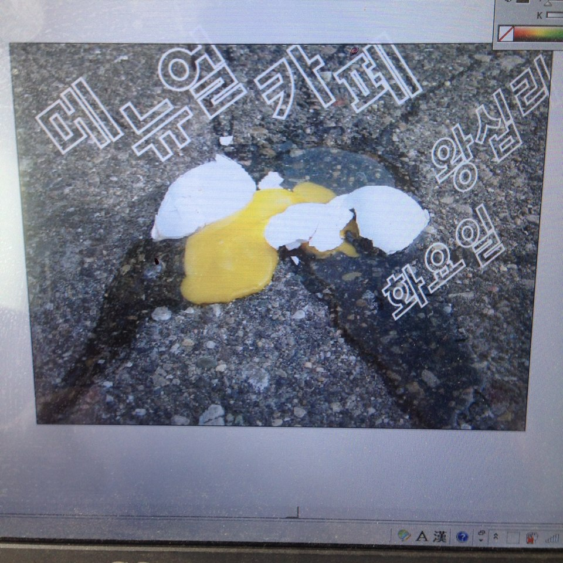

######2015Mar23 10:14:07+0900

---

gogo manual cafe!!

가자, 매뉴얼 카페!!

---

다이애나밴드는 작업실을 매주 화요일 오픈하여, <매뉴얼 카페>를 하려고 합니다.

매뉴얼 카페의 목적은 직관적입니다. 모여서 매뉴얼을 만드는 것이지요. 각자 만들려고 했었는데, 못만들고 있었던 매뉴얼들을 함께 만들어보는 것이지요. 예를들면, 저희 같은 경우에는 현재 국립현대미술관에서 전시하고 있는 <사물 행진>에 전시된 사물들의 제작 매뉴얼을 만들어보려고 해요. 저희들 생각에는 주변에 흥미롭고 재미있는 작업을 하시는 분들이 많이 있는데, 그런 여러분들께 매뉴얼을 만들어 배포하실 수 있는 작은 동기를 드리고 매뉴얼 제작 배포에 대한 여러 의견과 경험을 수렴하여 따뜻한 봄날, 행복한 시간을 가져보면 좋겠다는 생각이에요. 이 공간이 화려하진 않아도 봄에 꽤 괜찮거든요.

매뉴얼 카페의 목적인 '매뉴얼'은 그렇게 엄격한 것은 아닙니다. 손으로 만드는 것. 스스로 만드는 것. 아나키스트적인 태도. 그 모든 것을 포괄하고 있습니다. 오프라인의 만남. 실수와 실패. 고장나거나 부서지는 것. 대화와 소통. 그렇기 때문에, 굳이 오셔서 매뉴얼을 만드는 작업을 하지 않으셔도 상관없습니다. 이 공간에 오시면 커피도 직접 내려드셔야 하기 때문에, 이미 매뉴얼 카페의 목적은 달성이 되지요. 매뉴얼 까페는 그러니까 '매뉴얼'에 대한 일종의 트리뷰트(tribute), 헌사라고도 할 수 있습니다. '매뉴얼'에 공감하시는 모든 분들께 열려 있습니다. 일단 5층까지 올라오시려면, 이것도 만만치 않게 매뉴얼이거든여. 엘리베이터, 없습니다. 흐흐.

모든 장비와 자재들을 요청하시면(on-demand) 사용하실 수 있습니다.
장비는 실크스크린 감광기 1대, 고양이 2마리, 그리고 빈 공간, 빈 책상들입니다.
그리고, 아시다시피 저희는 목공작업을 하기때문에, 각도절단기 1대 및 그외에 몇가지 부족한 대로 목공 장비들이 있습니다.
그리고, 또 아시다시피 저희는 전자 인터액션 작업을 하기 때문에, 인두기 2대 및 그외에 넉넉하게 다양한 부품과 장비들이 있습니다.

기간은 내일부터 3월 24일 부터 6월 30일까지. 총 15회. 개최합니다.

5주씩 나눠서 총 3회 발표회도 가집시다. 매뉴얼전. 나중에 생각이 바뀔 수도 있지만, 지금 생각으로는 공동으로 어떤 도록을 내는 형식을 취할 생각은 없습니다. 각자의 매뉴얼을 만드시고 공동으로 프리젠테이션하는 정도에서 그치는 게 적당하고 봅니다. 만들어진 소책자 혹은 장편소설들은 지명도 높은 국내 독립zine 공간인 카페별X라던가 벌레벌X 출판사, X북소사이어티 등에 출판 혹은 배포 협조를 요청해봅시다.

커피는 팝니다. 어차피 저희도 원두 사오는 데가 있으니깐, 사다가 비치해놓고 매뉴얼로 각자 내려 드세요.
핸드 그라인더 1대, 모카포트 2대, 가스버너 2대, 핸드 로스팅용 수망 1개, 생두는 공짜, 그리고 여름을 대비해서 아이스 드립 도구가 있어요 (TIGER)

공간은 일정한 월세가 있는 공간이기 때문에, 방문자 분들께 일정 부분 후원을 부탁드립니다. 공간 운영 비용을 넘겨서 후원금액이 모인 경우 발표회 준비를 위한 비용으로 사용되며, 재정 공개 합니다.

저희는 다른 공간과의 요일배타적인 요일 연대에도 열려있습니다. 이X카님이나 잇X인트랩 분들 관심가져주세요.

그럼 내일 봐용 흐흐흐.