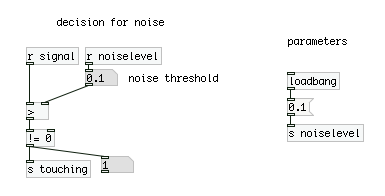
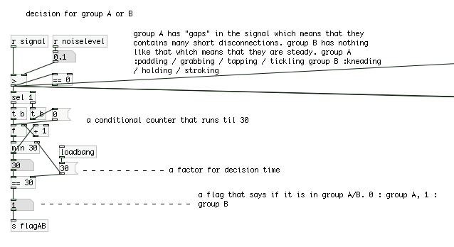
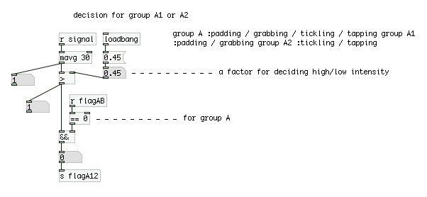
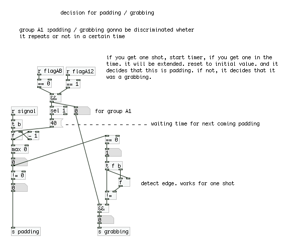
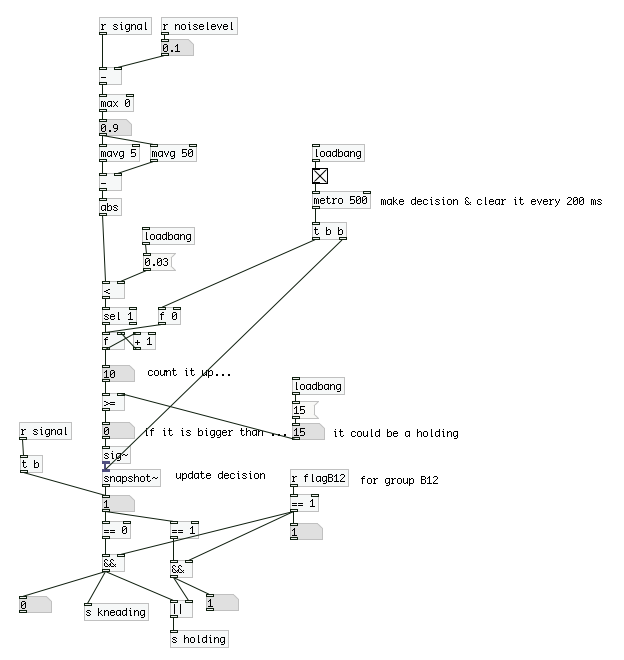

######2014Nov04 08:58:48+0900

2 hours.. to go.

---

잭이 달라는게..

CRDLT OVERVIEW..

---

CRDLT_Demo Models

* Copper Plate testings
  * get material for testing (check sources in GRA) (copper different thicknesses + coatings)
  * find metalworker / craftsman / jewellery maker
  * **Setup with Dooho how to test material**

* Wood Material testing
  * assemble wood for treatment test (dollar Range?) visit http://www.fijnhout.nl/, minervahavenweg 14. checking pricing beforehand
    * Grenen: 50 euros
    * Iepen: 75 euros
    * Kersen 130 euros
    * Walnut 120 euros (from boti)
    * xxx
    * xxx
  * assemble treatments for wood
    * oil 
    * oil + wax
    * lijnzaadolie
    * xxx check furniture boti / tieme / ron
  * Make sample board for comparison
  * comparison test :
    * density
    * wood structure
    * grain structure
    * cost

* Production of shell
  * CNC method: issues 
    * Rhino Model
    * Door Detail
    * Lid lock Detail
    * Weight of product
    * Interior shape for sound
  * Manual Method by Boti
    * Cost estimate
    * Door Detail
    * Lid Lock Detail
    * Weight of product
    * Time needed for production

* Electronics
  * Dooho’s improvements
    * **dooho send second prototype interior minus battery**
      * jack needs to put it together
    * **Schematics needed from Dooho for assembly (speak with Dooho about it)**
    * **Bill of materials needed (jack with dooho)**
    * Calibration mode test 
    * Battery issue with sensors
  * cost estimate on electronic part cost
  * time estimate on assembly

* Sound Scape
  * Salvador Breed Sounds: what else can he do? **gyroscope controlling pitch?**
    * call him to update...
  * New sounds from CD (license-free)
  * Make new track in house
  * Analysis on what is missing
  * Test sound play strateg

---

the messages... from jack..

---

Prototype-material research

---

This Will be document to discuss material research and findings. If we have a Comment or
addressing The issue please Mark who said what. For example : J: jack. D: Dennis. **DY: Dooho**

J: I would like to make. Plan of approach to how we are going to test The materials we propose. 
We need Dooho's input on how he would do it.

Boti: Calcluation for 3 prototypes: 3 days of work on ippen wood (material cost not included)

* €240x3= €720 ex btw. 871,20 inc. btw.
* if one of them is made out of walnut: Total cost would be €960 ex. 
* getting the wood, treating wood, glueing wood, cutting wood to size for cnc, then sanding and oiling after cnc.
* Wood cost: Ippen: €75, Cherry/kerst: €130.21 Pine/grenen: €50, ex btw

documentations of the prototype needed:
Oct 22 2014_J: Dooho: We need from you these things:

* **Final schematics of the electronics design (you did sketch before, but not sure if it was updated to the new situations)**
* **Final material list of all components: basically a bill of materials down to push buttons controls.**
* **A full working set (electonics) (this is with all the issues we needed to tackle. Such as power, sensor, etc..**
* **Also a filtered selection from 3M products that you think might work.  I know these are tapes and you suggested tapes, so lets have a look at it. If you have any clever ideas on how to apply the tapes so that it works and also aesthetically pleasing, please share.**

Oct 22 2014_J: **What is the info/ parameter needed to give to a jeweler to have them make alloys for us.  For instance, how much Ohms per cm squared. Dennis would like to know how to ask someone to make alloys and how to test it to meet our requirements.**

---

Patent descriptions

This will be a document to start making preparations for patent application.

patent stuff.
I don't see any special technology here.. (high-tech stuff).
So the point is actually how we apply this simple tech to get what we've get.
The device is just measuring a serialized resistance of 2 person, which is actually a combined resistance varying according to the touch gesture between those 2 person. or even more than 2 person.. only if they are all making touches one another.
I will run through the technological stuff after their touch action.. first of all, we measure the resistance.
How we measure the resistance is really low-tech. we just measure with 1 resistance serialized. How we detect such and such gestures. This might be recognized somewhat high-tech. Because there is a know-how on doing this. but **it is now easy to say that this one has the singularity.** because this **pattern recognition** is really developed to fit the demand of designers (yes, you guys, jack & dennis). **not a generally approvable 'new' tech but a specific solution.**
To be honest, i feel that there's no clear entry point to build up a patent from the project as technology side. I need some inspiration on this. From which perspective, we start?
IMO, The most interesting and exciting part of this project, I believe, is how the interactive sound feedback can stimulate and intervene the relationship of people..

---

그래서.

첫째로 할 게..

* **Final schematics of the electronics design (you did sketch before, but not sure if it was updated to the new situations)**
* **Final material list of all components: basically a bill of materials down to push buttons controls.**
* **A full working set (electonics) (this is with all the issues we needed to tackle. Such as power, sensor, etc..**
* **Also a filtered selection from 3M products that you think might work.  I know these are tapes and you suggested tapes, so lets have a look at it. If you have any clever ideas on how to apply the tapes so that it works and also aesthetically pleasing, please share.**

Oct 22 2014_J: **What is the info/ parameter needed to give to a jeweler to have them make alloys for us.  For instance, how much Ohms per cm squared. Dennis would like to know how to ask someone to make alloys and how to test it to meet our requirements.**

요고..

---

Final schematics of the electronics design

---

* ~~optocoupler board for power switching.. from rpi to sensor brd.~~

* ~~sch. for sensor brd.~~

* find mechanical switching plug-in for automatic small battery charge up.
  * or... solve the issue on power charging for that sensor booard!

* ~~replacement for rpi. --> check out.. what is available. for multiple sound modes.. capable.~~

* explanation on the pattern recognition @ pd patch.. for patent guy... and ourselves..

---

explanation on the pattern recognition @ pd patch.. for patent guy... and ourselves..

---

Data logger의 Camera Calibration 방법

1. 발명의 목적
Data logger에서는 센서의 측정치와 실제 물체의 위치를 비교 검증하기 위해 카메라를 도입하고, 센서의 측정위치를 카메라 영상좌표계로 변환하는 기술을 필요로 한다. 이를 위한 기존의 기술은 정확한 보정을 위해 영상 좌표계와 실좌표계 사이에 최소 8개의 높은 정확도의 위치데이터 쌍이 필요하다. 하지만, Data logger의 경우, 비교 검증 용도로 높은 정확도가 필요하지 않다. 따라서 이를 보다 빠르고 간편하게 수행하는 방법을 고안하였다.

2. 발명의 범위
카메라와 센서의 피사체가 2차원 평면으로 근사화 가능한 경우를 대상으로 한다. 즉, 차량에서의 경우와 같이 카메라와 센서의 설치 높이가 감지 거리에 비해 상대적으로 작아 무시할 수 있는 정도인 경우를 말한다(그림 1 참조). 또한 카메라와 센서의 x-y좌표상 거리는 0이라고 가정한다. 그러면 센서의 감지 정보는 x-y좌표계로 주어지고, 카메라의 영상 좌표계는 ix-iy 좌표계로 주어진다고 할 때, 본 발명은 x-y 좌표의 근사적인 ix-iy를 찾는 Camera Calibration 파라미터를 간단히 찾아내는 방법에 대한다.

그림 1 발명의 범위 및 전제 조건

3. 기존 기술
기존의 Camera Calibration 파라미터 계산은 이론적으로 8개의 데이터 쌍이 필요하다. 
아래는 3차원의 일반적인 경우의 파라미터 P와 P를 통해 x-y-z의 실좌표계의 데이터를 ix-iy의 이미지 좌표계로 변환하는 관계식이다.

이때 z=0이라고 발명의 범위에서 말한 것과 같이 가정하고 모든 원소를 m_34로 나누면, 다음과 같이 간략화할 수 있다. 

따라서 데이터 쌍이 8개만 있으면 위의 관계에서 연립 방정식 8개를 얻어서 P를 얻을 수 있다. 이 8쌍 (3차원의 경우라면, 11쌍)의 데이터를 자동적으로 구하기 위해 격자무늬 판을 활용하는 등, 다양한 방법이 제안되었으나, 모두 영상처리 시스템을 위한 정확한 mapping을 위한 방법이므로 알고리즘이 매우 복잡하여 손쉽게 사용할 수 있어야 하는 Data logger에는 적용이 어렵다.

4. 발명의 내용
본 발명은 8개의 데이터 쌍 대신 한 개의 데이터 쌍과 기준 직사각형을 도입한다(그림2). 변환의 특성상 그림 2에서와 같이 사각형 영역은 영상 좌표계에서는 사다리꼴이 되게 되어 있다. 따라서 카메라의 방향과 센서의 방향이 틀어진 각도를 보정하기 위해 한 쌍의 데이터를 측정치로부터 구한 뒤, 기준 직사각형이 영상좌표계에 사다리꼴로 표시되었을 때, 각 윗변, 아랫변, 높이 이상 사다리꼴의 세가지 파라미터를 직관적으로 조절하여 관심영역의 Camera Calibration을 간략히 수행할 수 있다.

그림 2 발명의 내용

5. 기대 효과
본 발명은 8개의 데이터 쌍 대신 한 개의 데이터 쌍과 기준 직사각형을 도입한다(그림2). 변환의 특성상 그림 2에서와 같이 사각형 영역은 영상 좌표계에서는 사다리꼴이 되게 되어 있다. 따라서 카메라의 방향과 센서의 방향이 틀어진 각도를 보정하기 위해 한 쌍의 데이터를 측정치로부터 구한 뒤, 기준 직사각형이 영상좌표계에 사다리꼴로 표시되었을 때, 각 윗변, 아랫변, 높이 이상 사다리꼴의 세가지 파라미터를 직관적으로 조절하여 관심영역의 Camera Calibration을 간략히 수행할 수 있다.

6. 청구범위
한 쌍의 점과 사각형을 이용하여 카메라 보정을 수행하는 방법

---

mTTL 특허.

Data logger의 Camera Calibration 방법

1. 발명의 목적
...why needed? this invention..

2. 발명의 범위
...coverage... or.. abstract.. summary of the content of invention.

3. 기존 기술
existing tech,

4. 발명의 내용
content.

5. 기대 효과
expected effect of this invention

6. 청구범위
claims.

---

my document for the patent made out of following structure.

0. title

1. purpose of the invention.

2. coverage (of the invention)

3. existing technic

4. content of the invention

5. expected effect of this invention

6. claims

---

purpose & coverage & existing technics.. could diverse as tactics.

i will write sth. about 4. content.

5 will be sth. straight forward along 1 to 4.

6 should be carefully written thus this part really set up effective part with the law

---

the system could go bigger and bigger but i just feel that this pattern recognition part could have advantage as a potential patent..

so will talk about pattern recognition. but if you guys want to broaden the subject, that's fine, too.

---

first of all, what we do here is recognizing some specific patterns in a single input signal of a system. These patterns in the signal actually correspond to specific acts that is being generated while the users of the system interact or touch each other including the system.

anyway, whatever situation. we...

---

######2014Nov05 11:19:48+0900

특허는 abstraction이다.

abstraction layer를 하나 찾아내야 한다. 하나 이상? ..

evernote를 참고해서.. abstraction layer를 찾아내라.

---

######2014Nov05 16:19:28+0900

absraction layer는.. 6가지.. 터칭이 되야 할 것 같다.

그걸 기준으로 생각해서..

노이즈 제거 후.. 반복되는지 보고 반복 그룹과 안반복 그룹을 나누고.

그 안에서 높은 반응 그룹과 낮은 반응 그룹을 나눈다.

그렇게 4가지가 나온상태에서..

... 암튼.. 패치의 내용을 그대로 말로 서술하면 될 것 같다..

전체적인 특허 구조를 예전껄 가져다가 채우는 것은 못할 것 같다.

왜? 걍.. 넘 하기 싫다고나 할까..

그 구조 얘기는 없었던 일로 하고.

알고리즘 설명을 잘 적어서 주고 끝내버리자.

---

지난 번에 영상을 참고하도록 하고.. evernote에 있는 "pd patch calibration points summary" 글이랑.. 캘리브레이션 설명하는 영상을 참고하면.. 감은 잡을 수가 있더라..

그렇게 해서 뒷부분에 생략한 부분까지 적어서 설명하고 끝내도록.

---

######2014Nov06 10:28:26+0900

* interpersonal touch gesture detection algorithm

  * system construction

    * the system measures one combined resistance of anything and anybody that participates in the circuitry.
    * if there is interpersonal touch gesture changes between somebody who is building up the circuitry, the measured combined resistance changes.
    * the system have several methods invented to recognize which kind of gesture has been performed in the circuitry.
    * we will cover how this touch gesture pattern recognition is designed.

  * categories of touch gesture patterns to be recognized

    * no touches
    * repeatitive touches / non-repeatitive touches
    * intense touches / mild touches
    * entry / exit of gesture
    * repeatitiveness in a non-repeatitive touches

  * no touches

    * first of all, even though there is no connection at all between these measuring electrodes, the measured value is not always equals to zero due to system noise.
    * so small portion of the dynamic range should be regarded as a meaningless range and rejected away.
    * after removing system noise, we want to classify if those touches are repetitive or non-repetitive.
    * 

  * repeatitiveness

    * the system has many internal counters to measure a time interval.
    * at start, the signal is expected to be lower than noise threshold and this clears out a counter.
    * if the signal goes higher than the noise threshold, the counter starts to count up until it reaches predefined value.
    * while the counter is counting but not reaching the predefined maximum value, the gesture is considered as a repeatitive one.
    * if the signal does not go below the noise threshold for predefined counts, the count will reach the predefined maximum value. and from that moment the gesture is considered as a non-repeatitive one.
    * if the signal goes below the noise threshold and does not increase again, the gesture is considered as no touches again and the counter will be cleared and stop.
    * if the signal goes below the noise threshold and then becomes higher then the noise threshold again, the counter will restart counting and again. while it is counting and not reaching the maximum, the gesture will be considered as a repeatitive one.
    * in this manner, if the signal keep repeatitively goes below noise level and goes over noise level in the predefined time interval, the gesture recognition will change repeatitively between no touches and repeatitive touches. in the final stage, the system averages repeatitive decisions over certain time interval to get the repeatitiveness factor of the gesture.
    * after recognizing repeatitiveness, we want to classify further if those touches are intense or mild.
    * 

  * intensity

    * intensity just directly comes out of the decision if the signal is over certain threshold or not.
    * if it is higher than the threshold, then it will be considered as a intense one. otherwise, it will be considered as a mild one.
    * putting this intensity decision and repeatitiveness decision together, the system can derive 4 different cases : mild repeatitive gesture (or tapping), intense repeatitive gesture (or padding), mild non-repeatitive gesture (or stroking) and intense non-repeatitve gesture (or holding).
    * 
    * 

  * entering and finishing of gesture

    * the system also detects entry and exit of gesture using another counter.
    * when the classification for current gesture updates to something else, use of edge detection algorithm will classify the entry and exit event of such gesture.
    * a rising edge detection - 'was 0, and now 1' - of the gesture classification will detect entry of that gesture. (for example, grabbing)
    * a falling edge detection - 'was 1, and now 0' - of the gesture classification will detect exit of that gesture.
    * 

  * the sense of repeatitiveness depends on the sense of the threshold

    * even though the system made once decision that the gesture is non-repeating, this only means that the signal is repeatedly crossing noise threshold.
    * of course, one can define other threshold to get another sense of repeatitiveness decision.

  * repeatitiveness in a non-repeatitive touches

    * absoluted differentiation of the signal for detecting repeatitiveness without a fixed threshold
    * the system also differentiate the signal to detect repeatitiveness not against fixed threshold but as a general matter.
    * the system collects counts of instant increase of absoluted differentiated signal that exceeds a certain threshold for certain time interval. this collected counts of viable instant increases do summarize the tendency of waving in the signal. so, applying a threshold to this collected counts timely, the system can recognize intensity waving aspect of the gesture. (for example, kneading)
    * 

---

seeedstudio pcb.. service.

sample pcb order..

---

optocoupler 검증.

optocoupler의 노랑색/초록색 케이블.. rpi용 케이블이 어디로 연결되는지 확인...

사진을 보면, 조금 다르다 회로가.. 저항이 2개뿐. 저항은  330 & 10k 였다. 회로가 대체 뭐지? 좀 다른거 같다. -> 체크체크.

---

######2014Dec19 01:06:48+0900

material test는 일단락 된것 같다. 월요일에 보낸다고 했고. 아마 1주일 가량 지나면 받을 것 같다.

서둘러서. 보드를 맡기도록 한다. 곧 크리스마스니깐..

보드를 맡기고. 클스마스 전에 받아야 한다. 2박3일이니까. 금욜 맡기면, 화요일 즉, 23일에 나온다. 시간 별로 없단 말이다.

보드를 뜰려면, 다른 보드도 같이 뜨는게 좋은데..

예를 들면, rec & play 보드. 아두이노를 이용하는 좀더 컴플렉스 rec & play 보드나..

터치 센싱 보드.

페이퍼 굿 보드.

터치 + 모찌 보드..

이런 것들을 생각해볼 수 있는데..

이런 것들 뿐 아니라.. 파워보드의 버튼 바이패스하는 부분. 그리고, 센서 보드를 어떻게든, 밑으로 내려놓을 수 있게.. 즉, 뚜껑에 붙이지 말고..

이렇게 할 수 있게 할 방법을 고안해야 한다.

---

오디오 카드는 어떤가.. 오디오 카드 없이도 문제 없이 작동이 되겠나? - 특히, B+의 경우.

음.. 예를 들면.. 지금의 경우.. B+에서도 어쨌거나.. 오디오카드를 썼어야 했는데, Vpp가 작게 나와서.. 바로 써가지고는.. 출력이 딸린다.

오케이. 그럼. 쓴다는 얘기다.

한가지.. 지금 ewent 스피커가.. 시스템이 오프 되도 켜지는 문제가 있는데.. 그리 나이쓰한 경우가 아니다.

**ewent 스피커를 별도의 일반 BT스피커로 쓰는 것은 비추. -> 어차피 나무로 케이싱 되면, 전파가 약해져서. EMI 제거를 위한 케이싱과 배 타적인 구성이 되기 때문에 비추천.**

메인버튼 -> 메인 배터리 -> 파워 보드 : 셀전압 / 파워-인 라인 / 파워-아웃 라인

파워 아웃 라인은 제어가 된다. 릴레이로.

문제랄까... 지금 스피커의 문제점일 수도 있는 것이.. 전원이 항상 켜져있어서..

시스템이 오프가 되어도, 스피커는 충전이 안되지만, (메인 파워 릴레이가 꺼짐.) 계속 켜져있어, 소모적이라는 것이다.

... 뭐 일단.. 릴레이를 또 쓴다거나.. 트랜지스터 수준에서 해결하려고 해본다거나. 여러가지 가능성은 있겠지만, 일단은 스킵. 이거는 보드를 안떠도 해결가능할 수가 있다.. -> 만일을 위해서 보드에 릴레이를 하나더 넣을 수 있게 하고.. perf brd. 섹션을 조금 넣자.

...

---

######2014Dec29 00:52:02+0900

일단.... microSD 연장선을 aliexpress에서 구매했는데.. 좀 경솔했나?
용산에 가보면 있을 수도 있었을텐데... 뭐 청구할 수 있는 돈이니까.. 그렇긴하다.

microSD to USB 아답타는 용산에 coms 가서 직접 보고 구매하는 것이 좋을 것 같다.
물건 1주일후 도착할 것 같다. UPS로 온다.

---

######2014Dec29 01:19:18+0900

그밖에 뭐가 필요할까? .. B+도 구매해야 할 것 같은데.. 일단은 있는 걸로 가능할 것이고.. 가능하면 협약 후에.. mmca돈으로 구매하는 것도 좋은 생각인것 같다.

오디오 카드는 3개 받았고. 스피커도 있다.

BT는 3개가 있나? 잘 모르겠다. 필요하면 구매.. 이건 국내구매 급하지 않다.

BT모듈은 3개가 있나? 역시 국내구매.

arduino pro mini. 이건 미국 구매. 6개 있는지 확인하고.

---

######2014Dec29 01:51:06+0900

system construction

-

arduino pro mini + BT module + lipo battery + lipo charger board (+ a housing case/PCB for all of this/revised circuit including 4n35 to control sensor brd. on/off)

~

rpi b+ + microSD-system (contains: satellite ccrma img + settings)

@USB1 : microSD-usb-adaptor + microSD extension + microSD-data (contains: pd patch + sound files)

@USB2 : UCA202 audio card + speaker

@USB3 : BT dongle

@P1 header - power source & control lines : arduino pro mini + power controller board (PCB+components) + control switch + battery pack (shaomi 5200mAh ?, instructable hackable direction..) + a hinge lever DPDT toggling switch + a lid(?)

TODO : whole system setup check-out
TODO : test of DPDT switch for sensor board charging. -> is it feasible activating this switch with lid open/close.. (when the cover is open switch clicks charging for sensor brd. also starts up..)

---

######2014Dec29 07:54:14+0900

<http://www.aliexpress.com/item/55pcs-6-Pins-DPDT-Momentary-Power-Micro-Push-Button-Switches-7mmx7mm/2038218753.html>

요런.. push button momentary switch DPDT를 이용해서, 뚜껑이 열렸을 때만 충전이 되게 할 수도 있다.

<http://static2.tme.eu/products_pics/4/8/e/48e6328a802b323d0b14b31a10227588/38355.jpg>

<http://img.weiku.com/waterpicture/2011/10/20/10/Low_force_Wire_Hinge_Lever_Micro_Switch_634592198435834164_3.jpg>

요런 toggle switch를 2개 써서. 할 수도 있긴할 것이다..

<http://thumbs2.ebaystatic.com/m/mw2lYz3EwdnNZGRuDmnEkxg/140.jpg>

---

######2014Dec29 10:54:25+0900

배터리 팩을 사서 뜯어서 쓰는 거보다.. 걍 배터리를 사서, charger/booster를 붙여쓰는게 현명하지 않을까?

이번엔 adafruit 꺼를 쓰는 것도 좋아보인다.

<https://www.adafruit.com/products/280>

이걸 쓰면 바로 셀 연결하고, 셀 전압 따고, 그러면 되는데.. 오토 파워 오프 기능이 없기 때문에. hard sleep 에 들어가게 arduino를 프로그램 해야 할 수가 있다.. 센서보드쪽에 충전기를 계속 따로 가져가야 할 거 같은데.. 그럴 경우에는.. 

---

전화기의 coupling transformer가 좋다고 한다. "telephone line coupling transformers

<http://www.epanorama.net/documents/groundloop/audio_isolator_building.html>

<http://www.epanorama.net/circuits/hybrid_classical.gif>

<http://www.epanorama.net/circuits/teleinterface.html>

-

여튼, 트랜스포머/페러데이 케이지 등을 사용하는 ground noise reduction 방법은 그리 믿음직스럽지도 않고, 검증 시간도 많이 걸릴것 같으므로, 시도하지 않는다.

<http://web.mit.edu/~jhawk/tmp/p/EST016_Ground_Loops_handout.pdf>

<http://www.fullcompass.com/common/files/3254-XF1%20QSC%20specs.pdf>

<http://www.jensen-transformers.com/transformers/direct-box/>

<http://www.ti.com/lit/wp/snva571/snva571.pdf>

<http://www.writenowcommunication.com/articles/item2.pdf>

isolation transformer / faraday cage라고 한다.

<http://en.wikipedia.org/wiki/Isolation_transformer>

<http://en.wikipedia.org/wiki/Faraday_cage>

<http://www.canadatransformers.com/faraday-shield/>

---

######2014Dec29 08:36:19+0900

arduino mini pro 사기 - <https://www.sparkfun.com/products/11114>

3.3 breakout downloader - <https://www.sparkfun.com/products/9873>

뚜껑 열고 닫고 감지하는 스위치..DPDT 예시.. 추가. - <http://www.aliexpress.com/item/55pcs-6-Pins-DPDT-Momentary-Power-Micro-Push-Button-Switches-7mmx7mm/2038218753.html>

---

######2014Dec30 12:26:30+0900

adafruit 에 주문했고.. 온단다.. 발송했단다.

지금 arduino pro mini는 4개가 있는데.. 최대 6개까지 필요할 수가 있긴하다.

일단 trinket을 받아서 해볼 생각이다.

필요한 보드를 떠서 맡기는 게 필요하다.

power board나 등등.. 떠서 맡기면 좋을 것 같다.

---

######2015Jan05 23:13:53+0900

물건 다 도착했는데, 젠장 미국 포스트는 부과세가 10프로 붙어서 들어왔다. 전에는 안이랬었는데.. 뭔가 억울하넹. 쩝.

암튼, 시간만 보내고 있으니깐, 기분 안좋다.

일을 해야겠다.

