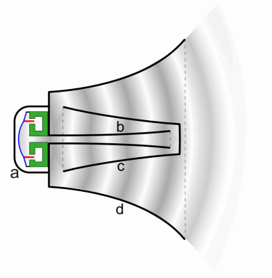
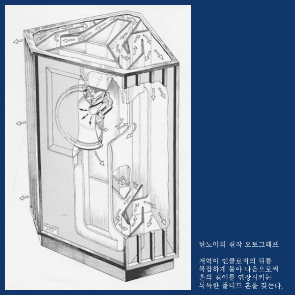

######2014Dec30 19:03:22+0900

음냐냐.. 뭐하고 싶은지 생각해봐야한당.

---

######2015Jan04 01:56:12+0900

허술해지기.

-

객체의 주체성.

-

허술하게 좀 그냥 하기.

상상은 하는데, 창조를 못한다.

---

######2015Jan11 01:11:02+0900

toys - "grand illusions"

---

######2015Jan27 19:21:45+0900

1) echo feedback (wow-wow? delay/reverb) 진행중

arduino에서 하는 건데.

<http://interface.khm.de/index.php/lab/interfaces-advanced/arduino-realtime-audio-processing/>

이거 대로 만들어서.. 앞단에. 마이크 프리앰프 달고. <http://www.circuitdiagram.org/microphone-preamp-circuit.html>

프리앰프 출력을 gain 10 (100k/10k) 2.5v (100k/100k) biased inverting op amp (tl072) 로 증폭시킨후에.. 아두이노에 넣었다.

출력에 33mH는 없고.. 103 (10mH) 를 달아줬다.

되긴하는데.. 허밍 humming이 심하다. 그라운드 문제인듯.

그리고, 아두이노의 8비트 리버브가 성능이 그럭저럭.. 하다.

=> 그라운드 문제를 더 잡아보거나, adafruit 오디오 앰프에다가 디지털로 오디오를 줘보거나(?되나?), 캡을 전부 필름 캡으로 바꿔서 노이즈를 잡거나 해야 한다. 전부 배터리로 작동하는 거 치고는 노이즈가 넘 심한 듯. 스위칭 파트는 아두이노 뿐이다.
스위칭 파트를 잡아 없애던가.. 순수 아날로그 방식으로 하던가 (모노트론 또는 기타 회로 참고.)

-

######2015Jan27 19:30:15+0900

2) 줄자를 라즈베리로 하기. => 미디 안쓰고.. 트럼팻 사운드 재현.

3) 우드 피아노 하기.

4) 기타 신작들, 사운드 연동 하기.

그리고, 오늘 밤에는 꼭 주문을 넣어야 한다.

-

######2015Jan28 03:35:27+0900

polyphonic의 세계에 빠지고 있는데.. 뭐 일단, 잠깐 정지하고.. 오늘 시간 계획을 세워보도록 해야겠다.

지금이 3시반인데.. 뭐뭐를 할껀지.. 그걸 좀 정해보자.

줄자/라즈베리파이. 이건 지금 적당한 소리는 찾았는데, 뭔가 맘에 안드는 부분이 있어서. 문제다.. 이걸 해결했으면 하는데.. 금방 안될 거 같아서 지금 이렇게 정리를 해보고 있지.

일단, 되고 나면? 그럼 거기에 벨로서티랑 피치 듀레이션 세가지 파라미터를 어떻게 넣는지 체크하고.

그러고 나서는?

지금 아두이노랑 .. 줄자랑 준비는 되어있는데.. 나노3.1에다가 우노 써서 강제로 업로드 시키고.

줄자 + 나노/라즈베리/오디오카드/앰프/스피커/배터리 요렇게 꾸려본다.

또는 배터리 안쓰고.. 별도 전원 쓸 수도 있긴 한데, 일단은 배터리로 먼저 구현해보고 그런담에 결정하도록 하자.

-

배터리는 샤오미10400 이고. 앰프는.. 머 일단 젤 좋은.. 20와트 앰프로 하고.. 오디오카드는 uca202 고.. 라즈베리에 오!프린트 이미지 올리고 시작하고. 나노에 줄자 코드 넣고.. 줄자 가져다가 납땜하고 씰링하면 준비완료.

-

지금 .. 당장.. 나노가 없고.. 잘 되지도 않아서.. 쩝.. 트린켓을 해야 하나? 어떡하지? 트린켓은 퍼마타가 되나? 잭꺼 할때도 필요해서.. 머 쩝..

---

######2015Feb04 14:29:10+0900

(전시장 사진)

전시장 와서.. 셋팅 잡아봤다.

이슈정리.

1) 스픽아웃 조명 2개중 1개를 뺄까? 아주 빼나? 아님 딴데 놓나? 딴데 놓기도 애매하다.

2) 피아노를 작업해야 한다. 피아노 건반의 크기는 어떻게? 상자는 또 어떻게 처리?

3) 북치고보행기 줄을 좀 당겨 잡아야 한다. -> 뭔가 좀더 쉽고 간편하게 당겨 잡을 수 있게 나비너트나 그런거 가능할까?

4) 비숍관리자에게 스피커를 단다. 근데 단 다음에는? 그 스피커에서는 어떤 소리가 나면 좋을까?

5) 깃발 수레 까딱이.. 어떻게. 깃발로 하기로 하는 건가? 뭔가 다른 좋은 방법은?

6) 쌍라이트 조명을 마저만들어야 할텐데.. 어떻게 만들건지.. 그건 그렇고, 220 전원 입력 시키는 방법은 어떻게? 너무 와이어가 치렁치렁인건 별론데..

7) 링겔확성기 완성하고 모듈 패키징 해서 넣어야 하는데, 어떻게? --> 모듈은 최소화 해서. 밑에다가 넣을 수 있을 걸로 예상.

8) 템버린 조명 보수하고 가져다가 설치. 역시 220 전원 입력.. 이거 어떻게?

9) 부케 마이크 작업하고 완성해야 함. -> 역시 시스템 어떻게 넣을껀지.

10) 발언대수레는.. 어떻게 마무리 할건가.

11) 그외 자바라잡아. 랑.. 후라쉬. 어떻게?

---

######2015Feb04 14:35:19+0900

이슈별 토론.

1) 스픽아웃 조명 2개중 1개를 뺄까? 아주 빼나? 아님 딴데 놓나? 딴데 놓기도 애매하다.

2) 피아노를 작업해야 한다. 피아노 건반의 크기는 어떻게? 상자는 또 어떻게 처리? -> 가로 38~35 * 19 / 앞면 커버. -> 판재 및 상자 작업은 내일 와서. / 시스템 작업은 빨리.

3) 북치고보행기 줄을 좀 당겨 잡아야 한다. -> 뭔가 좀더 쉽고 간편하게 당겨 잡을 수 있게 나비너트나 그런거 가능할까? (기타 줄감개?)

4) 비숍관리자에게 스피커를 단다. 근데 단 다음에는? 그 스피커에서는 어떤 소리가 나면 좋을까? -> 박수?

5) 깃발 수레 까딱이.. 어떻게. 깃발로 하기로 하는 건가? 뭔가 다른 좋은 방법은? --> 응 깃발. 2명이서 하는 걸로 하면 좋겠다! / 사운드 효과도 생각해볼까?

6) 쌍라이트 조명을 마저만들어야 할텐데.. 어떻게 만들건지.. 그건 그렇고, 220 전원 입력 시키는 방법은 어떻게? 너무 와이어가 치렁치렁인건 별론데.. -> 붙박이들을 이용.

7) 링겔확성기 완성하고 모듈 패키징 해서 넣어야 하는데, 어떻게? --> 모듈은 최소화 해서. 밑에다가 넣을 수 있을 걸로 예상.

8) 템버린 조명 보수하고 가져다가 설치. 역시 220 전원 입력.. 이거 어떻게? -> 붙박이.

9) 부케 마이크 작업하고 완성해야 함. -> 역시 시스템 어떻게 넣을껀지. -> 여러개를 충전하는 분할 케이블도 준비 5개 정도.

10) 발언대수레는.. 어떻게 마무리 할건가. -> 거의 끝?

11) 자바라잡아. 랑..

11.5) 후라쉬. 어떻게? -> 너무 어두워서 안된다고 생각한다.. -> 나중에 조명이랑 셋업 후, 가능성 다시 검증해보자.

12) 정가운데 충전 포인트가 필요하다.. 높이 낮게.. 충전도 하고, 220 공급도 하고. -> 거기에 이스라엘 종을 하나 놓고, 종을 치면 전체 조명이 켜지고 꺼지고 하는 거는 어떻지 생각해보고 있음. --> 됐고.. 벽에 2개를 붙박이로 설치 (존재감 있게! 판 2개 각목 3개 질러서.. / 단비농장 박스 사이즈 참고) / 붙박이에 충전용! PC파워 사용! (2개?)

13) 바닥 표시 -> 작은 원으로 표시만. 선으로 이어버리는건 싫다. 묶여있는 거 같다. -> 색색이 원 표시, 이건 또 너무 하는 거 같다 -> 흰색 인데.. 선으로.. 얇은 라인테이프에다가, 1.5미터 정도. 자유롭게 선으로 표시하는거 어떨까. -> 미정.

14) 후라쉬 하려면, 와이파이 공유기 설치 요청 필요.

---

######2015Feb08 06:40:51+0900

기존에 쓰던 스피커들이.. corn 스피커라면.. 요번에 혼 스피커를 첨 사서 써봤는데.. 싸구려라서 그런것도 있겠지만, 소리가 뭔가 명랑하고 좋다.

소리를 증폭하는 방식이 조금 다른 것 같은데, 혼 스피커는 기본적으로 compression driver 라고 해서... 음량 증폭 능력이 탁월하다는 것 같다.

재밌다!

-

요게 위키피디아에 있는 홈스피커의 설명. gif 인데.. 아직 확실하게 이해가 되진 않는데.. 궁금하긴하다.. 뭔가 공진.. 반사.. 증폭..

혼 스피커는 그래서 길~~ 게 뽑는다는데, 좁은 공간에서 길게 뽑자니.. 어렵고 해서, 반사를 많이 이용한다. 일반적인 메가폰들의 모양도 (중앙에 뭐가 툭 튀어나와있는 모양들..) 그래서 그렇게 된 거더라. 위에 gif에서도 반사가 들어있지.

이걸 좀더 멋지게 가져가면 위에 탄노이의 오토그래프 같은 것도 나온다! 어서 마니 본 모양. (예를들면, 종로의 ozone?)

-

<http://www.loudspeakerdesign.co.uk/infinite_baffle.php>
[../../../docs/pdfs/Infinite Baffle Enclosur...Design and Construction.pdf](../docs/pdfs/Infinite Baffle Enclosur...Design and Construction.pdf)

일반적으로 반복되는 이야기가.. corn스피커의 인클로져에 대한 얘기인데.. 인클로져의 역할이 뭔지에 대한 나의 오해에 대한 것인데.. 난 인클로져가 통을 만들어서.. 울림통 역할을 한다고 생각했는데, 기타 처럼... 아직도 그런건지 아닌건지 확실하게 이해가 되는 것은 아니지만,

많이들 하는 '이론적인' 이야기는.. 스피커의 앞과 뒤에서 나오는 소리의 180 위상차를 갖는 소리가 서로 더해져서 상쇄되는 현상을 막기 위해서 인클로져가 있다는 얘기가 길단 기본이다.. 그런데, 이렇게 해서 완전히 막아버리면 또.. 공기가 순환이 안되서 air damping 이 걸려서.. 움직임을 방해하게 되기 때문에 살짝 구멍을 뚫어주는 것! 이게 스피커들에 구멍이 뚤려있는 이유! 란다.

근데.. 여전히 울림통 역할은 안하는 걸까? 울림. 이란 것은 뭘까 혼돈이 찾아온다.. **울림은 사실 정적인가? 반대되는 소리를 정적으로 몰아 넣으면, 소리가 커진다니..**

<http://hyperphysics.phy-astr.gsu.edu/hbase/audio/spk.html>
[../../../docs/pdfs/Loudspeakers.pdf](../docs/pdfs/Loudspeakers.pdf)

여기서는 기본적인 이해에 대한 물리적 내용을 정리하고 있다.. 곰곰히 생각해볼 것들.

<http://en.wikipedia.org/wiki/Horn_loudspeaker>
[../../../docs/pdfs/Horn loudspeaker.pdf)](../docs/pdfs/Horn loudspeaker.pdf)

혼 스피커에 대한 위키피디아!

---

######2015Feb08 07:23:15+0900

ㅇㅇ 그리고, 어제 부케 스피커 - 포겟 더 랜드의 변용 버젼 - 에다가, 아이스크림 스피커를 달았는데, 소리가 진짜 완전 크게 나와서 크게 놀랐다. 8000원짜리 3와트 짜리 스피커가 .. 소리가 짱짱 뻣는다. 이럴 수가.

웨이브 쉴드와 아이스크림 스피거 궁합이 엄청난데, 어째서 그런건지, 잘 알아봤음 좋겠다. 라즈베리에 오디오카드 달고 20와트 앰프 달고 나오는 소리랑은 다르다. 되게 시원하게 잘나온다.

이걸 잘 조합해서, 앰프 단을 따로 빼서 아답타 따로 달고, 하면, 12볼트 안써도, 원하는 크기의 소리를 저가격으로 만들 수가 있을 것이다. 이번에 부케 메가폰을 다시 만들면서 연구해보자.

---

######2015Feb08 07:27:10+0900

그리고, 라즈베리에서 나오는 노이즈가 문제인데.. 아세아 상가 갔을때, 스피커 (좀 싸구려로 보이는) 에다가 코일을 병렬 연결하고 있는 아저씨들을 많이 볼 수 있었는데, 그게 어떤 용도 인지 궁금하다. 잡음을 잡는 것 같은데, 맞는지. 한번 실험해볼 필요가 있다!

inductive load를 추가로 달고 있는 거라고 볼 수 있다. inductive load를 병렬로 달면, 저주파에서 저항이 낮아지는 효과가 나타날 것이다. 즉, 저음역대가 보다 큰 소리로 전달되게 될 것이고, 고음역대는 그냥 스피커만 작동할 것이다.

또는, 인덕터가 아니라 변압기 코일이므로.. 직접적인 연결을 피하고 있기 때문에.. 잡음을 제거하는 효과를 본다고 볼 수도 있다.

둘중에 어떤 경우인지 확인 필요하다.

-

<http://blog.daum.net/_blog/BlogTypeView.do?blogid=0bmJK&articleno=4>

인덕터가 아니라.. 모양을 보면 아마도, 매칭 트랜스 일 것 같다. 트랜스 포머.

임피던스 매칭용.. 노이즈는 오히려 더 타서.. 해결책을 또 찾아야 하는 것 같던데.. 아저씨들한테 또 가게 되면, 확인 질문 해봐야겠다.

---

######2015Feb08 08:18:18+0900

1:1 transformer 트랜스를 이용해서 ground loop isolator 를 만들어 쓰는 경우를 많이 볼 수가 있다.

오디오용으로는 잘 되는 가 본데.. 해보고 싶고...

<http://www.amazon.de/gp/product/B003WGQUZ8>
<http://www.amazon.co.uk/hq-CAR-NF01-Skytronic-Ground-Isolator/dp/B000NVWB9O/>
<http://www.bcae1.com/glisoltr.htm>

이걸로 rpi노이즈를 잡았다는 얘기도 있다.

<http://www.raspberrypi.org/forums/viewtopic.php?t=16949&p=228657>

-

이게 정말 잘 된다면, 이걸 이용해서, jack의.. 센서보드 충전 문제를 해결할 수도 있지 않을까? 100mA 안팍의 전류를 전달하는 거라면.. 0.5와트 정도 전력이면.. 트랜스로 전달 가능하지 않을까? / 아마 효율 문제도 있고 하니.. 고 전력 전달에는 열도 많이 나고 안좋을 거 같긴하다만.... 시도해 볼만하다.
