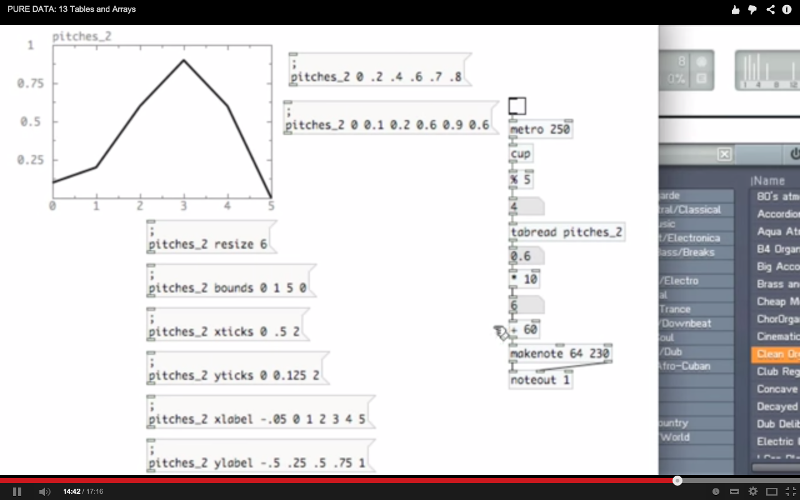

# 기술놀이와 해킹

## official
[http://www.unmakelab.org/?page_id=27](http://www.unmakelab.org/?page_id=27)

워크숍x세미나 2  
"AS IS" 클럽 (세미나) x BYOP(워크숍)
진행 _ 다이애나 밴드
일정 _ 10월 11일(토) – 12일(일)
시간 _ 오후 2시 - 5시 
장소 _ 아티스트 런 스페이스 413 (artist run space 413)
 
```
BYOP : 당신의 폰을 가지고 오세요(워크숍)

BYOP(Bring Your Own Phone). 여기서 폰이란 스마트 폰을 말한다. 불이 꺼지면 새까맣고, 그래서 얼굴이 비치고, 이빨에 끼인 고춧가루를 확인할 수 있는 그 넙적한 그것 말이다. 스마트 폰은 이름부터가 못마땅하다. 폰이 그냥 폰이지 스마트할 껀 뭐람. 나보다 스마트해 보이는 그 녀석. 스마트 폰을 쓰는 사람은 스마트 한 걸까? 자유도 센서와 지구 방위 나침반 센서를 내장하고 지구 궤도위에 위성과 통신하고 GPS위치로 내가 지금 어딜 바라보고 있는지 금세 알아맞히지만 화면이 꺼지면, 검은 스크린은 차가워서 얼음처럼 쨍하다….
```

## working day (10/6)

음 정말 몇일 안남았네.

오늘/내일 테스트/개발 해서 모듈 만들고.

수목금 3일간 세미나 준비하고 원정이가 웍숍 완성한다.

-

음.. 먼저 모듈 개발..

녹음/재생 모듈.
네트워킹 모듈. OSC모듈이라고 보면 된다.
센서데이터 모듈. 기본적인 신호 가공 기능이 들어있으면 좋겠다.

이 모든 것을 위해서.. 하나의 오버뷰가 필요하다.
전체적인 그림. 그렇게 해서 유즈케이스를 생각하면서 개발해야 한다.
agile 방식으로. 지나치게 유즈케이스에 메이진 말고, 계속해서, 작게 자주 많이 만들어 보도록 한다.
oop.

-

그러니깐.. 유즈 케이스는 스킵.
녹음/재생 모듈부터 가보자.

만들려고 하는 것은.
녹음/재생기다.
누르면 녹음 되고. 재생! 하면 재생되면 된다.
그리고 폴더를 지정해서. 읽고. - 이런 걸 표시하는 GUI가 있는지 확인.
파일을 선택할 방법이 필요하기도 하다... 진짜? 어데 쓰게?

-

머리가 아프려고 한다. 아프지 않게 조심.

-

노래 좀 틀어봐.

-

ㅇㅇ 표시 쥐유아이는 됐고.. 그냥 초기화 인자로 주거나.. 메세지로 주거나. 하면 된다.
녹음을 시키는 앱은 따로 만들어 주자.
찾아보던지.

-

아 그리고 녹음을 한 후에 프리뷰도 가능해야 한다.

-

아 그럼.. 녹음을 하고 프리뷰를 하고 저장하게 그렇게는 안되나? 매번 저장을 하고 불러서 들어보고 하는 것도 좋지만..
파일명을 넘겨주고 받고 하는 것도 복잡한데..

writesf~ 말고.. tabwrite~ 같은 종류로 해서 테이블로 쓰고.. 나중에 저장. 하면 저장되는 건 어떨지.

그게 아니면.. 매번 할 때 마다 그냥 저장이 되도 되고.. 뭐 이건 선택.

-

시작/끝에. 제로 크로싱을 안챙겨주면. 틱틱하는 소리가 남는다..

해결책은 제시 해주지 않는다.

-

타이머를 설정해서. 일정 시간동안만 녹음되도록 하는 것도 필요한 것 같다.

-

어레이로 하는 방법도 소개하는데.. 그렇게 하고 나서 파일로 저장하는 것은 소개하지 않는다.
어레이로 하는 경우에는 시간이 미리 정해지는데. 시간이 지나면 자동으로 멈춘다.
writesf~를 쓰면, 시간에 제약이 없이 녹음할 수 있다는 장점이 있다.

-

내 생각은 아무래도.. 자연스럽게 순서대로 하는 게 좋을 것 같다.
writesf~로 하되. stop 을 하고 나면. 로드를 하고. 프리뷰를 할 수 있게 해준다.
만약 맘에 안든다면 다시 start를 하면 되고, 맘에 든다면 거기서 멈추면 되고.
새 파일을 하려면. 다시 이름을 넣고 open 을 하면 된다.

-

이상 내용은 다음 영상을 보고 생각함..

[](http://www.youtube.com/watch?v=oXE7BvUd8W0)

-

버튼은 푸시락이 아니라 푸쉬 타입으로 해서.. 누르고 있는 동안에 녹음하는 식으로 해도 좋고..... 경우에 따라 다르니 두가지다 가능하게 해보면 좋겠다.

뭐 간단하게 기본 파일명을 생성해주는 것도 좋겠다. 시간을 초단위로 받아서. 날짜랑.. 하면 좋겠다. 이름을 바꾸는 기능도 있으면 좋겠는데.. 생성한 다음엔 못바꾼다. 이름을 미리 바꾸고 하던지 아님 그냥. 있는 기본이름으로 계속 쓰던지 해야 한다.
이름 바꾸는 걸 할려면 복잡해진다. 진짜.. 나중에 컴터에서 바꾸도록 하자.
그렇다면.... 굳이 이름을 넣는 기능이 필요할까? 보나마나 이름을 넣고는 잘 안할 것 같은데..
응.
필요없을 것 같으니 심플하게 그냥 날짜_시간으로 하자.

-

미리 제작된 패치가 있는지 찾아보자.

-

녹음 앱은 사실 많이 있어서... 있는 걸 써도 되긴 할 거다.. 굳이 제작해야 할 이유가 있을까?
지금까지 말한 기능이 다 되는 프리앱이 있다면 ..?
제로크로싱 핸들링도 그런 앱들이 해줄까?

-

오케이.. 
첫번째 예상밖의 일, 또는 현실은.. date. 오브젝트는 피디 바닐라에는 없으며, 아이폰은 그지 같아서 다이나믹 링킹을 허용하지 않는다. 따라서, 추가로 라이브러리를 깔수가 없다는 사실이다!! 대략적으로 data를 파일명으로 쓰는 멋진 일은 불가능해질 것 같다.
정말 방법이 없을까? 욕심이 생기는데.. ㅡㅡ.. 날짜와 시간이 적히면 얼마나 좋을까나.....

-

아.. x_time.c 파일을 봤는데... 시간에 관련해서.. 제공되는 것은 5가지 뿐인데..delay/timer/metro/line/pipe.
음. 어느 것도 날짜를 제공하진 않는다. 시간도 제공안하고.
앱 실행 시간 기준으로.. 할 순 있겠는데.. 그럴꺼면 뭐 그냥..
.. 그냥 하지 뭐. 카운터 하나 달아서.
뒤에 랜덤 넘버 하나 추가해주고.
..
그렇게 해야겠다.

-

cuinjune이란 아이디를 쓰는 사람을 찾았는데.. vl2s를 만든 사람..
음 이름이 zack lee여서 보니까.. 한국 사람인 것 같던데.. 참 착실.
질문하면 답도 잘 달아놓고.. (셀프 답글, 다른 사람들 보라고..)
공유도 잘하넹..
여튼 덕분에.. vl2s 받아서 써봐야지.. / vl2s 내부를 보니.. 상당한 실력자다. ㅡㅡ;;

[text] 란게 새로나왔는데.. 지금 있는 바닐라에 있더라.. 좋아보임. 관심가고..
어레이로 담은 사운드는 soundfiler에서 write 명령으로 저장하면 됨. <http://www.pd-tutorial.com/english/ch03s04.html>

-

<http://forum.pdpatchrepo.info/topic/7574/vl2s-list2symbol-for-vanilla>

자세히 보니 그다지 유용한건 아닌듯.

-

중대한 내용..

order of operarion in PD. 3 rules.

<http://en.flossmanuals.net/pure-data/ch039_order-of-operations/>

-

PD 그래프 기능

<http://en.flossmanuals.net/pure-data/ch045_arrays-graphs-tables/>



-

[makefilename]
이걸로.. 파일명 생성하면 좋다.

-

<http://discchord.com/blog/2014/4/17/mobmuplat-now-supports-audiobus.html>

AudioBus가 지원된다. MobMuPlat에서..

-

pd 에서 preset을 저장하는 것에 대해서..

<http://forum.pdpatchrepo.info/search/patch-saves-presets>
<http://forum.pdpatchrepo.info/topic/3453/saving-presets>

여러사람들의 의견.
<http://forum.pdpatchrepo.info/topic/194/saving-presets>

-

텍스트 파일 사용하기. (프리셋 저장도 하고.. 큐리스트) / qlist text textfile

<http://www.pd-tutorial.com/english/ch04s02.html>

-

오디오 phasor컨트롤.

[](http://www.youtube.com/watch?v=boX0v54SqtU&index=24&list=PL12DC9A161D8DC5DC)

-

테이프 효과를 내는 루핑. - 사운드 파일 들어봐. 좋다. / 재밌다.

<http://guitarextended.wordpress.com/2013/08/05/making-a-looper-with-pure-data/>

## working day (10/7)

인제 진짜.. 진도 좀 빼자.

-

음.. 진도 뭐.. 쪼.. 금 나가긴했는데.. 일단 지금까지 된거 정리하자.

뭐 쩝.. 난항이다.. 뭔가.. 퓨어데이타 첨하는 사람처럼 지지부진. 체력을 아껴서 밤을 새자.

-

writesf~로 할건지. tablewrite+soundfiler로 할 건지 확실히 정해야 하는데..
요점은 테이블 기반으로 하면, 시간이 미리 한정되는 문제가 있고.
파일 기반으로 하면, 시간은 자유로운데.. 파일 포인터를 어떻게 할 건지..문제가 된다. 파일 녹음이 끝나면.. close 를할 수 있는지 문제다.
어제 말한 것 처럼. writesf~로 하되.. 한번 녹음한 후에 다시 start를 하면 뒤에 이어붙는지, 다시 하게 되는지는 모르는 일이다.
아마도 뒤에 이어붙을 것 같은데, 그렇게 되면 어떻게 앞으로 돌릴 수 있을지.. 문제가 된다.

테이블로 하되.. 메모리를 계속 확장해서 가져갈 수 있게 해도 좋다.
그런데 어떻게 할 수 있을까? 가능할까?

-

음.. 리사이즈를 하는 걸 해봤는데..
문제는.. 보여주는 건데..
레코딩을 하면서 보여줄수가 없다는 것이다.
근데..
정말 보여줘야 하는 걸까?
안보여줘도 됨.
그럼 뭐가 문제지?

자.자.

어레이든 테이블이든..
놓고.
레코딩을 시작하고.
1초가 되면. 2초로 메모리를 늘려잡는다.
그러고나서. 1초까지의 데이터를 그대로 유지하면서, 이어서 쓰고 싶은거다.

-

쩝.. 아무도 이렇게는 안하는 것 같은데.. 관둘까?

함보자...

끝을 내야 한다. 한시간내로.

정말.

-

일단.. 사운드 파일의 길이가 제약되는 건 싫다.
그렇다면 writesf~로 하면 된다.
자 그런데. writesf~로 하면 stop을 해도 클로즈가 안된다. -> 안되는 것 같지는 않은데... 왜 딜리트가 안됐지?.. 함보자..
음. 일단 맥에서 할때는 그런 문제가 전혀 없는데? 근거 어디서 난건지..
딜리트 되고, 오버라이트 된다.
오버라이트를 하는 방법은. open도 새로 하면 된다.
만약에..open새로 안하고 start하면 어떻게 되지?
안되네..
오픈을 하고 스타트-스톱을 하고나면 다시 스타트 못함. -> open, start를 묶는 이유가 있네.

-

굳이 뉴파일을 할 필요가 없네..

-

데이터를 세이브 할려면. [set $1( 를 이용하랜다.. 일리가 있네.
그게 아닐거면 어레이를 이용해도 되는데.. 가능하면 위에 방법이 좀더 직관적이고 의미가 확실하네.
아.. 근데 바껴도.. 세이브를 안누르면.. 저장이 안되네 이런... 무의미한데..

-

어레이로 하면 되나?
어레이로 해도 마찬가지.. 세이브를 눌러야 저장이됨.

-

text를 쓰는 방법밖엔 없군.

-

그래 뭐 text 를 쓰던지 하면될것 같다..
그나저나..

-

어떻게 해나가야 하지? 이제?

-

...

-

센서 데이타에 대하여..

일단, motion 예제는.. 소리가나는 거였다는 사실! -> 센서 세트를 터치하면 해당 세트에 따른 소리가 나오는 거였다.

첫째. tilt.. 와 accel. 이건 x, y 는 거의 같은데.. tilt의 경우엔.. 90를 넘어가면 1또는 -1로 saturate가 된다. 가속센서 값은 그렇지 않다.
즉, 특정 케이스를 디텍트가 가능함. 간단하게.

둘째. gyro는 순간 각가속을 말하고. device motion data는 attitude 를 말한다는데.. 뭔가.. 북쪽을 가리키는 방향이 0,0,0인것 같다.. 즉 공간 맵핑에 사용이 가능하단 얘기다. 어디를 가르치고 있는지. 나온다.

만약 돌리는 걸 한다고 하면.. gyro (순간 각가속값) 을 쓰면된다.

-

좌표계에 대해서 얘기해도 재미있겠네..
device in space. 멋지지 않아 ㅎ

-

<http://en.wikipedia.org/wiki/Flight_dynamics_(fixed-wing_aircraft)#Reference_frames>

여기를 참고해볼때..device attitude in space에서 나오는 yaw의 방향은 북쪽을 가리키는 게 아닌지 생각된다.

궁극적으로는 reference frame에 따라서 달라진다.

실제 실험 결과로는.. 미묘하게 바뀌는 걸로 보인다. 정확한 맵핑은 어려울지 모르지만 감성적 맵핑은 가능할 것이다.

gps나 magnetic sensor등이랑 연동을 해서.. 보완하는 것으로 보임.

-

그밖에 인상적인.. 이야기들..이미지들.

<http://blog.denivip.ru/index.php/2013/07/the-art-of-core-motion-in-ios/?lang=en>
<http://en.wikipedia.org/wiki/Gyroscope#Properties>
<http://en.wikipedia.org/wiki/Attitude_indicator>
<http://en.wikipedia.org/wiki/Attitude_control#Sensors>
<http://en.wikipedia.org/wiki/Six_degrees_of_freedom>
<http://en.wikipedia.org/wiki/Flight_dynamics>
<http://en.wikipedia.org/wiki/Flight_dynamics_(spacecraft)>
<http://books.google.co.kr/books?id=GB1Cdqf433wC&pg=PA50&lpg=PA50&dq=flight+yaw+reference&source=bl&ots=yf9bQQMpqL&sig=JGxLRPFMCavzzVexpL0YDFsEtjo&hl=en&sa=X&ei=4Z80VKa1LM__8QWL-oEQ&ved=0CD8Q6AEwBQ#v=onepage&q=flight%20yaw%20reference&f=false>
<http://en.wikipedia.org/wiki/Flight_dynamics_(fixed-wing_aircraft)#Reference_frames>
<http://en.wikipedia.org/wiki/Aircraft_principal_axes#Vertical_axis_.28yaw.29>

"fuselage" 란 비행기의 동체..

<http://aviation.stackexchange.com/questions/3863/what-is-the-coordinate-system-used-in-an-aircraft>
<http://www.techdrawingtools.com/24/l2402.htm>

-

더블버퍼링 in pd..

<http://forum.pdpatchrepo.info/topic/5469/write-read-buffer/3>
<http://forum.pdpatchrepo.info/topic/2111/contiunous-writing-and-reading-arrays>

-

첫째. 페이즈 컨트롤을 좀더 정확하게 해서.. 음계처럼 되게 할 수 없는지. 멜로디컬하게.
둘째. 센서 값이 바뀔때, 샘플이 막 깨지면서 디지탈 적인 느낌이 너무 강하게 나와서 이보맨이 되는데.. 이걸 좀 완화하거나 제거할 수 없는지.
셋째. 다른 센서. 지금은 걍 기울기를 1차원으로 적용했는데. (거리 개념으로) 다른 센서와 다른 방법을 쓰면 어떻게 되는지.

-

일단, 3번 부터 처리한다.
숫자를 주고.. 사운드를 고를 수 있게 해보자. 버튼으로 넘기는 것도 좋으니까 살리고..

-

버튼 가운데 글씨로 표시해주는 거 좋은것 같다.. 녹음을 할 때도 그렇게 하면 좋겠다...

몇번 파일을 새로 녹음할건지.. 그때그때 리플레이도 가능하게 하고.

-

<iframe src="//player.vimeo.com/video/108334259?title=0&amp;byline=0&amp;portrait=0" width="300" height="205" frameborder="0" webkitallowfullscreen mozallowfullscreen allowfullscreen></iframe>

한번 놀아봄..

음. 나쁘지 않다.

-

어떤 이벤트를 설정해서, 어떤 사운드가 나게하는 것은 필요하다. 쉐이크라던지.. 간단한 정도에서 몇가지 서사를 만들수 있게..
예를들어 자이로로 하면 막 돌리는 액션에서 재미가 있는데..
딱 멈추는 순간에도 뭔가를 기대하는데. 갑작스런 멈춤이나 동작.
그런건 적용이 안되버린다. 무음.

-

녹음기를 업뎃해야 하는데..
10까지 숫자를 골라서. 녹음할 수 있게 하거나.. 그래야 함.

그리고, 여러개의 소리를 동시에 이용하는 구체적인 그림을 그려야 함.

-

**영역을 분할해서 여러가지 소리를 구간별로 할당하기.**
페이져가 너무 떨려서. 소리가 디지탈 적으로 되는 것 같은데. 변하는 속도를 좀 딜레이를 가지고 가져가는 옵션..
hivetron1처럼..

-

아.. 혼동이 되기 시작했다..
녹음기를
다시 만들고 있는데... 서둘르나 내가?
지금 actionpick에서 만든.. filename pick이.. 좋은 것 같은데.. 분할을 좀더 잘해야 할 것 같다.

자.
파일네임픽이란 놈은.. open.next open.current가 필요하다고 생각했다. 정말 그럴까?
아닌것 같은데... 그냥 open.next 만있으면 될 것 같은데..
아.. 그렇게 생각한 이유는.. 다시 녹음을 하려고 overwrite할 때.. 현재 쓰던 이름을 다시 가져와야 할 필요가 있기 때문에 그랬다.
음. 그렇다면 그렇게 하지 뭐.
open이란 이름 대신에 get. 으로 하자 그럼..

get.current get.next.

그렇게 하고..

로더 및 프리뷰어는.
오픈이 되면 그 때마다 로드해서 버퍼에 채워넣고. 명령을 받으면 플레이하고 그렇게만 하면된다.
tabplay~로 충분. 이부분은 건드리지 말고.

writesf~ 부분.. 이건.. get.current 든.. get.next 든.. 이름이 필요할 때 눌러서 하면 된다.

-

symbol로 가공되어서 나오는 파일이름은 간단히 [set $1(으로 저장하면 된다!
get.current를 굳이 해야할 필요가 없다.

-

10 개의 사운드를 관리하는 것 까진 완성.
근데 한가지.. 현재 사운드가 등록이 안된 슬롯인지 확인이 안된다.
텍스트 오버레이가 필요함.

-

텍스트 오버레이 됐고..
뉴사운드를 눌러야만.. 
새로운 사운드를 녹음하게 막는 기능도 다시 살렸다.

-

이렇게 해서 녹음기는 일단락.

-

```
첫째. 페이즈 컨트롤을 좀더 정확하게 해서.. 음계처럼 되게 할 수 없는지. 멜로디컬하게.
둘째. 센서 값이 바뀔때, 샘플이 막 깨지면서 디지탈 적인 느낌이 너무 강하게 나와서 이보맨이 되는데.. 이걸 좀 완화하거나 제거할 수 없는지.
셋째. 다른 센서. 지금은 걍 기울기를 1차원으로 적용했는데. (거리 개념으로) 다른 센서와 다른 방법을 쓰면 어떻게 되는지.

-

일단, 3번 부터 처리한다.
숫자를 주고.. 사운드를 고를 수 있게 해보자. 버튼으로 넘기는 것도 좋으니까 살리고..

어떤 이벤트를 설정해서, 어떤 사운드가 나게하는 것은 필요하다. 쉐이크라던지.. 간단한 정도에서 몇가지 서사를 만들수 있게..
예를들어 자이로로 하면 막 돌리는 액션에서 재미가 있는데..
딱 멈추는 순간에도 뭔가를 기대하는데. 갑작스런 멈춤이나 동작.
그런건 적용이 안되버린다. 무음.

여러개의 소리를 동시에 이용하는 구체적인 그림을 그려야 함.

**영역을 분할해서 여러가지 소리를 구간별로 할당하기.**
페이져가 너무 떨려서. 소리가 디지탈 적으로 되는 것 같은데. 변하는 속도를 좀 딜레이를 가지고 가져가는 옵션..
hivetron1처럼..
```

-

그동안 나온 아이디어들 총정리.. 위에..
음.. 어떻게 진행해야 할까.

-

다시 압축 요약을 해보자면..

<span style="color:tomato">COLOR(RED-alike)</span>
<span style="color:orangered">COLOR(RED-alike)</span>
<span style="color:maroon">COLOR(RED-alike)</span>
<span style="color:crimson">COLOR(RED-alike)</span>

첫째. 페이즈 컨트롤을 좀더 정확하게 해서.. 음계처럼 되게 할 수 없는지. 멜로디컬하게.
......--> 센서 값이 바뀔때, 샘플이 막 깨지면서 디지탈 적인 느낌이 너무 강하게 나와서 이보맨이 되는데.. 이걸 좀 완화하거나 제거할 수 없는지.
......--> 페이져가 너무 떨려서. 소리가 디지탈 적으로 되는 것 같은데. 변하는 속도를 좀 딜레이를 가지고 가져가는 옵션.. hivetron1처럼..
--> **악셀 프리퀀시를 해서 개선할수도 있다.**

둘째. 다른 센서. 지금은 걍 기울기를 1차원으로 적용했는데. (거리 개념으로) 다른 센서와 다른 방법을 쓰면 어떻게 되는지.
......--> 2norm 계열 말고.. 좀더 다양한 건 없을까.

셋째. 여러개의 소리를 동시에 이용하는 구체적인 그림을 그려야 함.
......--> **영역을 분할해서 여러가지 소리를 구간별로 할당하기.**

-

일단, 센서 값 변환 범위 또는 함수를 조절할 수 있게 해보자.. 파라메트릭 함수 면 좋을텐데...
그다음, 페이져가 너무 떨리는 걸 해결해보자.

-

[](http://www.youtube.com/watch?v=FctKVbAwHg8)

DA.. Differential Analyzer!!

-

hippie LSD ethics

<http://www.thenakedscientists.com/HTML/articles/article/turn-on-tune-in-drop-out/>

히피는 반문명. 자연주의.. LSD는 산업. 연구실에서 나온 공산품.. - 모순?

<http://www.tandfonline.com/doi/abs/10.1080/02791072.1985.10524327#.VDWFkimSwg8>

-

터치밴딩도 해야할까?
하는 것도 좋다고 하면..
또는 하는 옵션도 제공한다고 하면..
녹음기는 그대로 가고.
터치 샘플 10개 플레이어가 필요하고..
이걸.. 10개를 동시에 플레이를 하면 어떨지 모르겠지만.. 해볼 수도 있지.
링링레인 방식으로.. 오버랩시키는 거.

-

## working day (10/9)

compass 센서도 있더라.. 해봤다. 360도 기준으로 나옴.

-

센서 파트랑.. 사운드 파트를 따로 나눠서.
중간에 계산 식부분을 바꾸면서 링크를 만들 수 있게 한다.

-

여러개의 사운드 파트를 할려면..
사운드 파트가 철저히 모듈화가 되어야 하는데
메세지 이름이 겹치고.. 어레이 이름등이 겹치는 문제만 해결하면 되는데.. 좀따가.

-

첫날은 .. 기본 앱+ 사운드 채집. (원하는 어드밴스드 유저는 둘째날 자료를 봐도 되고..)으로.. 시그니쳐 만들고 영상 남기기.
둘째날은 .. 퓨어데이타 패치를 조립하고 GUI 파트도 만들어서. 게임 또는 악기 만들기. (여러개의 사운드 믹싱) 그리고 합주하기.
파라미터를 조작해서.. 저장하면 되도록.
그러기 위해서는 시뮬레이션 환경이 되야 함.

-

오늘까지 1째날 2째날 자료 까지 완성할것.

-

속도의 가변 폭이 사운드의 길이에 따라서 달라지는데.. 이걸 어떻게 해야 할 수도 있을 것 같다..
노멀라이즈 기능을 사용하면 좋을 것 같다.
주파수 분석 및 재해석 기능.
튜너가 있으면 좋겠다.

-

웍숍 발표 자료를 준비해야 한다.
지금 1시인데..
어느정도 끝이 나야 하는데....
무작정 준비할 수는 없다.

-

언제까지 끝을 내야 할까.
일단 선을 그어야 할 것 같다. 최소한의 자료..와 재료.

-

그렇게 해서 준비해놓고. 부담을 좀 덜고 나서.. 세미나 준비도 어느정도 하고.. 그런담에 조금 여유를 가지면서 살을 붙이는 식으로.

-

일단.. 앞으로 12시간이있다고 하자.

-

ㅇㅇ 딱 12시간 남았네.

-

선을 긋자고 했는데...

-

어제 하다가 안된거.. 모니터링하다가.. 스탑안시키고 다음 소리로 넘어가면.. 그때부터 에러나는 거.
그건 아마도 이것 때문에..

```
Toggle
attributes:
border thickness
output:
1 for toggle on, 0 for toggle off
input:
0 or 1 to toggle on/off
send "set x" to set value x without triggering output
```

GUI상태만 바꾸고자했으면 set이라고 해서 메세지를 줘야지 안그러면 다시 bang이 생겨서 무한 루프 상태가 된다.

이거 알았으니까.. 다시 고치려면 고칠수있다.

-

slider / multi-slider / knob. 세가지가.. 뭔가를 조절하는 GUI오브젝트인데.. 이들을 가지고 속도 조절 범위 설정을 할 수 있게 해줘야 할 것이다.

-

느낌상 슬라이더 계열이 좋은데.. 여러개를 한번에 조절하는 multi-slider도 좋겠다. 기본은 그냥 슬라이더..
노브는 뭔가 볼륨을 조절하는 용도로 하면 좋을 것 같은데.. 이것도 화면 압박이 있으면 multi-slider로 하자.

-

문제는 모두다.. 0-1 기준으로 되어있어서.. 

-

또 문제는 저장을 할 수 있어야 하는데..
그런게 libpd에서 가능할지..
지금 내가 쓰는게 libpd 인걸까?

ㅇㅇ 그런것 같다.

아.. 저장.. 파라미터를 저장하는 것은 그냥 textfile 로 가능 할 것이다..!
시간 허비했네.

-

일단 GUI쪽은 다 똑같으니까.. 슬라이더로하고..

-

8시까지 마친다.

-

재밌는게 나왔는데.. 오디오 캐스트!

http://en.flossmanuals.net/pure-data/streaming/oggcast/
http://icecast.org/docs/
http://www.jcraft.com/jroar/

지금 볼시간은 없지만.. 좋네.

-

[](http://www.youtube.com/watch?v=boX0v54SqtU)

이걸 사람들한테 공유할 만함.

보면서 느낀건데.. 리버스 플레이도 가능한지..

-

LPnorm에서 홀수를 주면 리버스가 될것이다..

-

즉, 0-1이기본이긴하나.. 음수를 주면 리버스 방향이 되게 할 수 있게 해야 한다.

즉, 사용자가 -얼마 부터 +얼마 까지 설정하고 그 노브를 옮기면 그대로 되면됨.

즉, 이 값이 곱해지면되는데..그럴려면.. +/-가 남아있는 odd LPnorm 을 쓰면서..

하면 되는데..

연속 구간이 아닌 상태로 구간을 분할해서 쓰려면..

하면 되는데.. 곡률이 구간마다 다르기 때문에..

너무 복잡한 문제는 빼고.

통일..

임의의 값에서 임의의 값 까지 구간을 설정하면 그 사이를 맵핑해주면 된다.

-

맵핑.

일단 입력 값은 -1 ~ 1 이거나 0 ~ 1 이다. NPnorm의 계수에 따라서 달라지는데.. 실수가 되면 어떻게 되는 지 실수는 홀수 인지 짝수인지..

모르겠고.. 복잡하니깐..하지 말고..

먼저 노브를 하나 해서.. 0 부터 9 까지 하고..

받는 쪽에서 짝수/홀수 경우 구분해서 입력값의 레인지를 조절하고..

어떤 영역안에 들어오면 어떤 이벤트가 발생해서.. 소리가 나게 하는게 먼저다.

즉 이벤트를 활성화 해야 하는데..

이벤트 머신이 필요하다.

믹싱 덱은 그대로 있고.

이벤트를 모니터링하고 있다가.

이벤트가 발생하면 덱을 조절해서 해당하는 소리가 해당 센서와 함께 나올 수 있게 한다. 설정도 가져오고.

이벤트는 여러가지가 될 수 있다.

온갖 센서 값의 조합이지.

-

이벤트를 설정하는 것을 사람들이 쉽게 할 수 있게 해줘야 하는데..

스킴은 대략..

다차원 공간에서의 어떤 영역이 된다.

이벤트만 설정하고 빠질 꺼기 때문에..

실시간 센서 값은 그대로 쓰면 된다. 사운드 제너레이션에..

-

이벤트 설정에는 다른 요소도 있을 수 있는데..
시간이 얼마 이상 조건을 만족해야 된다는 것도 들어 갈 수 가 있다..

-

복잡한 이벤트 설정은.. 어떤 GUI로 하기보단.. 패치로 짜버리는게 쉬울 수도 있다.

-

간단한 경우는 GUI로 해도 좋다.
일단 이벤트 설정을 해보자.
한가지 경우에대해서

-

그리고 볼륨 조절을 이벤트로 넣을 수도 있다.
소리를 깨지 말고.

-

즉, 지금 사운드 플레이 모듈은.
번호가 들어오면 로드를 하고.
페이져를 통해서. 플레이를 하고.
볼륨을 통해서 볼륨을 조절할 수 있어야 한다.
딜레이 효과 등도 생각해 볼 수 있다.

-

번호 입력 / 페이져 속도 입력 / 볼륨 입력 / 딜레이 라인 입력
네가지를 놓고 블랙박스화.
모든 입력 값은 저장/불러오기가 가능하게 해야한다. 즉, textfile 인터페이스를 가지고 있어야 한다.
그리고 GUI가 연결되어야 한다. -> 이게 여러개가 되면 무리일 수도 있겠지만 지금은 일단 그렇다..

-

그리고 센서 파트는 다 아는 거고 알아야 하는 거고. 값을 가공해서.. 넣는데.. 좀 있다가 생각해봐야할수도 있겠다..

-

페이져 속도 입력부분은 노멀라이즈가 필요할 것 같다.
샘플 사이즈에 따라서 같은 값이 의미가 달라진다. 전체 샘플을 다루기 때문에..
1은. 정상 속도다.
1을 받으면 x1 속도에 곱해서 쓴다.
10을 받으면 10배속이다.
-1을 받으면 -1배속 역재생이다.

-

또한 모듈이 한 패치에 여러개가 될 수 있기 때문에.

철저히 모듈화 시켜서 충돌이 없도록 한다.

GUI파트는 그게 어려운데.. 포함은 아니더라도 연결은 가능할 것이다.

-

이름은 soundpick.

-

delay line 은 안하기도 함.. 넘 복잡하고 나도 잘 모른다.

-

soundpick은 다 됐다.

-

GUI 파트를 조직적으로 하고..

-

센서 파트도 조직화하고..

-

예제를 어떻게 만들면 좋을까.

[receive fromSystem];
/shake (int) - a shake gesture occured (value is always 1);
/tilts (float) (float) - "cooked" XY tilt values -1 to 1;
/accel (float) (float) (float) - raw accelerometer data, x,y,z, range -1 to 1;
/gyro (float) (float) (float) - gyro data, in radians per second, around roll, pitch, yaw, range -pi to +pi;
/deviceMotion (float) (float) (float) - device attitude in space, at roll, pitch, yaw, range -pi to pi;
/accelFrequency (float) - accelerometer and tilt data frequency, in hertz (default 10). Sent on request;
/gyroFrequency (float) - gyro data frequency, in hertz (default 10). Sent on request;
/motionFrequency (float) - device motion frequency, in hertz (default 10). Sent on request;
/location (followed by 9 floats) - device location info. See MMPExamples-GPS.pd for full explanation.;
/distanceFilter (float) - GPS location update filter, in meters (default 1.0). Val <= 0 sends all updates. Sent on request;
/compass (float) - compass value, in degrees;
/page (int) - sent whenever user scrolls to new page

XY Slider
attributes:none
output:pair of floats 0.0-1.0 for x + y position
input:pair of floats 0.0-1.0 to set value / send "set x y" to set values without triggering output

-

일단 예제 한개는 완성을 한 것 같은데...
이놈이 자꾸 죽네! 이씨..
뭔지 원래 action pick은 안그랬었는데...
뭔가를 잘못하고 있나?
흠..
젝일.
이런게 젤 짜증나는뎅..
뭔가 차이점을 찾아내!!

-

soundpick 한테.. bang 같은거 받고 첨 부터 끝까지 한번 플레이해주는 게 있음 좋겠다..
아니면 애드온을 하나 해서 만들면 더 좋고..
계속 켜놓는데.. 원래 actionpick은 안죽어!! 이씨.
막넘기는 것도 한차례 했는 데 안죽는다.. 왜그럴까.
이런.. 눈으로 봐선 찾을 수가 없다.. GUI파트 쪽의 문제인가?
이런 또.. 이상하게 안죽는데.. 뭐였지..
전원 부족? 하는 일도 똑같은데 왜 하난 죽고 하난 안죽지?
아 디버깅 불능이다...
그냥 넘어가쟈. 죽는다고 하고 넘어가고... 근데 죽는 예제를 가지고 사람들이 가져다 쓰게 할 순 없지 않나...

-

GPS예제에서 시간이 나오더라.. 이럴 수가...
날짜 시간을 구할 수 있는 방법이 여기에!
GPS시간인줄 알았는데.. 그건 아니고.. getTime이란 메세지가 있더라.. 여튼 GPS예제를 보면.. 나와있으니 참고.

-

기본 예제는 마쳤다.
더이상 볼수가 없다. 뭐 쩝.. 문제 안생기기만 바란다.

-

예제 1에서 보여주는 건.. 기본적으로 사운드를 하나 가지고.
센서를 연결해서. 뭔가 플레이백에 변화를 주는 거다.

기본적인 GUI를 짜는 방법을 보여준다.

-

예제 2에서는 조건을 거는 걸 보여주면 좋겠다. 이벤트.
어떤 조건을 만족하면 소리가 나고 아니면 멈춘다.
여기서는 2개 이상의 소리를 함께 쓰고.. 2가지 이상의 소리가 함께 나게 해본다.

-

사용할 센서는 gyro를 2norm 해서. 이벤트를 만든다. 얼마 이상. 0.5 이상?
그러면 소리가 나기 시작하고 해당 자이로 값을 이용해서 볼륨에 변화를 준다. (아마도 노랫소리 - 빗소리)

이번 판에서는 페이즈 장난은 안한다.

모션 센서의 pitch를 이용해서. pitch가 즉 기수가 하늘을 향하고 있는지 본다.

조건이 맞으면, 이벤트가 시작되고. yaw에 따라서 두가지 소리의 비율이 변한다. (빗소리와 천둥빗소리의 전환)

-

만들어보자.

-

만들고 있긴한데.. 꽤 오래 걸린다 쩝... 이걸 사람들이 할 수 있을지 의문..

-

일단 모션센서의 pitch와 yaw라는 건.. 생각보다 측정치로 쓰긴 어렵다.. 모션과 합치가 잘되지 않는다.

-

그래서, 일단 수직을 향하는 것 감지는.. 가속도 센서의 y가 -1 근방일때. 로 하고.
방위 감지는 컴파스로 한다.

-

음.. 뭐 하긴 했다..

-

근데 지금 시간이.. 무려 4시다..

이제 부터 자료만들기를 시작해야 하는 건가?

그나저나 이걸로 되는 걸까?

-

새로만든 예제는 또 죽는다.. 첨 만든 예제는 안죽는 것 같은데.. 이번에도 뭐가 문제인지 모르겠다.. expr을 쓴게 문제인건가? 원래 vanilla 에서 지원이 안되는 놈이다 보니..

빼고 한번 해보면 좋겠네..

-

그나저나.. 이걸로 되는 걸까..

-

그리고 자료를 만들어야 함.

-

원정이가 소개자료랑.. 웍숍 컨셉에 대한 자료를 만들어줄거고.. 나는 구체적으로 워크샵 진행을 해야 할 것이다.

-

일단.. 숨을 좀 돌릴필요가 있다.

-

아이폰은 compass가 안된다!! 어라.

-

조건으로 하면.. 프로세싱 파워는 아낄 수 있을지 모르겠는데..

어차피 fade-in/out이 없으면.. 효과가 crappy하다.. 지저분하다는 거지.. 띡띡 끊기고 튀는게 그다지 ...

그냥 볼륨에 mavg를 적용하는게 더 효과적인데.. 그럴려면 사운드를 계속 백그라운드에서 플레이하고 있어야 하는데.. 뭐.

그게 나을 수도 있다.

-

네트워크는... 못하는 건가. 흠..

-

자료만들기.

-

(웤숍 소개는 원정이가..)

나름의 오프닝? 머리 치는 영상 한번더? (후니다님 소스..)

.. 시그니쳐 만들어보기 .. 영상 함 보여주기. "말로 해봐야 소용없다."

퓨어 데이타와 몹뮤플랏을 소개.

퓨어 데이타를 어떻게 소개를 하나?..

사운드 엔진이자.. 범용 언어의 하나이며. 비쥬얼 언어다... @#$% 뒤에 설명..

밀러 푸켓 사진? 마엘스톰씨랑. 오비와나비 씨.. / 그외에도 많겠지만 잘 모르니깐..

웍숍 도구 소개.

눈에 보이는 도구들.

재료들.. 핸폰.

눈에 안보이는 도구들.

녹음기 앱.

먼저. 녹음기를 설명해줘야 한다. 그리고 소리 채집을 해본다.

센서들.

센서 기본제공 예제.

기울기 센서 부터. 각 센서들에 대해서 설명해준다. 예제를 돌려본다. 채집한 소리로.

자이로 센서. 통에 넣고 돌리기.

비행기 자세 센서. 공간 맵핑.

콤파스 센서. 나침반.. 공간 맵핑. (지리적)

가속도 센서. 중력 잴때 유용. / 기울기 센서로 재도 되는데.. 뭐.. 쩝. 좀 다름.

GPS 예제. (기본제공 예제)

액션픽-예제. 내부 이해용 예제.

...

프로그래밍을 하는 것도 좋지만.. 공부를 시키는 건 좀 별로인데...

시간이 너무 짧다보니까.. 아무리 쉬운것도 부담일 수 밖에 없다..

공부 없이 액티비티 중심으로 가야하는데.. 좋은 대안이나 방법이 없을까.

...

ㅇㅇ 오케.. 그럼..이렇게 하자.

틀은 다 짜져 있고. 숫자만 바꿔서 해보면 되도록..

모든 센서의 출력치를 통일시켜서 몇가지 뽑아놓고.

그 중에 골라서 연결하고. 곱하기 한번, 더하기 한번만 하면 영역 매핑은 끝나는 걸로!

그렇게 해서 어느정도만 맞춘다. --> 이 정도는 GUI로 뽑아 줄 수도 있겠지만.. 시간도 없고.. 이참에.. 내부를 만져보는게 필요함.

...

여기까지 됐으면, 자유시간. 각자 만들어보기.

적당히들 되면.. 웍숍 참여 소감과 함께, 만든 '폰퍼먼스'를 보여주세요 시간.

-

"AS IS" LAB. -> 나도 오픈소스 라이센스로 만든 것을 공유해야 한다. 그것이 의미가 있음. / 사람들도 만든 것을 공유한다.

-

pure data는 BSD 라이센스..

-

음.. 절망적이긴하지만.. paf~ 가 없어서.... 윈도우에서 하면 적어도 될 것이긴해..
여튼, obiwannabe의 자동 연주 패치를 보여주면 다들 좋아할 꺼야.
퓨어데이터에 대한 소개도 되고..
<http://obiwannabe.co.uk/html/toys/sparkle/sparkle.html>

네트웤 - 넷피디.. 

```
Pure Data (Pd) is a visual programming language developed by Miller Puckette in the 1990s for creating interactive computer music and multimedia works. While Puckette is the main author of the program, Pd is an open source project with a large developer base working on new extensions. It is released under a license similar to the BSD license. It runs on GNU/Linux, Mac OS X, iOS, Android and Windows. Older ports exist for FreeBSD and IRIX.

Pd is very similar in scope and design to Puckette's original Max program, developed while he was at IRCAM, and is to some degree interoperable with Max/MSP, the commercial successor to the Max language. They may be collectively discussed as members of the Patcher[2] family of languages.

With the addition of the Graphics Environment for Multimedia (GEM) external, and externals designed to work with it (like Pure Data Packet / PiDiP for Linux, Mac OS X), framestein for Windows, GridFlow (as n-dimensional matrix processing, for Linux, Mac OS X, Windows), it is possible to create and manipulate video, OpenGL graphics, images, etc., in realtime with extensive possibilities for interactivity with audio, external sensors, etc.

Pd is natively designed to enable live collaboration across networks or the Internet, allowing musicians connected via LAN or even in disparate parts of the globe to create music together in real time. Pd uses FUDI as a networking protocol.
```

이게 위키피디아 설명이다.. 뭐 잘 요약되어있겠지.

-

몹뮤플랏 소개는..

영상보면 된다.

<iframe src="//player.vimeo.com/video/85295522?title=0&amp;byline=0&amp;portrait=0" width="500" height="281" frameborder="0" webkitallowfullscreen mozallowfullscreen allowfullscreen></iframe>

정신 없는 영상이지만.. 뭐 나쁘진 않다. 긴장되고 ㅎ

-

요점은 pd와 GUI를 코딩 없이 만들어서 쓰자는 것임.

-

둘째 날엔.. 이벤트와 여러개의 사운드 파일을 사용하는 것에 대해서 할 건데...

이걸로 게임을 만드는 것 까지 갈 수 있을지 의문이다...

역시 틀을 짜놓고.. 숫자만 바꾸기? (이거야 말로 pd 에서 하는 게 좋은데.. 센서 값을 여러개 복잡하게 쓸 것 같아서...)

틀도 짜면서 하기?

모르겠넹.. 숫자만 바꾸면서 한다고 해도.. 넘 복잡해지니까.. 하지말고.

이건 프리하게 가야 한다.

-

그나저나 게임 진짜 만드나? 악기?

신호는 연속성이 있어서. 건너뛰질 못하니까.. 악기를 만들어도 제약이 좀 따를 것 같은데....

이날..touch bending을 해도 좋을 것 같다. 근데 악기에까지 활용하는데에는 무리가 있을 것 같은데... 안해본 것도 아니고..

어떻게 하면 확실하게 잘되게 할 수 있을까.

터치밴딩을....

-

모르겄다. 일단 첫째날 부터 만들자.

-

3시간.

-

