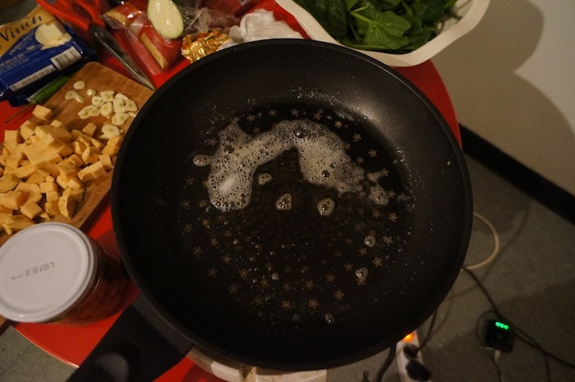
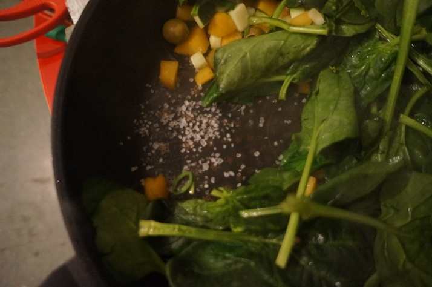
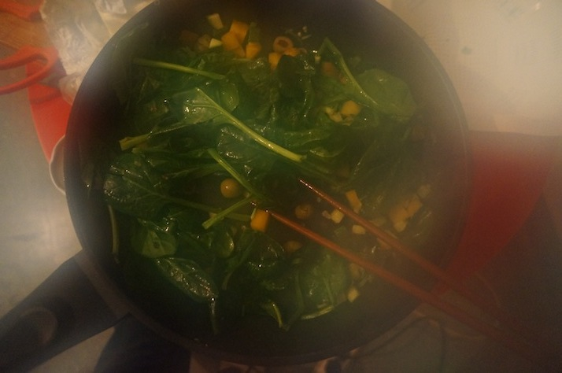
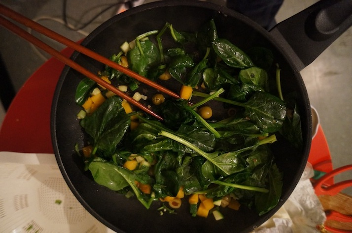
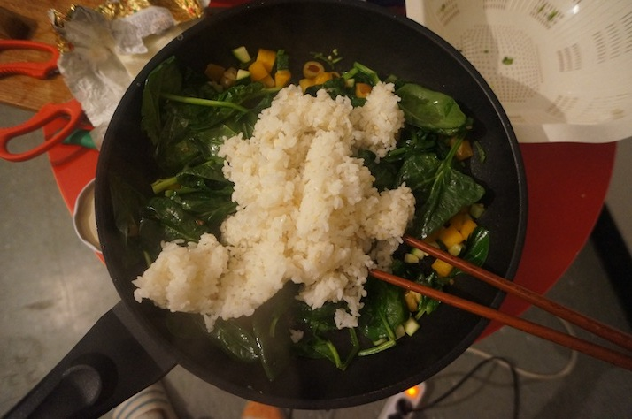
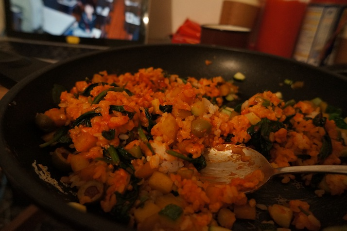

######2015Jan20 19:01:25+0900

근대국

<http://lara.tistory.com/384>

쉬웠다...

```
1/20/2015
lara.tistory.com/384
구수하고 부드러운 근대국 끓이는 법(위와 장에 좋아요)
날씨가 추워지는 겨울이면 따뜻하고 구수한 된장국을 먹고 싶어집니다. 겨울철푸른채소가금값일때근대는생협에서저렴하게구할수있는재료중하나에요.
근대는 위와 장이 안 좋은 사람에게 좋은 음식입니다.
그리고 다른 채소에 비해 비타민K가 월등히 많아 골다공증의 예방과 치료에 좋다네요. 만들기도 아주 간단하니 도전해보세요.
한살림에서 유기농으로 재배한 근대 300g,
http://lara.tistory.com/384
1/8
1/20/2015 lara.tistory.com/384
양도 많고, 활용도도 높은 근대는 겨울철과 봄에 좋아요.
근대의 싱싱함에 기분까지 좋아질 정도예요.
http://lara.tistory.com/384
2/8
1/20/2015 lara.tistory.com/384
깨끗하게 씻어서 듬성듬성 잘라주었어요.
맛난 육수 준비해주시고요. 육수 없으심 쌀뜨물도 좋아요.
2012/11/09 - [땀 삐질 집안 일/기타] - 다른양념이 필요없는 맛난 황태머리육수 끓이기
된장과 저는 만능양념 조금 넣었어요.
고추장을 넣어도 봤지만, 저의 입맛에는 고추장보다는 달달한 만능양념이 더 맛나더라고요.
http://lara.tistory.com/384 3/8
1/20/2015 lara.tistory.com/384
재래된장은 두레생협에서 구매한 건데 구수하고 맛나요. 만능양념, 요리할 때 정말 활용도가 높은 양념이에요. 조만간 포스팅할게요.
http://lara.tistory.com/384
4/8
1/20/2015
lara.tistory.com/384
육수가 끓으면 바로 근대를 넣어주세요.
http://lara.tistory.com/384
5/8
한살림 참바지락살이에요.
껍질이 없어 바로 찌개나 국물요리나 해물요리에 활용하면 편해요. 근대국에 조개를 넣으면 더 구수해집니다.
1/20/2015 lara.tistory.com/384
바지락살과 마늘을 넣어주고, 모자란 간은 된장으로 하세요.
http://lara.tistory.com/384
6/8
1/20/2015
lara.tistory.com/384
아욱처럼 소금넣어 바락바락 풋내를 없애는 과정 없이도 근대는 부드러워요. 근대는 데쳐서 조물조물 나물로 먹어도 맛납니다.
그리고 버섯이나 두부, 오징어, 수제비까지 응용이 무한 가능하답니다. 근대국 끓이는 법 아주 간단하니 여러분도 도전해보세요.
근대국 끓이는 법
1) 근대를 씻어 잘라놓는다.
2) 육수나 쌀뜨물에 된장(+ 고추장 등)을 푼다. 3) 근대와 마늘(+ 바지락 등)을 넣어 끓인다.
근대국은 버섯, 두부, 오징어, 수제비 등등 다양하게 응용할 수 있게 창의적으로 도전해보세요. http://lara.tistory.com/384 7/8

1/20/2015 lara.tistory.com/384
http://lara.tistory.com/384
8/8

```

---

######2014Nov17 02:27:36+0900

즉흥 요리 / 오늘의 요리.

고구마가 들어간게 특이하다..

```
오랜만에 요리요리..
고추장치즈호박고구마마늘청양고추시금치올리브올리브기름버터____ 느끼________한 볶음밥! ㅋㅋ / 꽤 괜춘..
오늘의 요리. 즉흥 요리.. 폭탄 믹스.
```













---

######2014Nov10 23:00:53+0900

아욱국.

<http://hls3790.tistory.com/237>

```
아욱을 한단에 800원에 구입했습니다. 날이 갑자기 추워져서 구수한 된장국이
생각나더라고요... 그래서 아욱된장국  준비했습니다.
아욱국 끓이는 방법은 시금치된장국 끓이는 방법과 같습니다... 시금치된장국도 동일하게
끓여보세요^^
 ♧ 아욱된장국
재료: 아욱1단. 멸치다시마육수7컵. 된장3T~3T반. 마른새우( 한줌정도). 다진마늘2/3T. 고추가루1T.
        소금2/3T. 다진파2T.
멸치다시마육수: 물8컵반. 국물용멸치 16마리. 다시마2조각(10cm × 10cm). 
        대파뿌리2개(또는 대파1/2개).고추씨1T( 또는 청양고추1~2개)
=> 저의 계량은 밥숟가락 한 술이 1T고요...종이컵 1컵이 1컵입니다.( 깍아서 계량합니다~)

1. 멸치다시마육수 끓이기 : 냄비에 물8컵반을 넣은후 국물용멸치 16마리. 다시마2조각(10cm × 10cm). 
                        대파뿌리2개(또는 대파1/2개).고추씨1T( 또는 청양고추1~2개)를 넣은후 센불에서
                        끓어 오르면 중불로 줄인후 9~10분 끓여줍니다...( 뚜껑은  열고 끓임)
                        완성된 멸치다시마육수를 고운체에 걸러 고운육수물만 준비합니다..
                        이렇게 준비한 육수가 7컵입니다...

==> 국물용멸치가 비린경우 전자렌지에 살짝 돌리거나 마른팬에 살짝 볶아주시고요....머리와 똥은 제거해줍니다.
    저의 경우 멸치가 비리지 않아 국물용멸치를 통째로 넣고 끓여주었습니다..

==> 멸치다시마육수에 고추씨가 없을때는 청양고추를 넣으시고요...매운맛이 싫은분은 생략하세요~
    멸치다시마육수에 통무. 마른새우.마른표고버섯을 넣어주셔도 좋습니다..

2. 아욱 1단을 다듬어 줍니다... 아욱잎에서 줄기는 1cm정도만 남긴후 잎을 떼어내어  흐르는 물에 손으로
    빡빡 문질러 씻어줍니다...아욱은 데치지 않고 손으로 조물조물 문질러 풋내를 제거합니다...
    풋내가 나지 않게 빡빡 조물조물 문질러 2~3번 씻어 소쿠리에 받쳐 물기를 빼줍니다..

3. 냄비에 멸치다시마육수 7컵을 부은후 된장3T를 소쿠리에 받쳐 풀어줍니다...
   ( 된장의 짜고 진한 정도에 따라 된장양은 조절하세요~~)
   여기에 마른새우 한줌을 넣고 가스불을 센불로 켠후 끓어오르면 1분후 아욱을 넣어줍니다...
   아욱을 넣고 끓어오르면 중불로 줄이고 5분정도 더 끓여준후....
   다진마늘2/3T와 고추가루1T. 다진파2T. 소금2/3T를 넣고 1~2분정도 더 끓이면 완성입니다..

==> 중간중간 거품 제거하시고요... 된장의 짠정도에 따라 소금양 조절하세요~~
==> 기호에 따라 고추장을 넣어주셔도 좋습니다..고추장을 넣을때는 집고추장을 넣고요...1T정도만 넣으세요.
==> 아욱된장국에 멸치다시마육수와 쌀뜬물을 1:1비율로 넣어도 감칠맛이 나서 좋습니다~~

저녁에 아욱국을 끓였더니....구수해서 아이가 잘먹더라고요...( 옥이 아들입니다.^^)
추워진 날씨에 간단한 아욱국 구수하게 끓여보세요...
```

참치야채비빔밥.

<http://blog.naver.com/rlaehal85/220149947373>

```
요즘 정말 해먹을것도 마땅치 않고...
이거저거 반찬하기도 귀찮고....
아~ 주부의 길은 멀고도 험하다요 ㅠㅠ
그래서 생각난,
냉장고속 짜투리 채소로 후딱후딱
맛있는 참치야채 비빔밥을 만들어 봤어용 ^^
그럼 돔팔이의 깨알 래시피 시작할게욤..ㅎㅎㅎㅎ
냉장고를 뒤져보니
콩나물국을 한번 끓여먹고 남은 콩나물이 있었네요~ㅎㅎㅎㅎ
깨끗이 몇번 씻어서 체에 받쳐  끓는물에 소금 약간 넣고 데쳐줍니당
너무 오래 삶으면 콩나물이 노골노골해져서 맛이 없으니
적당히 아삭한 식감을 살릴만큼만 데쳐주시면 되요 ^^
콩나물 무치는 방법은 다들 아실꺼라 믿고 넘어갈까요?ㅋㅋㅋㅋㅋㅋ
살짜꿍 ~ 알려드릴게용~
데친콩나물을 찬물에 헹궈 물기를 쫙 빼고~
가는소금과 연두한스푼 참기름과 통깨를 넣고 조물조물 무쳐주세요~
비빔밥에 들어갈 나물이니, 간은 약하게 하셔도 무방하답니당 ^^
양파는 체썰어 매운기를 빼기위해 찬물에 담궈뒀어요~
십분정도 담근후에 체에 받쳐 물기를 빼주세요 ^^
오늘 우리집 냉장고속 짜투리 채소는
당근,오이,상추가 있어네용~ㅎㅎㅎ
당근은 채썰어 숨죽을만큼 살포시 볶아주시고~
오이도 채썰어 주세용~
상추 몇장이 남아있었네요 ㅋㅋ 먹기좋게 한입크기로 썰어주세용!
그리고 참치는 체에 받쳐 기름기를 쪼~~~~옥 빼주세요!!!!
그래야 더 담백하답니다 ^^
애호박과 표고버섯이 조금 남아있길래
굴소스 살짝 넣어 휘리릭~~~볶아줬어요~~~
요래 양푼이에다가 먹기 좋게 재료를 넣어주시구요~~~
비빔밥에 찰떡궁합인 반숙 계란후라이도 올려줍니당..!!!
후라이가 참 이쁘게 잘됐지요?ㅋ
음, 비빔밥 후라이 이쁘게 하는 법은요~
아주 아주 약불에 후라이를 올리구요 뚜껑을 덮어주시면 되요 ㅎ
그럼 노른자가 터지지 않고 요로코롬 이쁘게 잘 부쳐진답니다 ^_^
이제 비비는건 남편담당~~~~~ㅋㅋㅋㅋ
오른쪽으로 비비고~ 왼쪽으로 비비고~~~~~~~~~~~호로록 호로록~~
맛있게 먹어주면 땡!!!!ㅋㅋㅋ
아삭아삭 생야채가 들어가서 그런지~
비빔밥이 참 상큼하고 깔끔한 맛이였어요!!!!
이시간에 진짜,,,,,너무너무 먹고싶네요 ㅠㅠ
조만간 또 만들어 먹어야겠어요~
반찬하기 귀찮고, 입맛 없을때에 딱인 메뉴
참치야채비빔밥, 비빔밥 꼭 한번 만들어 드셔보세요~~~~강추입니당 ^^
참고로, 비빔밥용 고추장은요~
시판용 고추장 두스푼과 올리고당 반스푼 참기름 한스푼 식초 반스푼 넣어주시면
그냥 먹는거보다 훨씬 더 맛있다는 점 ~~ 까지 알려드리공
이만 스르륵 잠이 들렵니당 ㅎㅎㅎㅎ
```
