# imagemagick

## how to use advanced image processing tool like 'imagemagick' with GUI @ mac osx

<http://www.imagemagick.org/discourse-server/viewtopic.php?f=4&t=25851>
```
News from John Cupitt, lead dev of NIP2 (New Image Processor 2) http://www.vips.ecs.soton.ac.uk/index.php?title=Nip2 the GUI of the graphics library libvips, but also now for several ImageMagick operations:
Hi Nicolas,

I've just put up nip2 7.40.2:

http://www.vips.ecs.soton.ac.uk/support ... -setup.zip

This time the IM stuff really does work on Windows, I've spent some
time tuning it with an actual Windows machine.

See http://libvips.blogspot.dk/2011/06/using-imagemagick-from-nip2.html.
-----
Many thanks to him and Alan Gibson (a.k.a. snibgo), who ported the ImageMagick operations.
Last edited by NicolasRobidoux on 2014-07-03T12:25:44+00:00, edited 1 time in total.
NicolasRobidoux
 
Posts: 1937
Joined: 2010-08-28T11:16:00+00:00
Location: Copenhagen, Denmark
Top
Re: Windows/Linux/OSX partial ImageMagick GUI
Postby jcupitt » 2014-07-03T08:15:42+00:00

It's actually the whole of convert. Hopefully anything you can do on the command-line you can do with a menu. 

On Windows you get a very annoying command window flash up briefly each time it runs convert.exe which I've not figured out how to hide, but otherwise it all should work.

The Magick menu is mostly just a very long list right now, it should really be organised into a nice tree. You can use the toolkit browser to make it a bit less indigestible: click View / Toolkit Browser, then type (for example) "chop" into the search box. Doubleclick on the chop line to run that operation.
```
<http://libvips.blogspot.dk/2011/06/using-imagemagick-from-nip2.html>
```
Using ImageMagick from nip2
final update: nip2 now wraps the whole of ImageMagick, click Toolkits / Magick and take a look. 

update: this is now a standard part of nip2. Click Filter / Magick and have a look. 

The development version has an experimental link to ImageMagick in now, built more-or-less in the style of this earlier blog post. There's a Filter / Magick menu with five sample operations, the most complex of which is Annotate, the ImageMagick operation for adding text to an image.

The sourcecode for the Annotate menu item is pretty simple:

Annotate_item = class 
  Menuaction "_Annotate" "add text annotation" {
  action x = class 
    _result {   
    _vislevel = 3;
                
    text = text_widget;
    font = Font_widget;
    geometry = Geometry_widget; 
    gravity = gravity_widget; 
    foreground = foreground_widget;
    antialias = antialias_widget;
    command = magick_command (join_sep " " [
      font._flag,       
      antialias._flag,  
      gravity._flag,    
      foreground._flag, 
      "-annotate", geometry._flag, "\"" ++ text.value ++ "\""]);

    _result = system command x;  
  }     
}
But goodness me it turns into a beast when you click it:


It can probably be made a little prettier, but it does need all those options. I suppose sections could be folded away until you needed them.

The menu item supports nip2 Groups, so you can select a set of images and operate on them all at once. There's a toggle in Preferences that lets you switch between ImageMagick and GraphicsMagick (it just prepends "gm" to the command line that gets run). The "command" item shows the command that nip2 is running to generate the image. It knows about adding a ".exe" to the end of the executable name on Windows, though I've not tested that yet.

It seems unlikely that much of the wrapping could be generated automatically: it's just too hard to work out which options modify which operations. Someone would have to go through the docs and make a class for each major command. At least the things are fairly brief.
```
<https://github.com/jcupitt/nip2>

<http://www.vips.ecs.soton.ac.uk/index.php?title=Downloading,_Installation_and_Startup_of_Nip2#Installation_and_Start-up_on_a_Macintosh_Computer.>
```
Installation and Start-up on a Macintosh Computer.

At this time the newest Mac version of the software, nip-7.8.11.dmg is actually listed on the previous stable page.

There is no real installation process just download the file and then use it in the same ways as other Mac programs.

However you do need Max OS 10.2 or greater and you need to install Apple's X11 server, for more information see http://www.apple.com/macosx/x11/ 
```
download nip2 --> <http://www.vips.ecs.soton.ac.uk/index.php?title=VIPS>

help from local installation of nip2 --> <file://localhost/Applications/nip2-7.40.3.app/Contents/Resources/share/doc/nip2/html/nipguide.html>

## imagemagick tips

### making a stripe with several images.

> input
> 
> 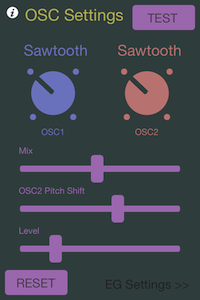
> 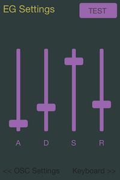
> 
> 
> output
> 
> 
> 
> steps
> 
> 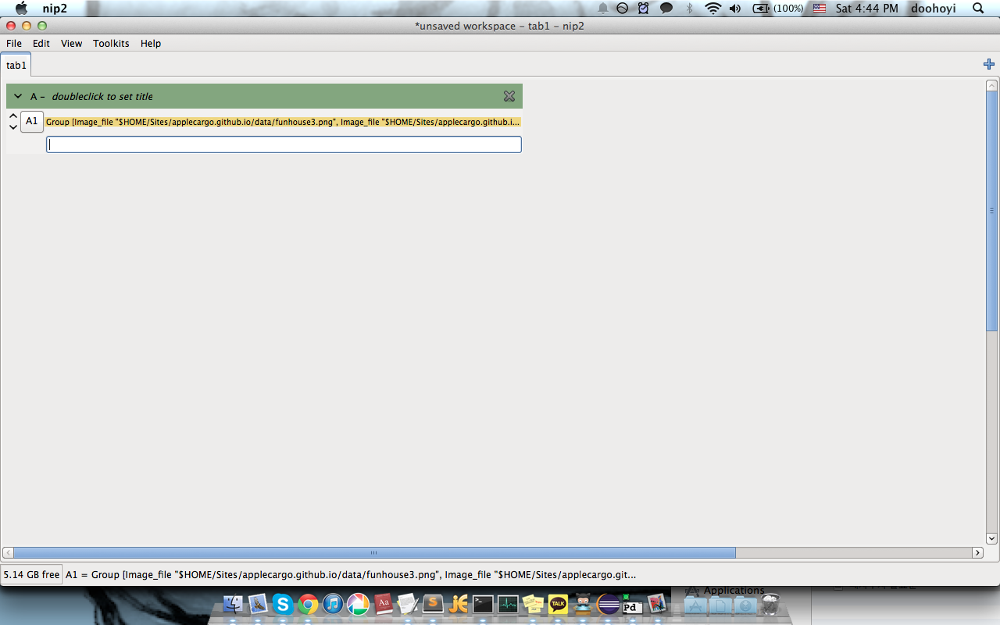
> 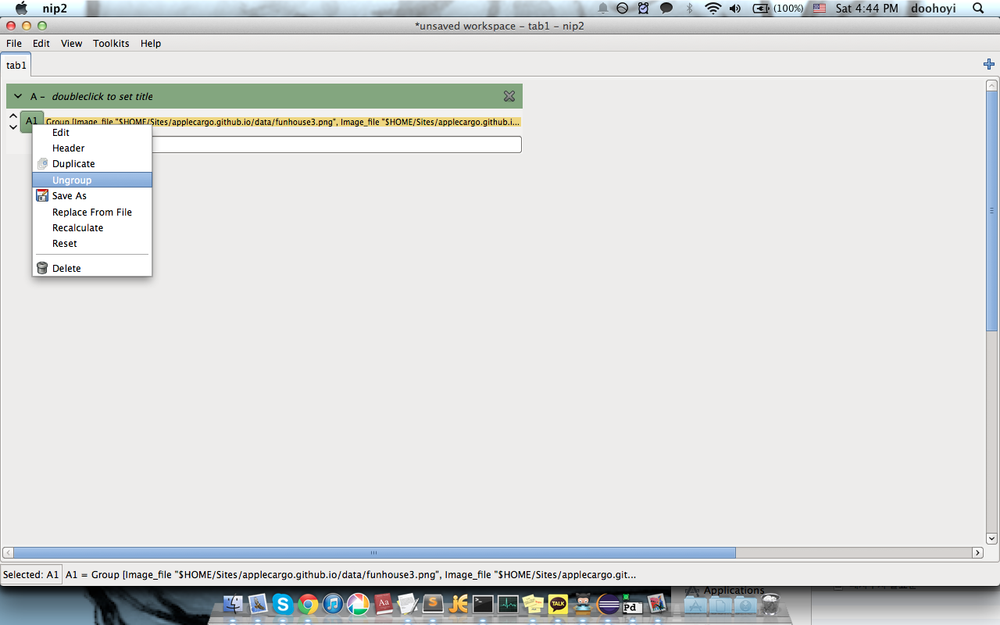
> 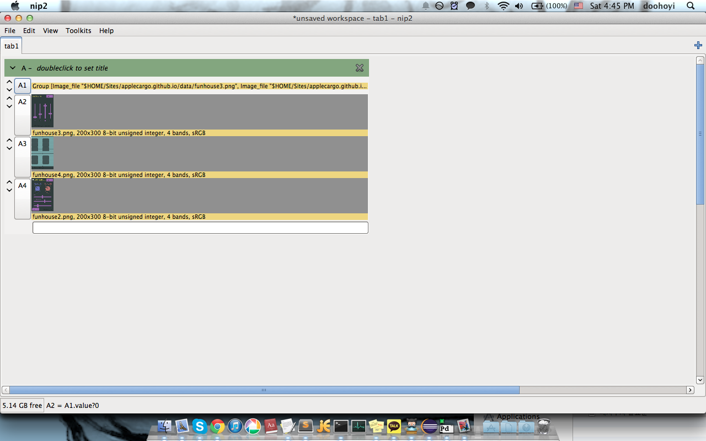
> 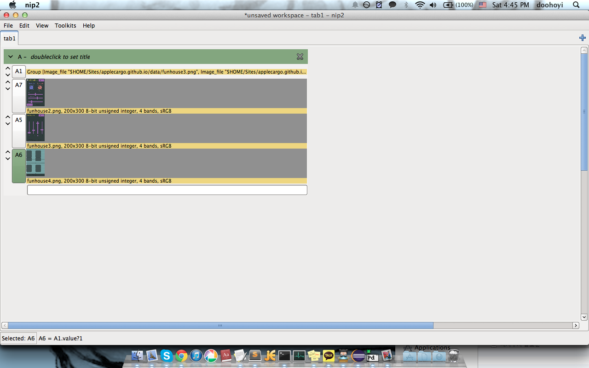
> 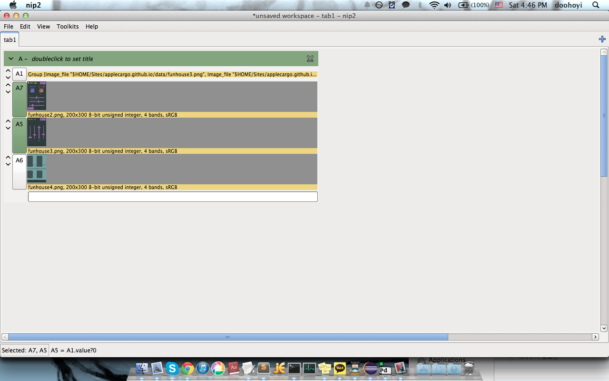
> 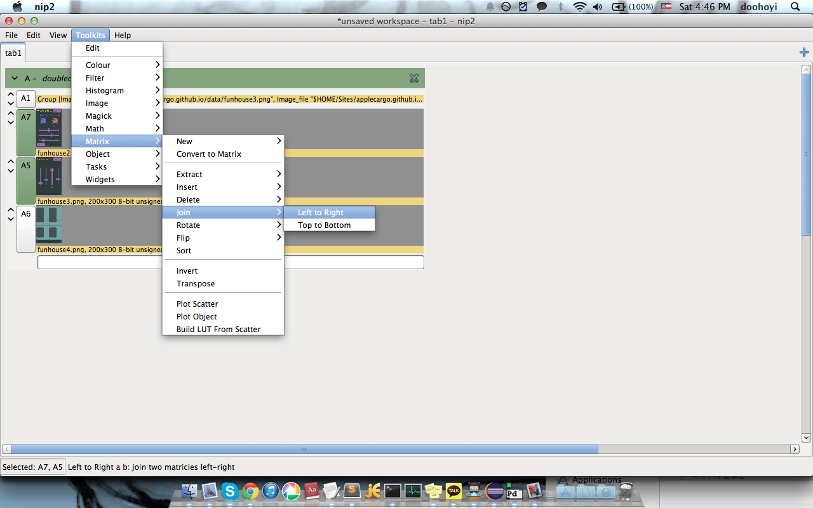
> 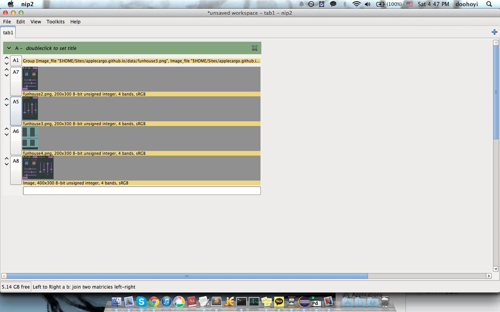
> 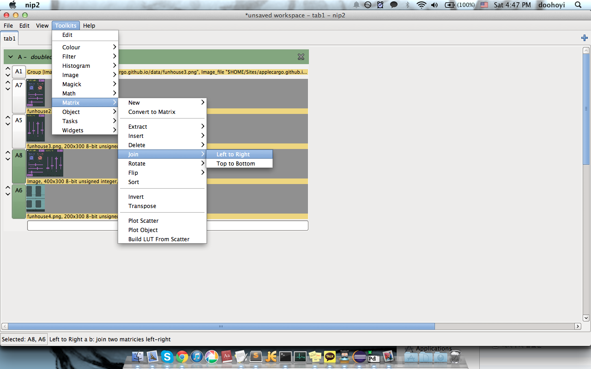
> 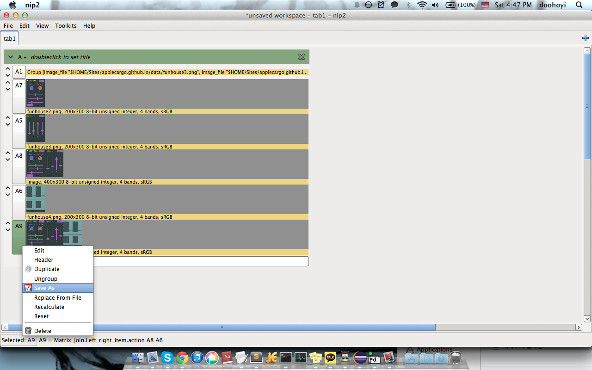
