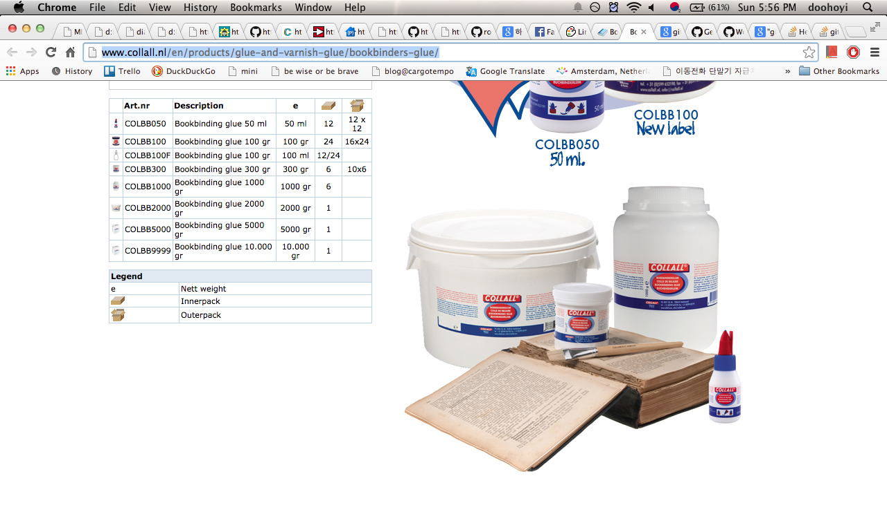

######2014Nov09 17:55:38+0900

네덜란드에서 썼던.. 바인딩글루는 다음의 상품인 것으로 보인다.

<http://www.collall.nl/en/products/glue-and-varnish-glue/bookbinders-glue/>



-

pva (poly vinyl acetate) 계열의 본드들이 많이 있고, 사용되고 있는데.. 그들중의 한 종류로 보인다.

찾아보면 여러가지 좋은 성질들이 있어서. 바인딩 글루로 사용될수 있다고 한다.

<http://en.wikipedia.org/wiki/Polyvinyl_acetate>

```
in bookbinding and book arts, due to its flexible strong bond and non-acidic nature (unlike many other polymers). The use of PVAC on the Archimedes Palimpsest during the 20th century greatly hindered the task of disbinding the book and preserving and imaging the pages in the early 21st century, in part because the glue was stronger than the parchment it held together.
```

-

그 외에도 여러가지 바인딩 글루들이 존재하는데.. 다음 글이 읽을만하다.
고대의 방법부터.. 요즘 나오는 ph neutral도 나와있음..

<http://www.ibookbinding.com/blog/bookbinding-gluing-tips-techniques-types-info/>

ph neutral..

<http://www.dickblick.com/products/lineco-neutral-ph-adhesive/>

