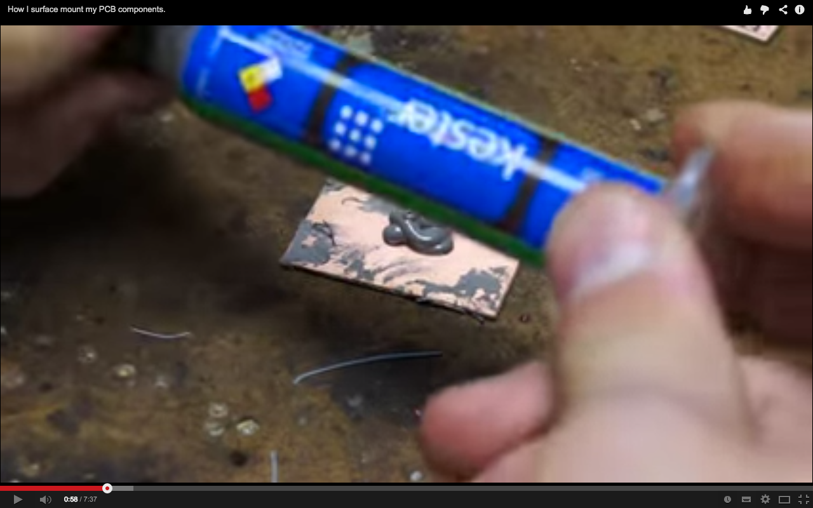

# electronic cad & home board design & building & testing

SMT way

kicad gimp etching avrdude + consol-dev.. whole process is described.

using positive photo resistive sheet called 'riston'

in detail, for SMT oven making.

with solder paste called 'kester'

