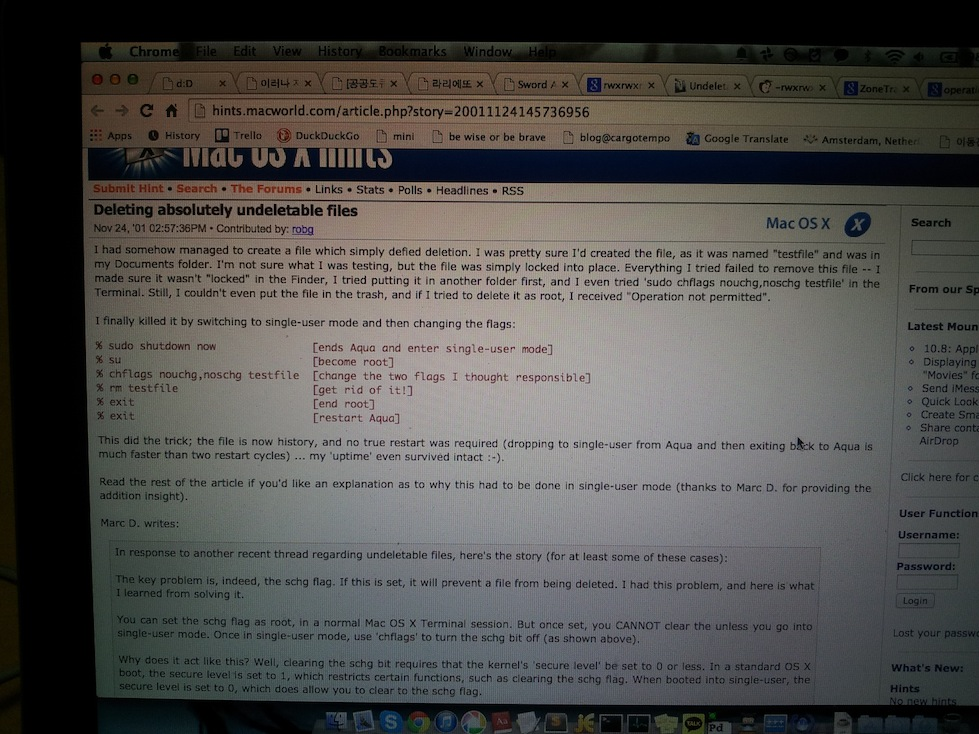
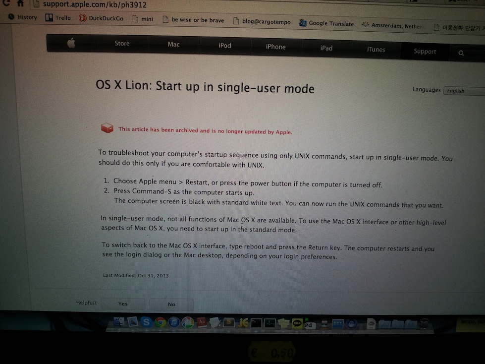
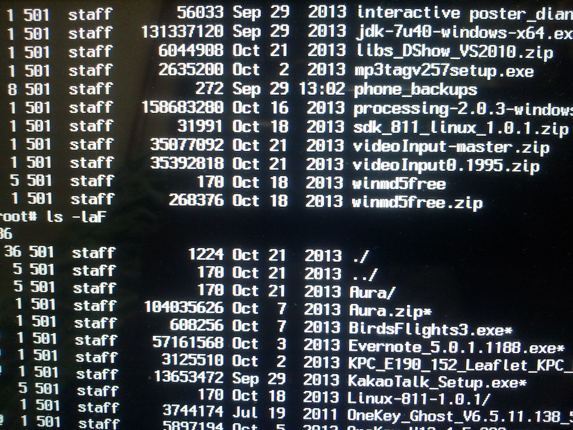
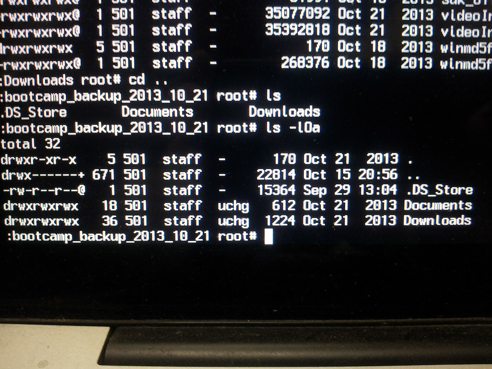
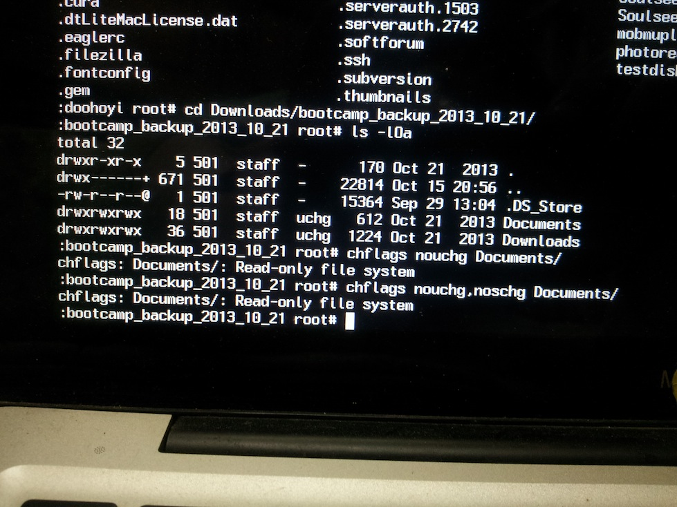
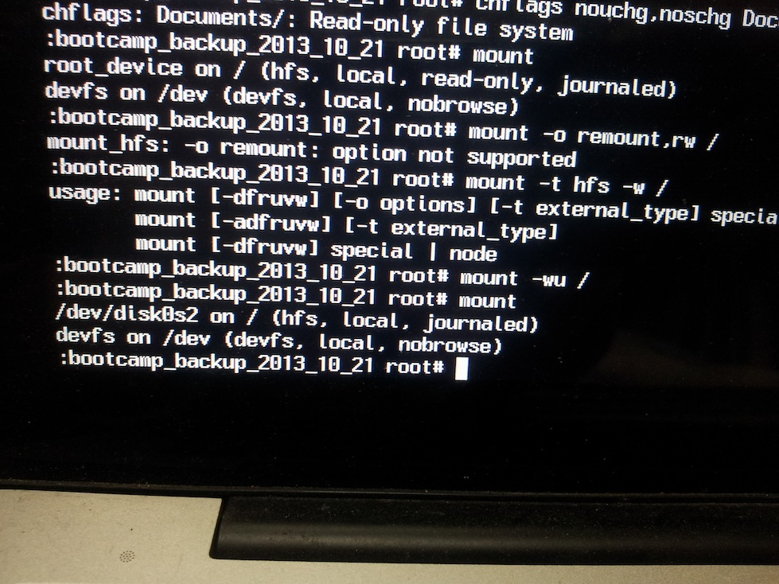
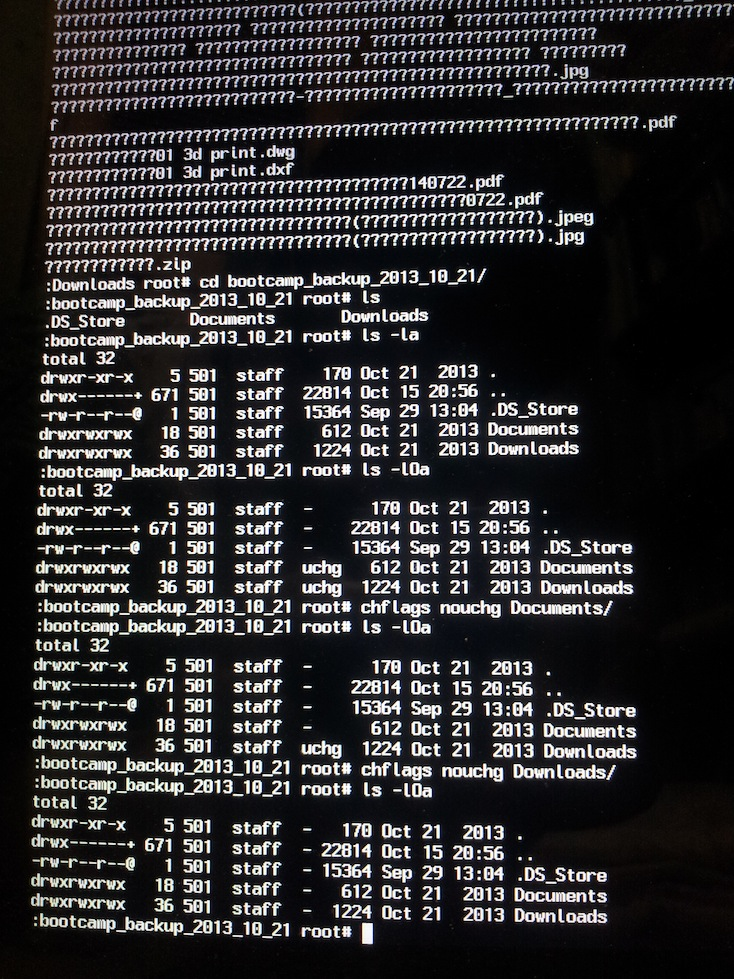

##OSX

---

###Deleting absolutely undeletable files 

<http://hints.macworld.com/article.php?story=20011124145736956>

```
I had somehow managed to create a file which simply defied deletion. I was pretty sure I'd created the file, as it was named "testfile" and was in my Documents folder. I'm not sure what I was testing, but the file was simply locked into place. Everything I tried failed to remove this file -- I made sure it wasn't "locked" in the Finder, I tried putting it in another folder first, and I even tried 'sudo chflags nouchg,noschg testfile' in the Terminal. Still, I couldn't even put the file in the trash, and if I tried to delete it as root, I received "Operation not permitted". 

I finally killed it by switching to single-user mode and then changing the flags:
% sudo shutdown now               [ends Aqua and enter single-user mode]
% su                              [become root]
% chflags nouchg,noschg testfile  [change the two flags I thought responsible]
% rm testfile                     [get rid of it!]
% exit                            [end root]
% exit                            [restart Aqua]
This did the trick; the file is now history, and no true restart was required (dropping to single-user from Aqua and then exiting back to Aqua is much faster than two restart cycles) ... my 'uptime' even survived intact :-). 

Read the rest of the article if you'd like an explanation as to why this had to be done in single-user mode (thanks to Marc D. for providing the addition insight).

Marc D. writes:
In response to another recent thread regarding undeletable files, here's the story (for at least some of these cases): 

The key problem is, indeed, the schg flag. If this is set, it will prevent a file from being deleted. I had this problem, and here is what I learned from solving it. 

You can set the schg flag as root, in a normal Mac OS X Terminal session. But once set, you CANNOT clear the unless you go into single-user mode. Once in single-user mode, use 'chflags' to turn the schg bit off (as shown above). 

Why does it act like this? Well, clearing the schg bit requires that the kernel's 'secure level' be set to 0 or less. In a standard OS X boot, the secure level is set to 1, which restricts certain functions, such as clearing the schg flag. When booted into single-user, the secure level is set to 0, which does allow you to clear to the schg flag. 

Some general references on kernel security levels and chflags can be found at: 
http://profile.sh/syswiki/index.php?chflags and http://profile.sh/syswiki/index.php?Changing your kernel security level. 

Hope this helps.
```

이걸 참고해서.. 부트캠프의 백업폴더와 그 내부의 파일이 삭제 불능이던 문제를 해결하였다.
그러는 와중에
ls의 옵션
ls -F. (폴더는 뒤에 /, 파일은 뒤에 * 을 붙여서 구분하기 쉽게 표시)
ls -lOa. (uchg, schg등의 옵션을 확인할 수 있는 파일 플래그 정보 포함 리스트 풀뷰.)
등을 배웠고.
Read only filesystem 에러 해결을 위해
mount -wu / 를 쳐서. r/w 로 재 마운트하는 법을 배웠다.
재마운트 후,
chflags nouchg,noschg /Documents
chflags nouchg,noschg /Downloads
를 통해 uchg플래그 삭제 후, 모든 내부파일등 삭제 가능해짐.









single user mode에 들어가는 법은 <http://support.apple.com/kb/ph3912>

```
To troubleshoot your computer’s startup sequence using only UNIX commands, start up in single-user mode. You should do this only if you are comfortable with UNIX.

Choose Apple menu > Restart, or press the power button if the computer is turned off.
Press Command-S as the computer starts up.
The computer screen is black with standard white text. You can now run the UNIX commands that you want.

In single-user mode, not all functions of Mac OS X are available. To use the Mac OS X interface or other high-level aspects of Mac OS X, you need to start up in the standard mode.

To switch back to the Mac OS X interface, type reboot and press the Return key. The computer restarts and you see the login dialog or the Mac desktop, depending on your login preferences.
```

Cmd-S를 누름. 부트캠프가 있는 상황에선...
부트 파티션으로 맥파티션을 마우스로 선택하기전에, 키보드로 Cmd-S를 먼저 누르고 있는 것이 좋다.
키를 확실히 누르고, 부트 파티션 클릭.

Read-only filesystem error 문제 해결은...
mount -wu / 는 <http://www.securemac.com/macosxsingleuser.php> 에서 나옴..

---

##linux

