### apache

### 403 forbidden: permission to access images

<http://stackoverflow.com/questions/9173880/403-forbidden-permission-to-access-images>

```
you should check file permissions for /v2/wp-content/themes/default/images/contact-yellow-icon.png

i think they should be 644 so that all can read that file

or you can check file permissions of /v2/wp-content/themes/default/images/contact-innovation-logo.png

you can change permissions with ftp manager or with shell

** updated by Eric Leroy if file permissions 644 does not work, change to 755 that is what I used to fix the issue. If you are not familiar on how to do this on *inx based, and mac systems, here is how: Open terminal and navigate to the parent folder of the images. type sudo chmod -R 775 (then type the name of your images folder after 775 ) it will ask you for your password, then your images will work on your website.
```

######2014Nov11 01:49:48+0900

when there is troubles.. doing brew install..

check out..

<https://github.com/Homebrew/homebrew/blob/master/share/doc/homebrew/Troubleshooting.md#troubleshooting>

brew update

&

chown -R $(whoami) /usr/local

&

brew doctor


```
Run brew update — then try again.
Run brew doctor — the doctor diagnoses common issues.
Read through the Common Issues page.
If you’re installing something Java-related, maybe you need the Java Developer Update or JDK 7?
Check that Command Line Tools for Xcode (CLT) and/or Xcode are up to date.
If things fail with permissions errors, check the permissions in /usr/local. If you’re unsure what to do, you can sudo chown -R $(whoami) /usr/local.
```

######2014Nov15 15:23:21+0900

<http://superuser.com/questions/614797/can-i-make-google-chrome-allow-fullscreen-by-default>
<https://developer.chrome.com/extensions/match_patterns>
<https://support.google.com/chrome/answer/3123708?p=settings_manage_exceptions&rd=1>

매번 귀찮게 나오는.. full screen allow? --> allow. 를 없애 버리는 거라는데...
이걸 하면, 뭔가 찜찜하게도 해제를 못한다는데.. 어떻게 되는 건지 모르겠네..
일단 적어둔다.


######2014Nov09 18:05:33+0900

<http://www.nycresistor.com/2013/11/03/streamline-your-parts-ordering-process-through-eagle/>

bom을 처리하는데 있어서.. 사실은 많은 도움이 필요하다.
사실은 보드 설계 단계에서 부터, 회로도가 완성되면, bom을 체크하고, 원하는 부품이 구매가 가능한지 점검하고 확인하고,
구매 대상인 부품들의 footprint를 바탕으로 layout을 하는 게 이치에 맞는 순서일 수가 있다.
지금 까지는, 덮어놓고 보드부터 그리고, 부품구매는 따로 생각을 했었지만....

eagle에 내장된 bom.ulp를 이용해서는.. 조금 부족한 부분이 있다.
일의 단순반복성을 생각할때, 좀더 자동화될 필요가 있다고 보는데, (사람들이)
그래서 bom-ex라는 것도 나오고.. newark의 designlink라는 서비스도 나온다.

위 링크에서, bom-ex의 사용법과.. mac의 automator를 이용하는 방법까지 소개해준다.

-

bom-ex는 실제로 사용해보진 않았지만, (이번엔 그냥 designlink로 quick하게.. 견적을 뽑아보는 경우였기 때문에 안썼다. / designlink가 이런 용도로는 좋은 것 같다.) 좋아보이긴한다. 특히.. 다음의 상세한 소개를 보면..

<http://www.bot-thoughts.com/2012/03/eagle-managing-parts-with-bom-ex.html>

어떤 식인건지 이해는 할 수가 있다.. 단, 뭔가 지속적으로 사용하면서 나만의 bom 라이브러리가 형성이 되야만 빛을 발할 것이란걸 예상할수 있다.

[Bot Thoughts_ Eagle_ Managing parts with BOM-EX.pdf](../../../docs/pdfs/Bot Thoughts_ Eagle_ Managing parts with BOM-EX.pdf)

오픈소스 / 블로그의 특성상 이런 글은 없어질 수가 있으므로 백업해둔다...
이만큼 잘 설명해준 글이 없다.

-

python script의 예시이다. 자동으로 digikey의 부품을 가져오고.. 뭐.. 그런다고 한다..

<https://github.com/nycresistor/Grab-Bag/blob/master/Bom-ex/addDKPartToBom-ex.py>

BeautifulSoup / html5lib 등등의 라이브러리들을 사용하는데.. 이를 통해서, 웹페이지들을 긁어오는 scrap 기능을 자유자재로 사용할 수 있다고 하니, 흥미롭다. 매우.

<http://www.crummy.com/software/BeautifulSoup/>

-

여하튼, 어떤 방식이 되었든간에... bom-ex등으로 csv 파일로 주문리스트를 생성하고 나면 그걸 제출해야 하는데...
이부분은 해당 업체가 그런 주문서를 받아들여줘야 한다.

digikey 같은 경우를 예로 들어보면, 다음과 같은 식으로 csv파일으로 주문을 받아준다.

<http://www.digikey.com/classic/help.aspx?WT.mc_id=BOMhelp&id=BOMHelp&site=US>

-

그리고, 각자 사용하다보면.. 자기만의 라이브러리가 만들어지게 된다.

<https://code.google.com/p/bot-thoughts-eagle-library/>

뭔가 미심쩍긴하지만.. bob starr란 아저씨 (bom-ex 만든사람)이.. 일반적인..라이브러리  총정리판도 내놓았다.

<http://www.bobstarr.net/pages/downloads.html>

성실한데.. 미국식이다 지대로.. 뭔가 맘에 안드러.

여기가도 있다.. git repo.

<https://github.com/robertstarr>

-

여튼, 장기적으로.. 이걸 할 줄 알면 좋을 것 같아서.. 정리해둠.

### electronic cad & home board design & building & testing

SMT way

[](http://www.youtube.com/watch?v=oh4ZDkBHFYM&feature=youtu.be)

kicad gimp etching avrdude + consol-dev.. whole process is described.

using positive photo resistive sheet called 'riston'

[](http://www.youtube.com/watch?v=h-NG8Vk1aC0)

in detail, for SMT oven making.

with solder paste called 'kester'

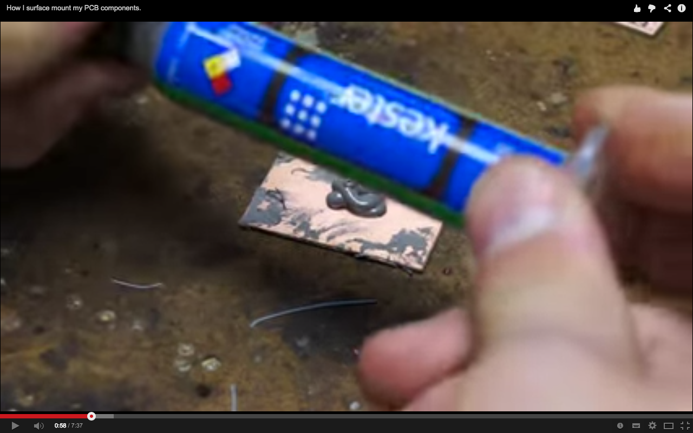

---

### home-pcb-etching

에칭 파우더를 뜨거운물에 희석.
온도나 농도 그리고 pcb 사이즈에 따라 다르지만 위 같은 경우 7~10분정도 소요.

에칭파우더와 같이 판매하는 애칭 폐액처리제용 파우더를 이용해 중화하여 처리
--
에칭 파우더를 뜨거운물에 희석한거구요. 온도나 농도 그리고 pcb 사이즈에 따라 다르지만 위 같은 경우 7~10분정도 걸립니다.

Hunmin Koh 뒷처리는 어떻게 하셨어요?

강병수 에칭파우더와 같이 판매하는 애칭 폐액처리제용 파우더를 이용해 중화하여 처리하였습니다. http://www.devicemart.co.kr/goods/view.php?seq=3626

Taeyoon Choi 그런데 중화제를 나눠서 섞어야 하는데 바로 섞어서 부글부글 끓어올랐죠. 그다음엔 어떻게 처리되었는지 기억이...ㅋㅋ

강병수 ㅎㅎ 끒은건 아닌것 같고.. 미숫가루처럼 뭔가 가루가 섞이지 않고 위에 떠 있던 기억이.. ^^

### imagemagick

### how to use advanced image processing tool like 'imagemagick' with GUI @ mac osx

<http://www.imagemagick.org/discourse-server/viewtopic.php?f=4&t=25851>
```
News from John Cupitt, lead dev of NIP2 (New Image Processor 2) http://www.vips.ecs.soton.ac.uk/index.php?title=Nip2 the GUI of the graphics library libvips, but also now for several ImageMagick operations:
Hi Nicolas,

I've just put up nip2 7.40.2:

http://www.vips.ecs.soton.ac.uk/support ... -setup.zip

This time the IM stuff really does work on Windows, I've spent some
time tuning it with an actual Windows machine.

See http://libvips.blogspot.dk/2011/06/using-imagemagick-from-nip2.html.
-----
Many thanks to him and Alan Gibson (a.k.a. snibgo), who ported the ImageMagick operations.
Last edited by NicolasRobidoux on 2014-07-03T12:25:44+00:00, edited 1 time in total.
NicolasRobidoux
 
Posts: 1937
Joined: 2010-08-28T11:16:00+00:00
Location: Copenhagen, Denmark
Top
Re: Windows/Linux/OSX partial ImageMagick GUI
Postby jcupitt » 2014-07-03T08:15:42+00:00

It's actually the whole of convert. Hopefully anything you can do on the command-line you can do with a menu. 

On Windows you get a very annoying command window flash up briefly each time it runs convert.exe which I've not figured out how to hide, but otherwise it all should work.

The Magick menu is mostly just a very long list right now, it should really be organised into a nice tree. You can use the toolkit browser to make it a bit less indigestible: click View / Toolkit Browser, then type (for example) "chop" into the search box. Doubleclick on the chop line to run that operation.
```
<http://libvips.blogspot.dk/2011/06/using-imagemagick-from-nip2.html>
```
Using ImageMagick from nip2
final update: nip2 now wraps the whole of ImageMagick, click Toolkits / Magick and take a look. 

update: this is now a standard part of nip2. Click Filter / Magick and have a look. 

The development version has an experimental link to ImageMagick in now, built more-or-less in the style of this earlier blog post. There's a Filter / Magick menu with five sample operations, the most complex of which is Annotate, the ImageMagick operation for adding text to an image.

The sourcecode for the Annotate menu item is pretty simple:

Annotate_item = class 
  Menuaction "_Annotate" "add text annotation" {
  action x = class 
    _result {   
    _vislevel = 3;
                
    text = text_widget;
    font = Font_widget;
    geometry = Geometry_widget; 
    gravity = gravity_widget; 
    foreground = foreground_widget;
    antialias = antialias_widget;
    command = magick_command (join_sep " " [
      font._flag,       
      antialias._flag,  
      gravity._flag,    
      foreground._flag, 
      "-annotate", geometry._flag, "\"" ++ text.value ++ "\""]);

    _result = system command x;  
  }     
}
But goodness me it turns into a beast when you click it:


It can probably be made a little prettier, but it does need all those options. I suppose sections could be folded away until you needed them.

The menu item supports nip2 Groups, so you can select a set of images and operate on them all at once. There's a toggle in Preferences that lets you switch between ImageMagick and GraphicsMagick (it just prepends "gm" to the command line that gets run). The "command" item shows the command that nip2 is running to generate the image. It knows about adding a ".exe" to the end of the executable name on Windows, though I've not tested that yet.

It seems unlikely that much of the wrapping could be generated automatically: it's just too hard to work out which options modify which operations. Someone would have to go through the docs and make a class for each major command. At least the things are fairly brief.
```
<https://github.com/jcupitt/nip2>

<http://www.vips.ecs.soton.ac.uk/index.php?title=Downloading,_Installation_and_Startup_of_Nip2#Installation_and_Start-up_on_a_Macintosh_Computer.>
```
Installation and Start-up on a Macintosh Computer.

At this time the newest Mac version of the software, nip-7.8.11.dmg is actually listed on the previous stable page.

There is no real installation process just download the file and then use it in the same ways as other Mac programs.

However you do need Max OS 10.2 or greater and you need to install Apple's X11 server, for more information see http://www.apple.com/macosx/x11/ 
```
download nip2 --> <http://www.vips.ecs.soton.ac.uk/index.php?title=VIPS>

help from local installation of nip2 --> <file://localhost/Applications/nip2-7.40.3.app/Contents/Resources/share/doc/nip2/html/nipguide.html>

### imagemagick tips

### making a stripe with several images.

> input
> 
> 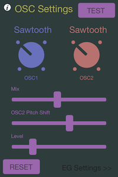
> 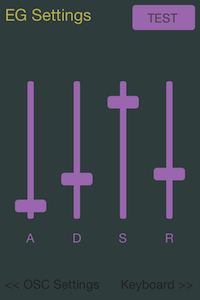
> 
> 
> output
> 
> 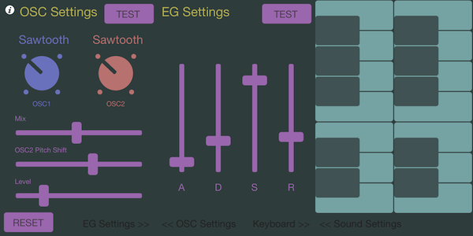
> 
> steps
> 
> 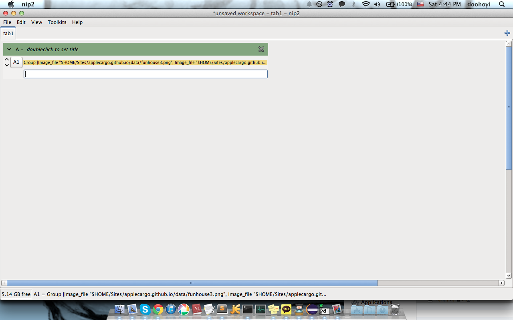
> 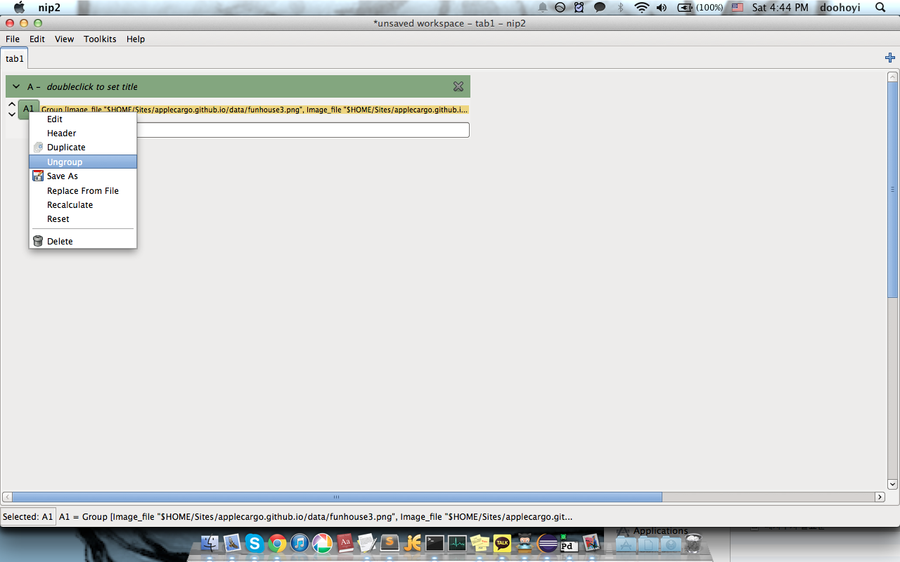
> 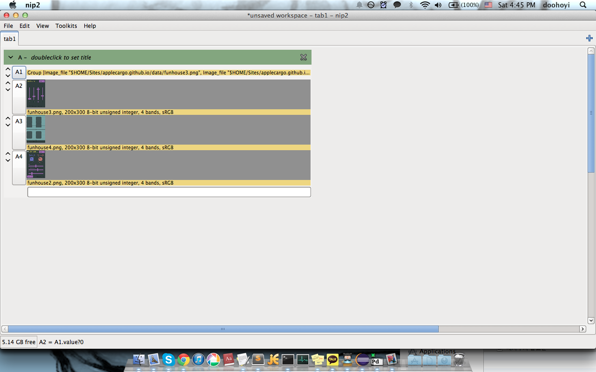
> 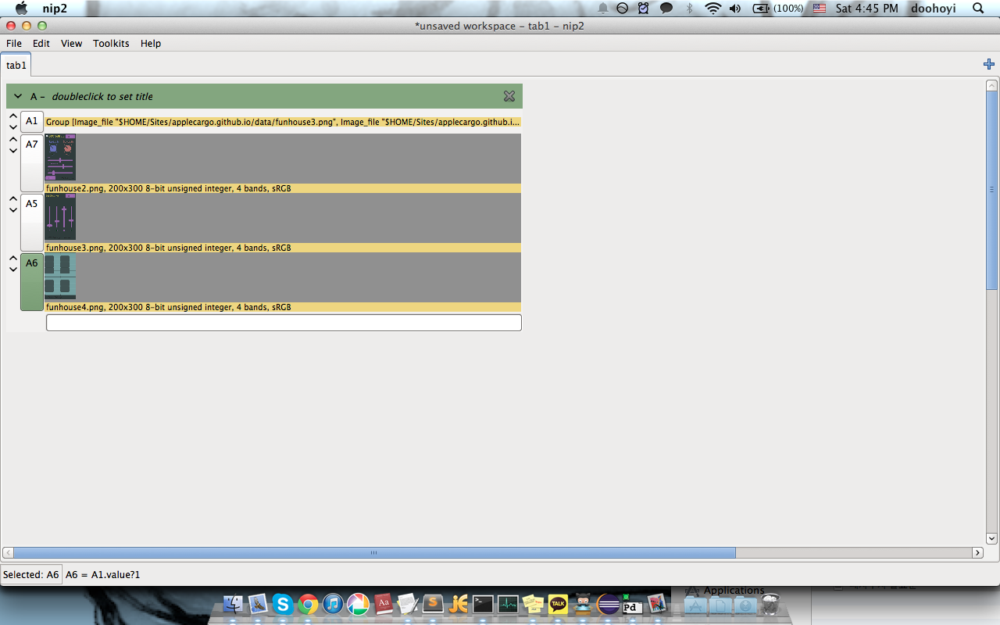
> 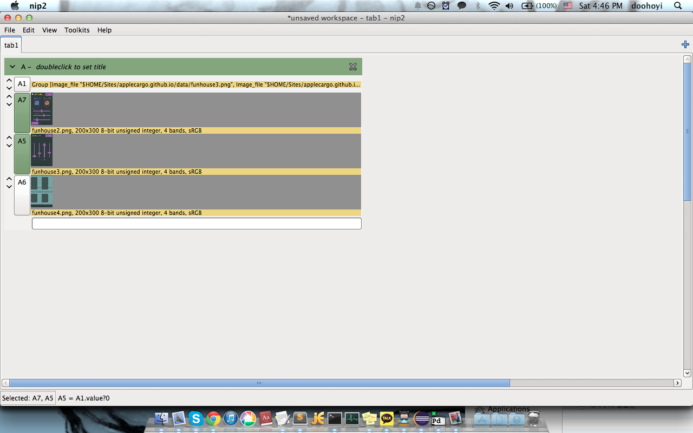
> 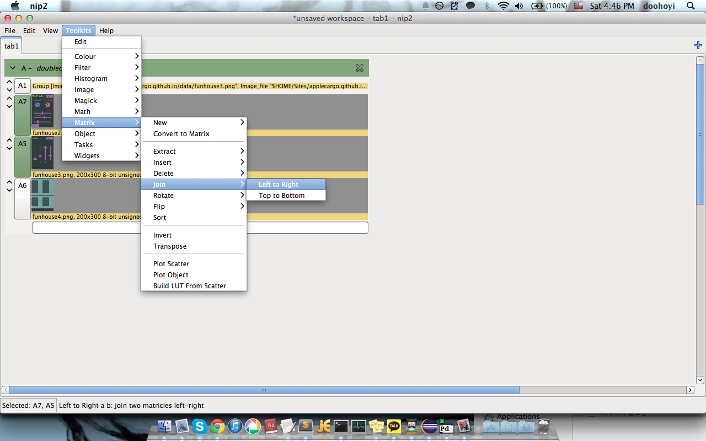
> 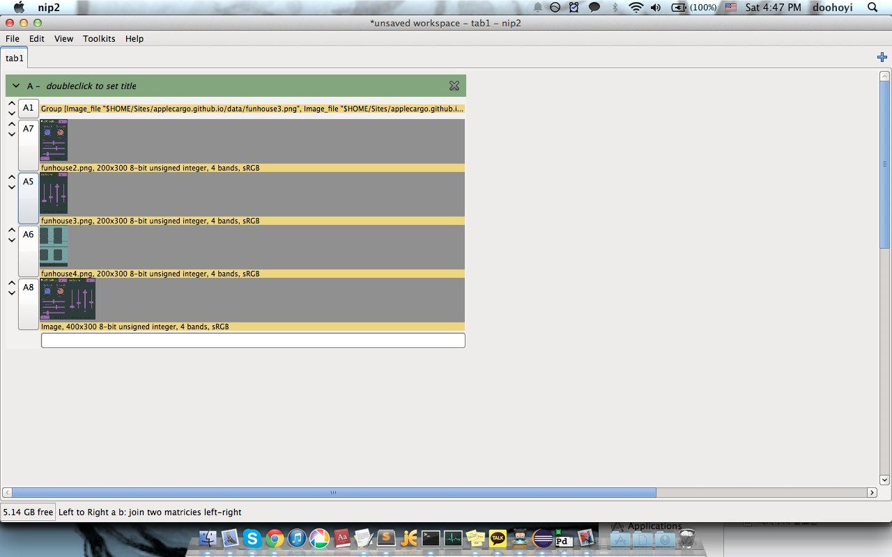
> 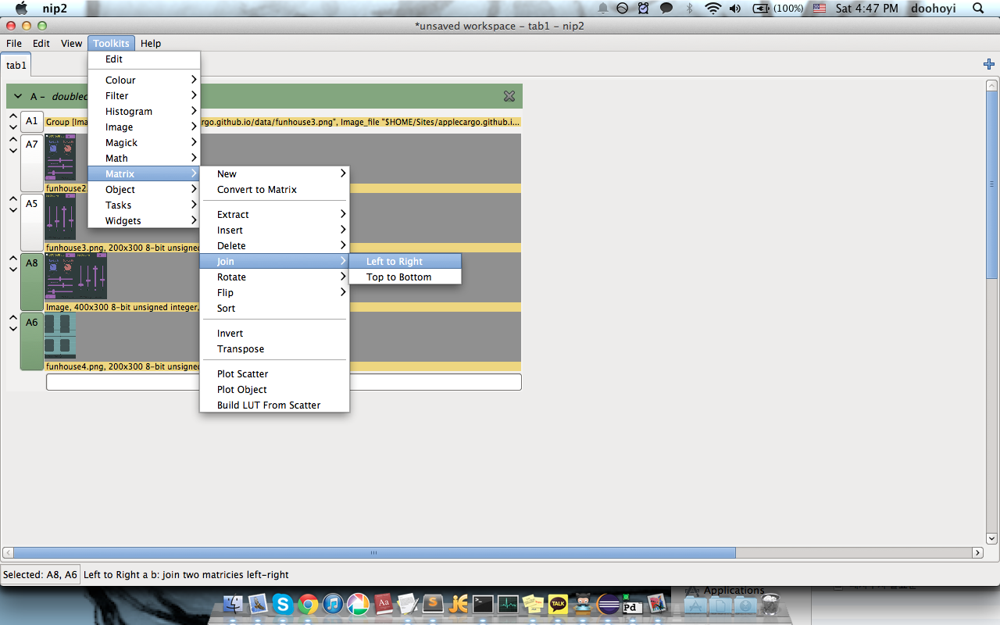
> 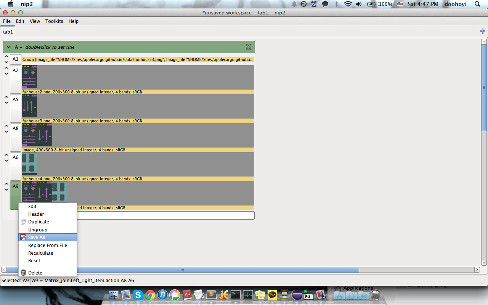


######2014Nov19 22:46:48+0900

<http://www.ppomppu.co.kr/zboard/view.php?id=etc_info&no=12995>

```
제목: 65세이상 세대주는 "실버할인" 통해서 인터넷 30%할인 가능합니다. 24
분류: 기타정보
이름: 100mb.kr


등록일: 2010-02-26 12:36
조회수: 3633 / 추천수: 11
링크: http://www.100mb.kr/03_cyber/04_notice_content.php?no=15405 

※ 저희 가족 등본입니다. 개인정보 도용하는거 아닙니다^^;

SK브로드밴드 가입을 예정중이신 분이라면 가족중 65세 이상 세대주 앞으로 가입을 해주세요.
(어머니/아버지/할머니/할아버지.. 등)

3개 통신사중 유일하게 SK브로드밴드에서만 65세 이상 세대주에 대해서 복지할인과 동일한


할인혜택을 주는 "실버할인" 혜택을  드리고 있습니다.


가입자분(세대주)이 만 65세 이상에 해당되고, 세대주로 등록된 등본상의 주소지와 설치를 희망하


시는 주소지가 동일하다면 30%할인이 가능합니다^^


만약 분가를 한 상태라면, 우선 세대주가 거주하시는 장소에  설치를 받으신 후
(설치장소에는 컴퓨터가 설치되어 있어야 합니다.)

등본 제출하에 "실버할인" 혜택을 받으시고 바로 분가한 주소지로 이전설치 하시면 됩니다.


SK브로드밴드는 3년이상 약정시 이전설치비를 면제 해드리고 있으며, 1년약정을 하시고,


이전설치비 2만원을 부담하시더라도 이렇게 이용하시는것이 훨씬 이득입니다^ㅡ^(약 10만원이상 절약됨)
```

---

<http://www.ppomppu.co.kr/zboard/view.php?id=etc_info&no=21980>

```
제목: skt 휴대폰 + sk 인터넷 결합상품정리. 97
분류: 기타정보
이름: WIN2NET(윈투넷)


등록일: 2012-12-11 15:01
조회수: 22690 / 추천수: 73

 
2013-08-13 sk 변경사항 수정


시작하기에 앞서..

모든 결합은 ★☆해당 결합상품에서 다른 결합상품으로 변경하시면 위약금! 사은품위약금 다나옵니다!!!!(최악의 경우지만) 꼭!!! 대리점과 인터넷 가입점 확인후 결정하세요★☆

1.가족 주소지 무관하며, 어지간한 가족은 다됩니다. (명의자 조정은 좀 해야합니다)
EX)본인+누나+자형(누나남편) 결합 할려고 하면. 본인 명의로 신청시 결합불가. 누나 명의로 신청시 결합가능합니다.
해당부분은 결합하실 가까운 대리점, 인터넷 가입점, 휴대폰 판매점 등에 확인하시면 더욱 쉽게 확인하실 수 있습니다.
(정확하게는 본인 직계존비속 + 배우자 형제 + 장인장모사위 포함) -> 해서 누나의 남편은 안됨. 누나 기준으로 하면 배우자 형제 가능

2.등본은 같은 주소지인 가족, 가족관계증명서는 본인+배우자+자녀+부모님 나옵니다.(형제안나옵니다.-형제간 결합예정시 부모님 앞으로 가족관계증명서 발급)
온라인 등본 발급처 : http://www.minwon.go.kr/main?a=AA020InfoMainApp
온라인 가족관계증명서 발급처 : http://efamily.scourt.go.kr/index.jsp

3.결합에 따른 위약금은 없습니다. 결합 해놓으면 혜택적용 빠지면 변경된 조건으로 적용입니다.

4.결합제한 요금제는 대표적으로 커플계열요금제와 PDA 요금제 결합 불가능하며, 일부 특수요금제와 기업용 특수요금제 결합불가입니다.
-기업용 특수 요금제는 대표적으로 군인요금제 가있겠습니다 ㅎ 이건 사용하시는분이 압니다 0_0;; 
-pda 요금제도 종류가 많아서 결합상품에 따라 되는것도 있고 안되는 것도 있습니다. 
결합시 대리점 문의하세용^^

5.결합중 휴대폰 변경시. 기변은 결합 유지/ 애이징,해지후신규가입은 결합 풀리니 새로 묶으셔야합니다.

6.동일 명의 skt 2회선 결합하실려면 2개회선 모두 2009년 6월 이전 개통회선이어야합니다. 한대라도 이후 회선이시면 1대만 적용됨.

7.LTE 눝 요금제 결합가능합니다!!!!

1. 신규상품 "한가족할인"
특징 : 기존 다른 결합상품과 다르게 
휴대폰 1대 + 인터넷 1대 형식의 개인형 결합상품입니다.
단독 세대가 많은 요즘 시대를 반영한 상품이라 할수있겠습니다.

조건:
1.SKT 사용자이며 SKT62요금제 이상 사용자 분 
2.동일 명의로 SK 인터넷을 이용해야만함.

결합시 인터넷만 이용하신다면 요금이 13200원 (VAT포함) 이라는 파격적인 요금으로 이용가능합니다.
만약 TV도 같이 하신다면 TV 요금이 + 9900원 / 여기에 휴대폰에 2200원 추가할인이 들어갑니다.
즉 인터넷 + TV 실납부 금액은 23100원이며 / 휴대폰에 추가할인 2200원 까지 들어가지는 어마어마한 요금제이죠.

요금제가 62요금제 이상이라는 조건을 잘 살펴봐야하는데
올인원 / LTE / 무료음성 / LTE 눝 요금제 개열 6X 이상 요금제라면 모두 적용가능합니다.

어쩌면 뽐뿌 여러분과는 가장 안맞는;;;;;;(요금제가 너무 높아여 -_-;) 상품이라 할수있겠으나,
보통 여성분들은 휴대폰을 보통 62요금제 정도 쓰시기때문에 여성 1인가구를 대상으로는 아주 큰 인기가 있을듯합니다.

주의사항 
1. 이용중 휴대폰 요금제를 하위요금제로 변경하게되면 결합은 풀립니다. (다시 상위요금제로 올리면 재결합가능합니다. 자동결합X/114문의)
2. 기변은 관계없으나, 해지후 신규가입, 애이징은 다시는 결합 불가능하니 주의하셔야합니다.

추천
1)휴대폰 회선 관리/ 요금제 관리 /데이터부가서비스 이런거 모르겠고 그냥 62요금제 이상 쓴다 하시는분은 무조건 선택
2)가족분들이 이미 SK 의 타 결합상품으로 혜택을 받고 있고 나혼자 따로 살아야될 경우 추천

비추천
1)SK 타결합을 이미 이용중인경우 (1인명의의 SKT 회선이 2개라도 한쪽 결합상품만 혜택받을수있습니다.)
2)휴대폰 변경이 잦으신분들.
3)요금제 나는 개통 3개월 이후에는 62요금제 이상을 사용해본적이 없다! 하는 분들.

2.TB결합할인(TB끼리할인,가입연수할인,1:1단순결합 등등)가장 유명한 가입연수 할인입니다. <2013년 07월 17일 기준 변경된 정보없음>

특징 가족중 SKT 사용자분 회선을 모아 총 가입연수를 계산한 후 인터넷/휴대폰에 할인을 받을 수 있습니다.이때 주소지는 무관하며 결향 유형으로는

1)인터넷1 + 휴대폰1 결합(개인결합)
2)인터넷1 + 휴대폰2인~5인 결합(가족결합)
3)인터넷2 + 휴대폰2인~5인 결합(가족결합)
3가지가 있습니다.

할인폭은 개인결합의 경우 가입연수 상관없이 인터넷 10% / 결합휴대폰 기본료에서 10% 할인입니다.

가족결합의 경우는 가입연수에 따라 차이가 있습니다.
10년미만 : 인터넷10% + 휴대폰 각각 기본요금 10% 할인 + 결합자간 통화요금 50% 할인 
10년이상 : 인터넷20% + 휴대폰 각각 기본요금 20% 할인 + 결합자간 통화요금 50% 할인
20년이상 : 인터넷30% + 휴대폰 각각 기본요금 30% 할인 + 결합자간 통화요금 50% 할인
30년이상 : 인터넷50% + 휴대폰 각각 기본요금 50% 할인 + 결합자간 통화요금 50% 할인
EX) 인터넷 27500원 스마트 광랜 신청후 30년 이상으로 결합시 요금 13750원

추가로 일반집전화와 인터넷 전화 TV를 신청할때를 살펴보면 다음과 같습니다.

일반전화 기존 1100원 -> 결합후 550원 인터넷전화 기존 2200원 -> 결합후 1100원TV -> 휴대폰 결합으로 할인에서 제외됨. 원요금 그대로 납부.

전화의 경우 가입연수와 상관없이 기본료 50% 할인입니다.(통화요금 아님) 50%라지만 금액 자체가 크지는 않습니다.

휴대폰 할인은 어떻게될까요?
기본 개념이!!! 중요합니다. 휴대폰 할인과는(더블,스페셜,LTE) 기본적으로 중복이 되지 않고, 더 큰쪽 하나만 적용이 됩니다.
즉 TB결합할인이 10000원 , 스페셜할인이 12000원이라면 휴대폰은 22000원 할인이 아닌 더큰 스페셜 할인 12000원만 할인입니다.
이 회선의 가입연수도 포함이 되므로 총 가입연수 증가를 위해 할인은 없어도 같이 묶어 두시면 좋습니다.

복지적용도 가능하시다구요?
SK의 경우 복지 폭이 상당히 넓습니다. 
만65세 실버할인, 다자녀(자녀3명 이상) 할인, 국가유공자, 국기초대상 등 이경우는 상품별로 좀 살펴봐야됩니다.
휴대폰 : 휴대폰결합할인 + 복지 중복적용가능 
인터넷 : 휴대폰 / 복지 중 더 큰쪽 적용 
일반전화/인터넷전화 : 휴대폰결합은 기본료 할인 + 복지혜택은 통화요금할인 . 즉 중복가능
TV : 휴대폰결합불가 / 복지혜택 적용가능 (기본 실속형 9900원에서 30% 할인이 아닌/ 원요금 12100원에서 30% 할인된 8470원 적용됨)
입니다.

추천!
1)가족중 SKT 피쳐폰 사용하시는분이 많이실 경우. (더블,스페셜,LTE 할인과 중복되지 않기때문)
2)총 가입연수가 합해보니 20년 이상된다 하시는분. (30년 이상되면 전통신사 모든 혜택중에 가장 좋음)
3)10년 이상 되시면서 집,사무실 처럼 인터넷이 2대 필요하신분 (각각 가입연수 포함으로 20~30년 금방 채웁니다)
4)인터넷만 1년정도 쓰고 위약금 물고 해지예정이신분들 (휴대폰 결합은 위약금 산출 대상아님)

비추천 ㅠㅠ
1)가족 스마트폰 비율이 높으신분들 (온가족 프리나, 온가족 무료 추천)
2)휴대폰 변경이 잦으신 분들 (가입연수 채우기 힘듬) 


3. TB끼리 온가족무료 (온무, 온가족, 인터넷무료 등) <2013년 07월 17일 기준 변경사항 있음>
휴대폰 회선수로 휴대폰 혜택을 유지한체 인터넷 무료로 이용하는 방식입니다.
온가족 무료 상품 이용중에는 휴대폰의 가입연수가 올라가지 않습니다.
변경사항<2013년 07월 17일 기준>
1. 온가족 2회선 결합시 인터넷요금이 기존 13200원 -> 11000원 추가할인
2. TV도 같이 이용시 인터넷명의자의 SKT대표휴대폰에 추가요금할인 2200원
3. SKT 4회선 결합시 집전화발신 무료 200분 -> 250분으로 확장

특징

2인 이상 휴대폰결합시 가장 저렴한 인터넷 요금. (휴대폰1회선으로는 결합불가)
2회선 -> 인터넷반값
3회선 -> 인터넷무료
4회선 -> 인터넷무료 + 집전화(일반/인터넷 모두) 기본료 무료 + 집전화 발신시 국내통화(시내,시외,휴대폰) 250분 무료 입니다.

주소지 무관 가족 휴대폰 회선수를 체크하며 휴대폰 혜택은 그대로, 인터넷쪽에 혜택을 몰아 주는 방식입니다.
최근 sk로 개통하신 휴대폰이 많으시거나, 가입연수쪽 혜택을 받기 애매하신분들 또는 휴대폰 2~4대중 한 두대는 자주 왔다갔다하신다하면 추천해드립니다.

계산하기가 편하기때문에 많은 분들이 찾으십니다. 
한가지 예로 가족 skt 휴대폰 3분 사용중. sk 인터넷 + 일반전화 + tv(실속형110개체널) 선택시 인터넷 무료+전화1100원+tv 9900원 / 
총 납부 금액은 11000원 + 통화요금 +대표휴대폰1회선 2200원할인 입니다.(타상품은 보통 3만원이상)
인터넷 쪽에 압도적인 요금 혜택을 자랑하고 있고 휴대폰 쪽에는 변경되는 사항이 없기때문에 부담없이 선택가능합니다.

온가족 무료의 경우 휴대폰 쪽은 건드리지 않기때문에 친척분들께 부탁하기도 편하고, 가입시 친척분이 동의만 해주시면 114에서 문자로 결합되었다는 통보만 들어간후 처리가 되기 때문에 결합하실때 부담도 적습니다.

또한 휴대폰이 빠지더라도 회선수에 맞게 할인 혜택이 그대로 적용되며, 모든 회선이 빠진다하더라도 일반 상품보다는 저렴하기때문에 부담이 전혀 없습니다. 

또 한분 빠지셨다가 다른가족분이 들어온다거나, 휴대폰을 해지후 신규가입하실경우 새로 결합묶어주기만 하면 혜택 그대로 적용되어 좋습니다.

추천!
1)휴대폰 상태는 지금 그대로 유지하고 있으시면서 결합을 찾으시는분!
2)가족 skt 휴대폰이 2대이신분 (보통2대이면 가입연수 결합도 혜택이 그렇게 크지 않고, 온가족무료는 혜택이 좋습니다)
3)복잡한 통신요금 계산보다는 간단하게 혜택 받고 싶으신분!

비추천 ㅠㅠ
1)단기간 이용후 해지 예정이신분.
2)가족중 skt 휴대폰 가입자수가 극히! 적으신분
3)인터넷 설치가 급하신분(증빙서류 첨부 및 결합 절차에 시간이 좀 소요됨)
4)인터넷명의자분이 휴대폰 변경이 잦으신경우.
☆예전에는 인터넷 명의자가 바껴도 결합이 가능했지만, 최근 변경사항으로 인터넷 명의자는 중간에 변경되면 온가족 무료 재결합이 안됩니다.


3. tb끼리 온가족 프리 <2013년 07월 17일 기준 변경사항 있음>변경사항<2013년 07월 17일 기준>
1. 인터넷 요금할인 기존 2200~5500원 -> 3300원~6600원할인 으로 증가 
2. TV도 같이 이용시 인터넷명의자의 SKT대표휴대폰에 추가요금할인 2200원
3. 대표자 휴대폰 추가요금할인 3300원 <즉 온가족 프리로 인터넷 + TV의 경우 대표자 휴대폰은 5500원할인됩니다>

온가족프리 상품 이용중에는 휴대폰의 가입연수가 올라가지 않습니다.

특징뽐뿌가족분들께 특화된!!! 혜택이라고 말씀드릴 수 있겠습니다.

혜택부터 살펴보면 
인터넷1회선 + 휴대폰1회선 -> 인터넷19800원 + lte안심옵션 or 데이터500MB 
인터넷1회선 + 휴대폰2회선 -> 인터넷18700원 + lte안심옵션 or 데이터500MB + 가족간음성통화,문자 무제한 
인터넷1회선 + 휴대폰3회선 -> 인터넷17600원 + lte안심옵션 or 데이터500MB + 가족간음성통화,문자 무제한 + 망내지정1인 음성통화,문자 무제한!
인터넷1회선 + 휴대폰4회선 -> 인터넷16500원 + lte안심옵션 or 데이터500MB + 가족간음성통화,문자 무제한 + 망내지정1인 음성통화,문자 무제한!
lte안심옵션:lte모두 소진후 자동으로 3g로 변경되어 3g 데이터 무제한사용.
데이터500: 2G / 3G 모두 적용되며, LTE고객이시라도 데터링 필요하시분은 데이터 500 신청가능

휴대폰쪽은 그냥 요금제되로 사용하시는 주변 분들께는 사실 선택하기 조심스러운 상품이긴합니다.
다만 뽐뿌 가족분 처럼 부모님이나 형제분 휴대폰 요금제를 직접 관리 하신다하면 추천해드립니다.
휴대폰 쪽할인은 그대로 유지 되면서, 부가서비스(데이터)가 따라가기때문에 관리하기도 편합니다.
전체적인 통신요금 할인을 희망하신다면 추천해드립니다.

온갖고프리상품 역시 온가족 무료와 마찬가지로 휴대폰 회선이 빠진다고 해서 특별히 위약금이 나온다거나, 
결합을 하신다고 해서 약정이 새로 가거나 하는건 일체 없습니다. 휴대폰 결합 묶어놓으시면 회선수에 따른 혜택/ 
휴대폰 빠지면 빠지고 남은 회선수에 따른 혜택/ 모두 빠지면 인터넷 요금 22000원으로 계산해서 요금이 나옵니다. 
(일반 스마트 광랜보다 저렴합니다) 해서 1회선이라도 있으시다면 일단 선택하시는게 좋습니다.

추천!
1)skt 휴대폰 1대 이신분중 요금제가 62요금제 이하로 사용하시는 분들
2)가족분 데이터 사용량은 많으나, 통화량이 적으신분들.
3)가족간통화량이 많으신분.
4)가족분이 skt로 결합 묶자고 하시는데 커플요금제 깨기가 부담되시는 분들!(3회선 이상이실때 망내지정 이용)
5)전체 통신요금 절감을 희망하신다면 적극추천!

비추천 ㅠㅠ
1)요금제 낮게 쓰고 데이터 높게 사용한다는게 이해가 안되시는 분들..(죄송합니다. 휴뽐에서 조금 공부하시면 금방 아십니다;;)
2)가족분들이 데이터 1기가가지고는 택도 없이 많이 사용하시는분들. (모두 무제한 데이터 하시고 온가족 무료로 추천)
3)복잡한 요금 체계가 귀찮으신 분들.


4. 신규상품 "TB끼리 TV플러스" 요금제

발음한번 해보세용 제미있습니다
"티비끼리 티브이플러스 요금제" - 죄송합니다..
SKT 휴대폰을 사용하면 TV까지 같이 신청하시는 고객님들께 휴대폰에 2200원 추가로 할인 넣어주는 요금제입니다.
SK로써는 최초로 중복 가능한 결합상품이며위 1,2,3번 상품에 모두 적용 한 상태로 안내해드렸습니다 - 즉 신경안쓰셔도 됩니다.

SK 상품이 워낙많아 쉽게 결정하기 어려우시죠?
106 본사 교육과정이 6주인데.. 이중 2주가 결합상품만! 교육합니다.
나머지 2주가 상담동석과 전산교육임을 가만하면... 어마어마하죠 -_-;;

이해 안되시는 부분은 덧글남겨주시면 시간나는되로 답변드리겠습니다 ㅎㅎ
```

---

<http://www.ppomppu.co.kr/zboard/view.php?id=phone&no=1925092>

```
제목: skb(sk 브로드밴드) 명의이전 방법 상세정리 61
분류: 정보
이름: 우하항ㅋ


등록일: 2013-08-28 15:47
조회수: 15859 / 추천수: 57


sk 브로드밴드 명의이전시 양수인의 입장에서 정리해봤습니다.

*양도인 - 회선 파는(주는) 사람, 양수인 - 회선 사는(받는) 사람

1. 양도인의 이름, 주민등록번호, 설치된 주소지를 받는다(양도인의 신분증은 옵션). 본인 신분증도 준비.
(양도인의 신분증은 팩스로 안보내도 전화인증이 되는데 양수인의 신분증은 필수이다.)

2. 아래의 URL로 접속해서 명의이전신청서 양식을 출력
https://my.skbroadband.com:8443/my/product/join_member2.asp
총 4장인데 중간 2장만 출력해도 된다 어차피 보내는 건 작성양식있는 2장임

3. 채워넣는다
진한색표시란은 모두 다 써야한다. 
(양식 첫장은 맨 위 B인터넷 체크하고 양도인 이름 주민번호 설치장소 쓰고
양수인 이름 주민번호 휴대폰 납부방법 및 청구서수령방법 자동이체정보(카드나 은행계좌번호)
114번호 안내 여부는 그냥 비신청하면 됨
신청일 양도인 이름 싸인 양수인 이름 싸인
두번째 장은 개인정보수집 위탁 제공 및 신용정보 동의서인데 모두 동의해야 걸리는 게 없을 듯 하다.
특히 신용정보의 이용 및 제공/활용 란에는 주민등록번호가 있는데 진한색깔은 아니지만 꼭 작성해야 한단다.)

4. 02-6202-7220 으로 신청양식2장과 본인의 신분증 앞면 복사해서 팩스보냄(혹시나 팩스번호 변경될수도 있으니 사전에 확인하길 바람)
(skb 명의변경부서 연결하려면 106 통화 눌린 후 음성나오면 5번 눌리고 또 음성나오면 6번 눌리고 음성나오면 주민번호13자리+#)
(팩스번호 문의할때 양도인의 회선이 본인이 원한 년차가 맞는지와 모뎀쓰고 있었는지 확인)
***수정 - 약정 및 최근 상품권 받은 현황도 확인해보면 좋을 듯. - 양수인의 상품권은 양도인의 위약금이 되거나 추가상품권 획득 제한***

(이쯤에서 양도인에게 약속한 금액 입금. 양도인의 입금 확인을 받고 진행하면 된다.)

5. 팩스 보낸 후 10분쯤 뒤 skb 명의변경부서와 연락. 명의변경 신청한다. 이때 양도인의 이름, 주민번호를 알아야 이야기가 진행된다.
(참고로 전화 문의할 때마다 항상 양도인의 이름, 주민번호를 물어보니 가지고 있어야 한다.)

6. 양수인의 명의변경 동의는 신청과 함께 이루어지니 남은건 양도인의 명의변경 전화 동의.
(skb에 등록된 양도인의 전화번호가 양도인 본인 명의가 아니라면 신분증을 필히 첨부해야 함. 양도인 측에서 직접 팩스하면 됨)

7. 명의변경이 끝나면 문자로 명의변경 처리가 완료되었다고 양도인과 양수인에게 날라온다.

8. sk 브로드밴드 홈피에 접속해서 아이디 생성. 본인 명의로 가입한 상품이 없으면 가입이 되지 않는다. 꼭 명의변경 완료 문자 받고 가입할 것.
(가입하려고 하면 폰인증을 하는데 하루 3번 이상 인증번호 못 날린단다. 완료 안되었을 때 인증번호 받아도 가입상품 없다고 퇴짜)

9. 106 - 5 - 1 전화해서 주소지 변경(주소지 변경을 해야 양도인의 인터넷이 끊긴다고 한다.)

10. 신청서류 및 양도인 개인정보 폐기.

+@ 양도인이 모뎀을 사용하고 있었다면 택배로 받아서 쓰면 되고 사용하지 않았다면 끝.
남은건 본인 집에 인터넷 기사 불러서 설치 정도?ㅎ

제가 오늘 깔끔하게 명의변경 받아서 정리해서 올려봅니다~ㅎㅎㅎ


****수정
모뎀을 사용하고 있었을 경우 굳이 택배로 안해도 된다네요. 분실처리하고 새 모뎀 받으면 된답니다.
비용발생은 잘 모르겠구요. 분실처리한 모뎀은 추후 반납요청하고 기존 주소지 알려주면 기사가 수거하러 간답니다
혹은 양도인 전번을 알려주던지요 ㅎㅎ
저는 양도인이 아파트라 모뎀을 안썼다고 하셔서(skb에서도 확인) 그냥 넘어갔지만요 ㅎㅎㅎ
참고로 이전설치비용은 공짜랍니다~ㅎ
```

######2014Nov10 05:53:51+0900

http://www.squidoo.com/mac-local-server

apache local server. & mysql

http://blog-en.mamp.info/2009/08/how-to-access-ftp-with-mamp.html

local ftp server.

http://www.macinstruct.com/node/152

something further : DDNS to make my server accessible in the world.


##OSX

---

###Deleting absolutely undeletable files 

<http://hints.macworld.com/article.php?story=20011124145736956>

```
I had somehow managed to create a file which simply defied deletion. I was pretty sure I'd created the file, as it was named "testfile" and was in my Documents folder. I'm not sure what I was testing, but the file was simply locked into place. Everything I tried failed to remove this file -- I made sure it wasn't "locked" in the Finder, I tried putting it in another folder first, and I even tried 'sudo chflags nouchg,noschg testfile' in the Terminal. Still, I couldn't even put the file in the trash, and if I tried to delete it as root, I received "Operation not permitted". 

I finally killed it by switching to single-user mode and then changing the flags:
% sudo shutdown now               [ends Aqua and enter single-user mode]
% su                              [become root]
% chflags nouchg,noschg testfile  [change the two flags I thought responsible]
% rm testfile                     [get rid of it!]
% exit                            [end root]
% exit                            [restart Aqua]
This did the trick; the file is now history, and no true restart was required (dropping to single-user from Aqua and then exiting back to Aqua is much faster than two restart cycles) ... my 'uptime' even survived intact :-). 

Read the rest of the article if you'd like an explanation as to why this had to be done in single-user mode (thanks to Marc D. for providing the addition insight).

Marc D. writes:
In response to another recent thread regarding undeletable files, here's the story (for at least some of these cases): 

The key problem is, indeed, the schg flag. If this is set, it will prevent a file from being deleted. I had this problem, and here is what I learned from solving it. 

You can set the schg flag as root, in a normal Mac OS X Terminal session. But once set, you CANNOT clear the unless you go into single-user mode. Once in single-user mode, use 'chflags' to turn the schg bit off (as shown above). 

Why does it act like this? Well, clearing the schg bit requires that the kernel's 'secure level' be set to 0 or less. In a standard OS X boot, the secure level is set to 1, which restricts certain functions, such as clearing the schg flag. When booted into single-user, the secure level is set to 0, which does allow you to clear to the schg flag. 

Some general references on kernel security levels and chflags can be found at: 
http://profile.sh/syswiki/index.php?chflags and http://profile.sh/syswiki/index.php?Changing your kernel security level. 

Hope this helps.
```

이걸 참고해서.. 부트캠프의 백업폴더와 그 내부의 파일이 삭제 불능이던 문제를 해결하였다.
그러는 와중에
ls의 옵션
ls -F. (폴더는 뒤에 /, 파일은 뒤에 * 을 붙여서 구분하기 쉽게 표시)
ls -lOa. (uchg, schg등의 옵션을 확인할 수 있는 파일 플래그 정보 포함 리스트 풀뷰.)
등을 배웠고.
Read only filesystem 에러 해결을 위해
mount -wu / 를 쳐서. r/w 로 재 마운트하는 법을 배웠다.
재마운트 후,
chflags nouchg,noschg /Documents
chflags nouchg,noschg /Downloads
를 통해 uchg플래그 삭제 후, 모든 내부파일등 삭제 가능해짐.

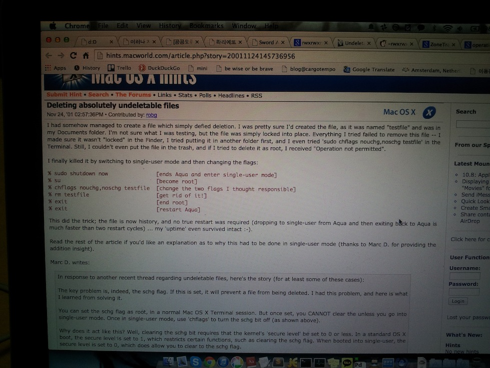
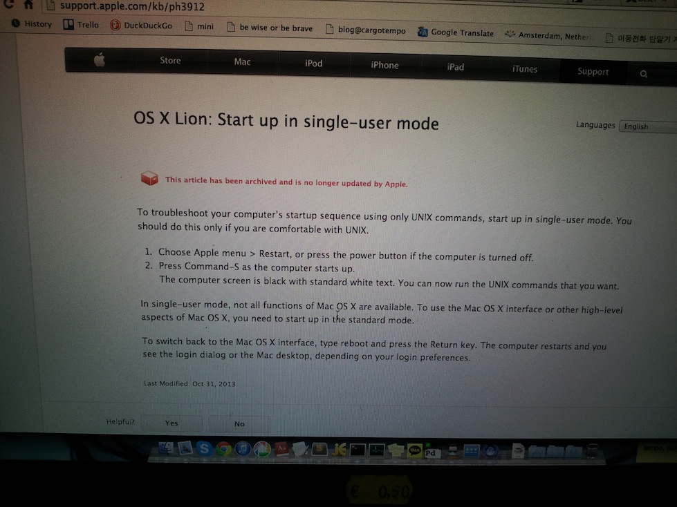
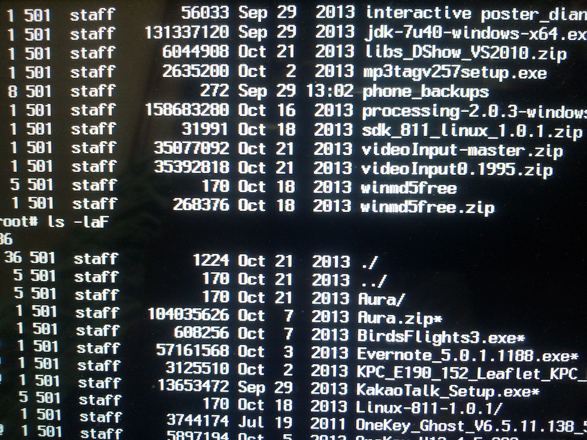
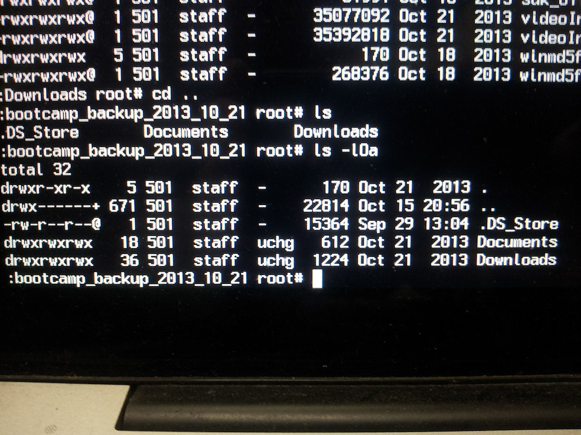
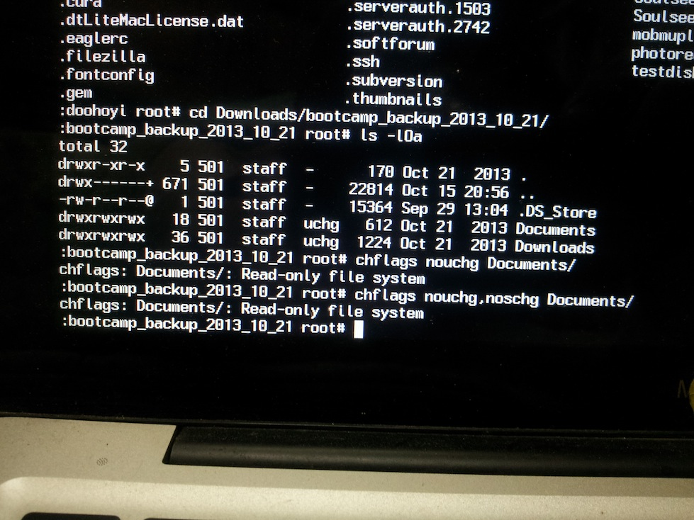
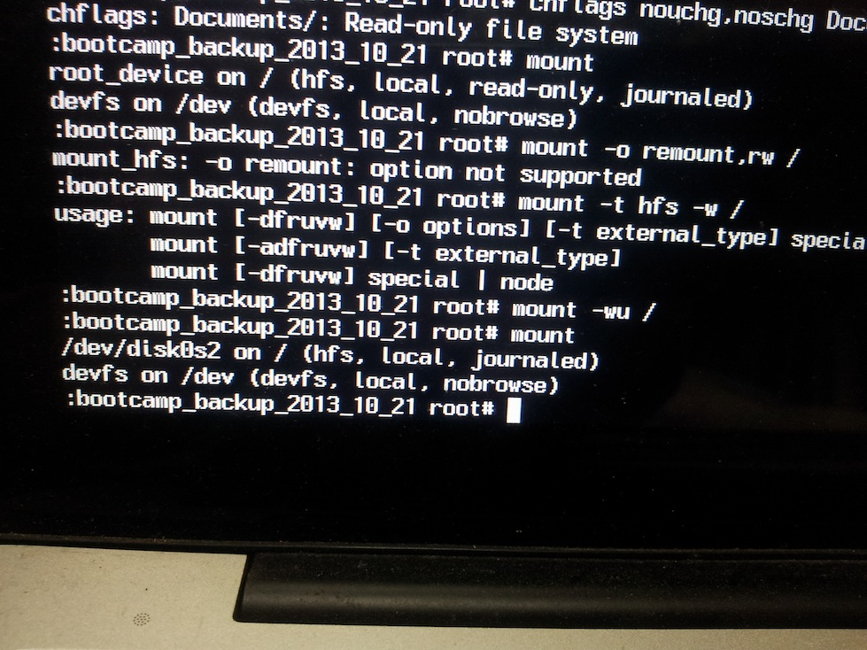
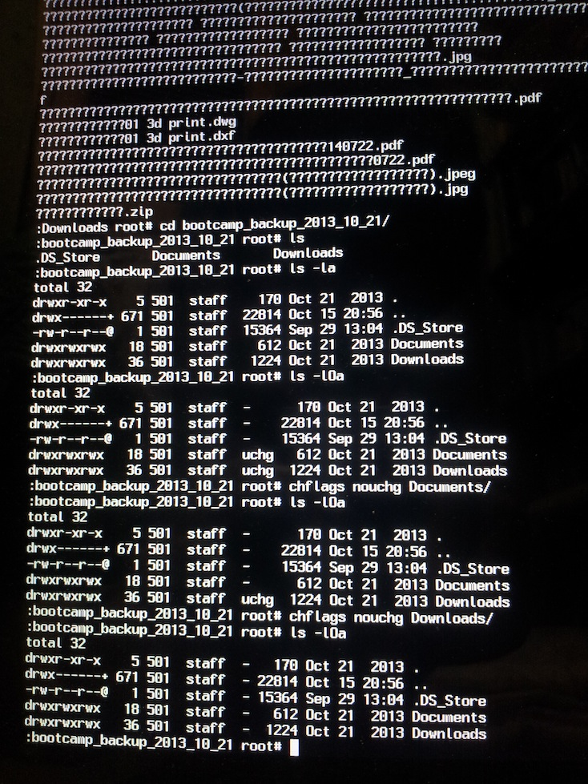

single user mode에 들어가는 법은 <http://support.apple.com/kb/ph3912>

```
To troubleshoot your computer’s startup sequence using only UNIX commands, start up in single-user mode. You should do this only if you are comfortable with UNIX.

Choose Apple menu > Restart, or press the power button if the computer is turned off.
Press Command-S as the computer starts up.
The computer screen is black with standard white text. You can now run the UNIX commands that you want.

In single-user mode, not all functions of Mac OS X are available. To use the Mac OS X interface or other high-level aspects of Mac OS X, you need to start up in the standard mode.

To switch back to the Mac OS X interface, type reboot and press the Return key. The computer restarts and you see the login dialog or the Mac desktop, depending on your login preferences.
```

Cmd-S를 누름. 부트캠프가 있는 상황에선...
부트 파티션으로 맥파티션을 마우스로 선택하기전에, 키보드로 Cmd-S를 먼저 누르고 있는 것이 좋다.
키를 확실히 누르고, 부트 파티션 클릭.

Read-only filesystem error 문제 해결은...
mount -wu / 는 <http://www.securemac.com/macosxsingleuser.php> 에서 나옴..

---

##linux

---

## ok cash bang -> point to cash refund...

<http://proxy-server-list.tistory.com/21>

담엔 꼭 현금환급을 받도록 해야겠다.

-

```
ok캐쉬백 현금환급 방법, 오케이캐쉬백 현금 입금
POSTED AT 2013/12/30 01:12
ok캐쉬백 현금환급방법
ok캐쉬백 포인트를 자신의 통장으로 현급 환급 상환 받는 방법입니다~~
www.okcashbag.com/mycashbag/point/myPointRefund.do
위 페이지에 접속하세요...
 
그럼 아래같이 적립포인트 상환신청, 충전포인트 환급신청이있는데.. 
적립포인트는 말그대로 쇼핑몰이나 주유소등에서 적립한걸 말하는거고 충전포인트는 현금 계좌이체나 신용카드로 직접 충전한 포인트를 말합니다.
참고 : OK캐쉬백 현금 충전하는 방법
적립포인트나 충전포인트 어느걸 현금으로 환급받을지 클릭하시고
주민번호, 환급받을 포인트 입력, 입금받을 은행 계좌 입력하시고 상환신청하기 버튼을 클릭하시면 됩니다..
주의사항
1. 적립포인트는 ok캐시백 5만포인트 이상 있는 회원만 현금 환급됩니다..
2. 입출금이 자유로운 통장만 가능(가상계좌, 적립식통장, 평생계좌 등록불가)
3. 현금으로 전환 신청시 4일-6일 정도 일정 시간이 소요됩니다. 입금이 되기전에 포인트가 미리 차감됩니다..
4. 본인명의 통장으로만 입금됩니다.
5. 충전포인트 환급시에는 수수료가 있습니다. 
(환급 수수료는 10,000포인트 미만은 1,000포인트, 10,000포인트 이상은 환급금의 10%이며, 1,000포인트 이하는 환급 불가능)

신청결과 조회를 클릭하면 오케이캐시백 환급처리 결과를 볼수있습니다.
저는 2012년 3월 12일에 환급 신청해서 3월 15일에 입금받았네요^^
```


######2014Nov10 23:16:16+0900

Auto Brightness in Mountain Lion

disabling this feature...

<http://apple.stackexchange.com/questions/61080/auto-brightness-in-mountain-lion/61083#61083>

```
I see that you don't have the "Slightly dim the display while on battery power" setting enabled in Energy Saver, but do you happen to have "Automatically adjust brightness" enabled in your Display preference pane?

Displays pane in System Preferences highlighting "Automatically adjust brightness"

That's the setting that adjusts your brightness based off of the light level detected by a Mac's ambient light sensor. (You may have already thought of this and or maybe it's too obvious but I wanted to suggest it just in case.) Good luck!
```

## order of operation!

<http://en.flossmanuals.net/pure-data/ch039_order-of-operations/>

according to \#3, pure data 'gurantees' right thing. :D

### alternative to sketchup

2D-sketchup?
well, in the end, i m just using old sketchup 7.1 pro only for exporting to dwg
but worth to note following links found searching for '2D-native sketchup-alike'
<https://sites.google.com/site/sketchupsage/resources#TOC-Other-Modelers>
<http://sketchucation.com/forums/viewtopic.php?f=180&t=22091>
<http://www.cadstd.com/>
<https://groups.google.com/forum/#!topic/sketchup-pro/gsEjrAySQTM>


######2014Nov10 23:21:26+0900

for OSX, open source projects

---

kdiff3

<http://sourceforge.net/projects/kdiff3/files/kdiff3/0.9.98/>

meld

for mac
<http://brewformulas.org/Meld>
just, 'brew install meld'

<http://meldmerge.org/>

pre-built binaries for windows

<http://sourceforge.net/projects/meld-installer/files/?source=navbar>

both are good enough.. let's see what is better having both.

---

######2014Nov15 15:52:45+0900

써보니까..
kdiff3가 더 좋은 것 같다..
안정적이고.. 숏컷도 잘 되어있고...

정착중..

-

한가지 새로운 개념이.. 
merge의 개념인데.. 요걸 참고하자..

<http://stackoverflow.com/questions/5246150/copy-single-difference-in-kdiff3>

왼쪽 파일 내용 오른쪽 파일 내용 합치는 법이다.. 참고.

### Hide the Admin Bar in WordPress

<http://davidwalsh.name/hide-admin-bar-wordpress>

```
add_filter('show_admin_bar', '__return_false');
```

### Apply Custom CSS to Admin Area

<http://css-tricks.com/snippets/wordpress/apply-custom-css-to-admin-area/>

Add to the functions.php file:

```
add_action('admin_head', 'my_custom_fonts');

function my_custom_fonts() {
  echo '<style>
    body, td, textarea, input, select {
      font-family: "Lucida Grande";
      font-size: 12px;
    } 
  </style>';
}
```

## github-pages

to have more than 1 account.. set up gitx.
to push, only command line possible.

first clone repo from github 'git clone'
then get into the folder
and do sth.
use gitx to commit.
push with 'git push -u origin master' <- then, this becomes default push relationship.

<http://stackoverflow.com/questions/18801147/changing-the-default-git-remote-push-to-default/18801178#18801178>

afterwards, just push with 'git push' is fine.

---

[markdown syntax 배우기](http://dynalon.github.io/mdwiki/#!quickstart.md)
[markdown_syntax_advanced](http://daringfireball.net/projects/markdown/syntax)

*italic*
**bold**
~~strike-through~~

<span style="color:tomato">COLOR(RED-alike)</span>
<span style="color:orangered">COLOR(RED-alike)</span>
<span style="color:maroon">COLOR(RED-alike)</span>
<span style="color:crimson">COLOR(RED-alike)</span>
<http://www.w3schools.com/html/html_colornames.asp>

---

######2015May31 22:26:36+0900

**sublime text tip : folder search wih constaint of extension!**

<http://stackoverflow.com/questions/17555791/sublime-text-2-find-in-folder-with-file-extension/17556064#17556064>

```
In case you'd like to search within .js files located within a directory, you can add an Include Filter in the search path:

/project,*.js
This will search for the text you've entered, limiting the scope to files within /project and it's sub-directories having the extension .js.
```

---

######2015May31 22:32:38+0900

**tip : linux. : How to chmod all directories except files (recursively)?**

<http://superuser.com/questions/91935/how-to-chmod-all-directories-except-files-recursively/91938#91938>
```
find /path/to/base/dir -type d -print0 | xargs -0 chmod 755 
find /path/to/base/dir -type f -print0 | xargs -0 chmod 644
```

---

######2015May31 22:35:20+0900

**tip : apache : Creating a symbolic link in Sites directory : FollowSymLink**

<http://stackoverflow.com/questions/3775102/creating-a-symbolic-link-in-sites-directory>

```
That's a configurable Apache option. It appears that by default on Macs (and probably most installations) Apache is configured to not follow symbolic links. I'm guessing (as others mention above) that it's for security purposes.

But it can be really convenient at times to enable following of symbolic links, particularly during development of certain kinds of apps. What you need to do is 1) change the Apache configuration to allow the following of symbolic links, and then 2) restart Apache.

The configuration step is performed as follows:

a) cd /etc/apache2 (this is where Apache's configuration files are by default on a Mac)

b) you'll see a couple of directories here. One is called users

c) cd users

d) ls should reveal a .conf file with your login name (login.conf) I'm "marvo" so mine is named "marvo.conf"

e) Edit this file (I use vi) -- but you have to do it using sudo:

sudo vi marvo.conf
f) You'll see something like

<Directory "/Users/marvo/Sites/">
    Options Indexes MultiViews 
    AllowOverride None
    Order allow,deny
    Allow from all
</Directory>
g) Add the "FollowSymLinks" option so that the second line of that .conf file looks like:

Options Indexes MultiViews FollowSymLinks
(You can find other configuration options out there on the 'net. I found this page: http://httpd.apache.org/docs/2.0/mod/core.html#directory )

h) Save the file.

Now you have to restart Apache so that it picks up the configuration change. Googling around a bit, I found that this is most easily done from the command line with the following command:

sudo /usr/sbin/apachectl restart
(Found that at http://mcapewell.wordpress.com/2006/09/22/restart-apache-in-mac-os-x/ )

Now that symbolic link should work just fine on your Sites pages.
```

---

######2015May31 22:37:02+0900

**How can I create a symbolic link in Terminal?**

<http://apple.stackexchange.com/questions/115646/how-can-i-create-a-symbolic-link-in-terminal/115647#115647>

```
┌── ln(1) link, ln -- make links
│   ┌── Create a symbolic link.
│   │                         ┌── the path to the intended symlink
│   │                         │   can use . or ~ or other relative paths
│   │                   ┌─────┴────────┐
ln -s /path/to/original /path/to/symlink
      └───────┬───────┘
              └── the path to the original file/folder
                  can use . or ~ or other relative paths
i.e.

echo "baz" > foo
ln -s foo bar  
ls -al    bar  # bar -> foo
cat       bar  # displays contents of foo: baz
For more information about ln(1) see the man page.
```

